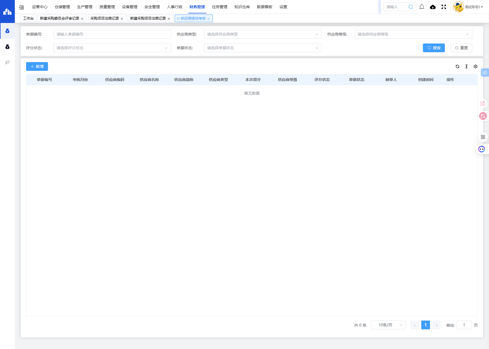
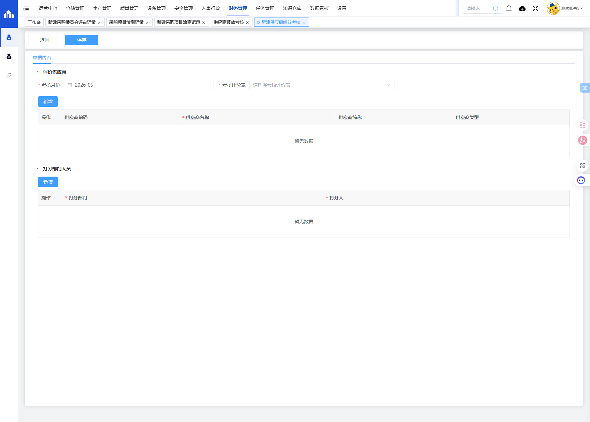

# 供应商绩效考核模块

## 一、模块概述

供应商绩效考核模块用于管理供应商的绩效考核评价，包括考核月份、考核评价表选择、供应商信息和打分部门人员配置，实现供应商绩效的量化评估和等级管理。

- **页面URL**：`#/financial-manage/operating/cangchu/performance-appraisal`
- **完整URL**：`https://gdmms.y1b.cn:8424/#/financial-manage/operating/cangchu/performance-appraisal`

## 二、功能定位

| 功能维度 | 说明 |
| :--- | :--- |
| **核心功能** | 供应商绩效量化考核与等级评定 |
| **数据来源** | 供应商评价配置、打分人员评分 |
| **目标用户** | 采购人员、质量管理员 |
| **输出形式** | 供应商绩效考核报告、等级评定结果 |

## 三、列表页面结构

### 3.1 搜索筛选字段

| 字段编号 | 字段名称 | 类型 | 必填 | 描述 |
| :--- | :--- | :--- | :--- | :--- |
| 1 | 单据编号 | 文本输入框 | 否 | 输入单据编号进行搜索 |
| 2 | 供应商类型 | 下拉选择框 | 否 | 选择供应商类型进行筛选 |
| 3 | 供应商等级 | 下拉选择框 | 否 | 选择供应商等级进行筛选 |
| 4 | 评分状态 | 下拉选择框 | 否 | 选择评分状态进行筛选 |
| 5 | 单据状态 | 下拉选择框 | 否 | 选择单据状态进行筛选 |

### 3.2 列表表格字段

| 字段编号 | 列名 | 类型 | 描述 |
| :--- | :--- | :--- | :--- |
| 1 | 单据编号 | 文本 | 单据编号 |
| 2 | 考核月份 | 文本 | 考核所属月份 |
| 3 | 供应商编码 | 文本 | 供应商编码 |
| 4 | 供应商名称 | 文本 | 供应商名称 |
| 5 | 供应商简称 | 文本 | 供应商简称 |
| 6 | 供应商类型 | 文本 | 供应商类型 |
| 7 | 本次得分 | 数值 | 本次考核得分 |
| 8 | 供应商等级 | 文本 | 供应商评定等级 |
| 9 | 评分状态 | 文本 | 评分完成状态 |
| 10 | 单据状态 | 文本 | 单据当前状态 |
| 11 | 制单人 | 文本 | 单据制单人员 |
| 12 | 创建时间 | 日期时间 | 单据创建时间 |
| 13 | 操作 | 按钮 | 编辑/删除/查看等操作 |

## 四、新增页面结构

### 4.1 操作按钮

| 按钮名称 | 描述 |
| :--- | :--- |
| 返回 | 返回列表页面 |
| 保存 | 保存草稿 |

### 4.2 评价供应商字段

| 字段编号 | 字段名称 | 类型 | 必填 | 默认值 | 描述 |
| :--- | :--- | :--- | :--- | :--- | :--- |
| 1 | 考核月份 | 月份选择器 | **是** | 当前月份 | 考核所属月份 |
| 2 | 考核评价表 | 下拉选择框 | **是** | 空 | 选择考核评价表模板 |

### 4.3 供应商列表字段

| 字段编号 | 列名 | 类型 | 必填 | 描述 |
| :--- | :--- | :--- | :--- | :--- |
| 1 | 操作 | 按钮 | - | 编辑/删除 |
| 2 | 供应商编码 | 文本 | 否 | 供应商编码 |
| 3 | 供应商名称 | 文本 | **是** | 供应商名称 |
| 4 | 供应商简称 | 文本 | 否 | 供应商简称 |
| 5 | 供应商类型 | 文本 | 否 | 供应商类型 |

### 4.4 打分部门人员字段

| 字段编号 | 列名 | 类型 | 必填 | 描述 |
| :--- | :--- | :--- | :--- | :--- |
| 1 | 操作 | 按钮 | - | 编辑/删除 |
| 2 | 打分部门 | 文本 | **是** | 打分部门名称 |
| 3 | 打分人 | 文本 | **是** | 打分人员姓名 |

## 五、交互操作

1. **搜索**：输入单据编号、选择供应商类型/等级/评分状态/单据状态，点击"搜索"按钮查询数据
2. **重置**：点击"重置"按钮清空搜索条件
3. **新增**：点击"新增"按钮进入新建供应商绩效考核页面
4. **新增供应商**：点击评价供应商区域的"新增"按钮添加供应商
5. **新增打分人员**：点击打分部门人员区域的"新增"按钮添加打分人员
6. **保存**：点击"保存"按钮保存草稿
7. **返回**：点击"返回"按钮返回列表页面

## 六、截图记录

### 6.1 列表页面

### 6.2 新增表单

## 七、注意事项

1. 考核月份和考核评价表为必填项
2. 考核评价表需在供应商评价配置中预先创建
3. 供应商名称和打分部门、打分人均为必填项
4. 本次得分和供应商等级由系统根据评分自动计算
5. 供应商等级一般分为A/B/C/D等级
