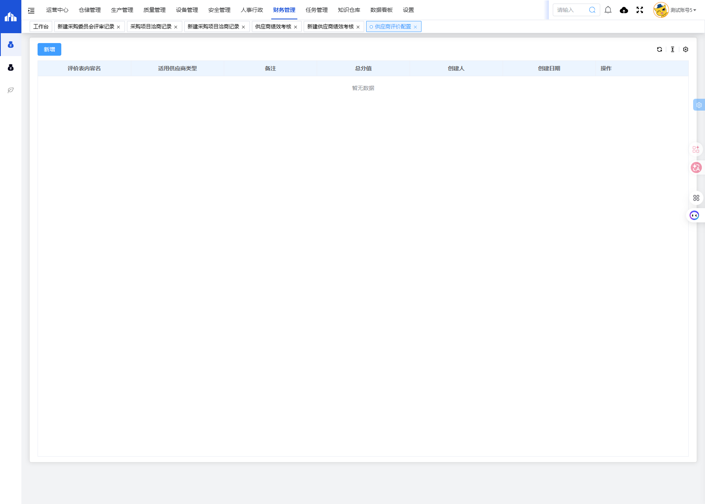
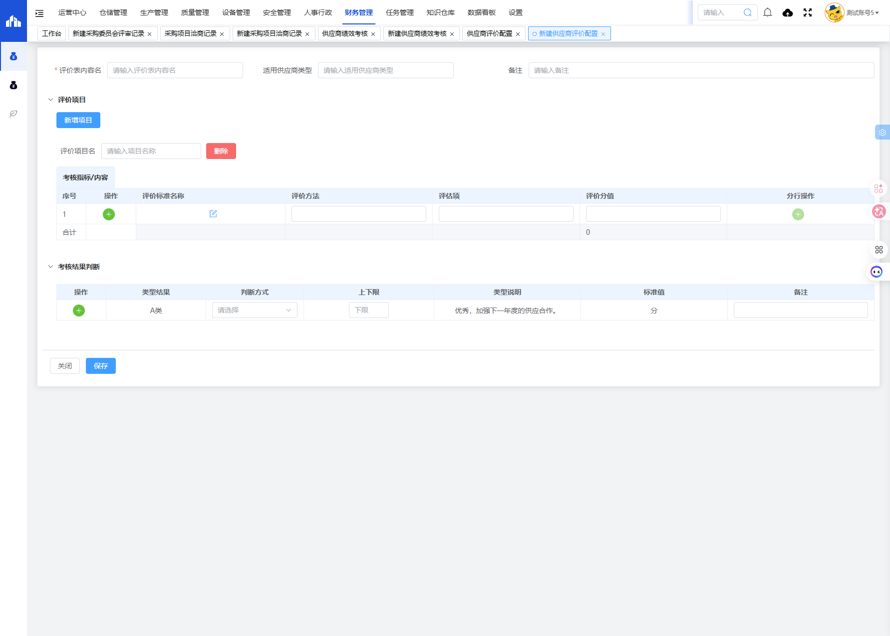

# 供应商评价配置模块

## 一、模块概述

供应商评价配置模块用于配置供应商绩效考核的评价表模板，包括评价项目、考核指标、评价标准、评价分值和考核结果判断规则，实现供应商评价体系的标准化配置。

- **页面URL**：`#/financial-manage/operating/cangchu/supplier-evaluate-content`
- **完整URL**：`https://gdmms.y1b.cn:8424/#/financial-manage/operating/cangchu/supplier-evaluate-content`

## 二、功能定位

| 功能维度 | 说明 |
| :--- | :--- |
| **核心功能** | 供应商评价表模板配置与管理 |
| **数据来源** | 管理员手动配置 |
| **目标用户** | 采购管理员、质量管理员 |
| **输出形式** | 评价表模板、考核结果判断规则 |

## 三、列表页面结构

### 3.1 列表表格字段

| 字段编号 | 列名 | 类型 | 描述 |
| :--- | :--- | :--- | :--- |
| 1 | 评价表内容名 | 文本 | 评价表模板名称 |
| 2 | 适用供应商类型 | 文本 | 适用的供应商类型 |
| 3 | 备注 | 文本 | 备注说明 |
| 4 | 总分值 | 数值 | 评价表总分值 |
| 5 | 创建人 | 文本 | 创建人员 |
| 6 | 创建日期 | 日期 | 创建日期 |
| 7 | 操作 | 按钮 | 编辑/删除/查看等操作 |

## 四、新增页面结构

### 4.1 操作按钮

| 按钮名称 | 描述 |
| :--- | :--- |
| 关闭 | 关闭当前页面 |
| 保存 | 保存评价配置 |

### 4.2 基本信息字段

| 字段编号 | 字段名称 | 类型 | 必填 | 描述 |
| :--- | :--- | :--- | :--- | :--- |
| 1 | 评价表内容名 | 文本输入框 | **是** | 评价表模板名称 |
| 2 | 适用供应商类型 | 文本输入框 | 否 | 适用的供应商类型 |
| 3 | 备注 | 文本输入框 | 否 | 备注说明 |

### 4.3 评价项目字段

| 字段编号 | 字段名称 | 类型 | 描述 |
| :--- | :--- | :--- | :--- |
| 1 | 评价项目名 | 文本输入框 | 评价项目名称 |

### 4.4 考核指标/内容表格字段

| 字段编号 | 列名 | 类型 | 描述 |
| :--- | :--- | :--- | :--- |
| 1 | 序号 | 数值 | 指标序号 |
| 2 | 操作 | 按钮 | 添加/删除行 |
| 3 | 评价标准名称 | 文本输入框 | 评价标准名称 |
| 4 | 评价方法 | 文本输入框 | 评价方法描述 |
| 5 | 评估项 | 文本输入框 | 评估项名称 |
| 6 | 评价分值 | 数值输入框 | 该项评价分值 |
| 7 | 分行操作 | 按钮 | 行操作按钮 |
| 8 | 合计 | 数值 | 所有评价分值合计 |

### 4.5 考核结果判断表格字段

| 字段编号 | 列名 | 类型 | 描述 |
| :--- | :--- | :--- | :--- |
| 1 | 操作 | 按钮 | 添加/删除行 |
| 2 | 类型结果 | 文本 | 考核结果类型（如A类/B类/C类/D类） |
| 3 | 判断方式 | 下拉选择框 | 判断方式选择 |
| 4 | 上下限 | 数值输入框 | 分数上下限 |
| 5 | 类型说明 | 文本 | 类型说明描述 |
| 6 | 标准值 | 文本 | 标准值（含单位"分"） |
| 7 | 备注 | 文本输入框 | 备注说明 |

### 4.6 默认考核结果判断

| 类型结果 | 类型说明 | 判断方式 |
| :--- | :--- | :--- |
| A类 | 优秀，加强下一年度的供应合作 | 上下限 |

## 五、交互操作

1. **新增**：点击"新增"按钮进入新建评价配置页面
2. **新增项目**：点击"新增项目"按钮添加评价项目
3. **删除项目**：点击"删除"按钮删除评价项目
4. **添加行**：点击操作列的"+"按钮添加考核指标行
5. **删除行**：点击操作列的"-"按钮删除考核指标行
6. **保存**：点击"保存"按钮保存评价配置
7. **关闭**：点击"关闭"按钮关闭当前页面

## 六、截图记录

### 6.1 列表页面

### 6.2 新增表单

## 七、注意事项

1. 评价表内容名为必填项
2. 评价分值合计自动计算
3. 考核结果判断默认包含A类（优秀），可添加B/C/D类
4. 每个评价项目可包含多个考核指标
5. 评价配置保存后可在供应商绩效考核中使用
