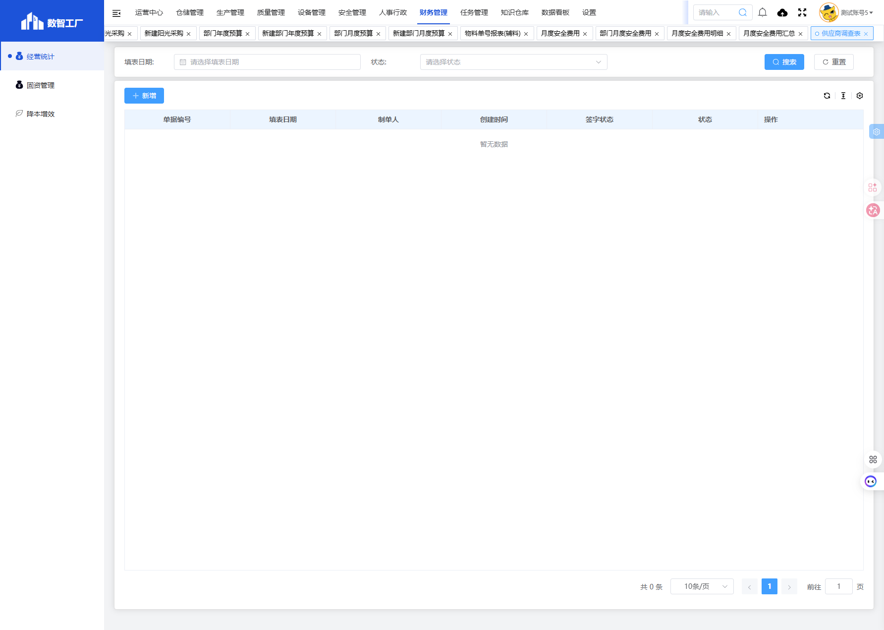
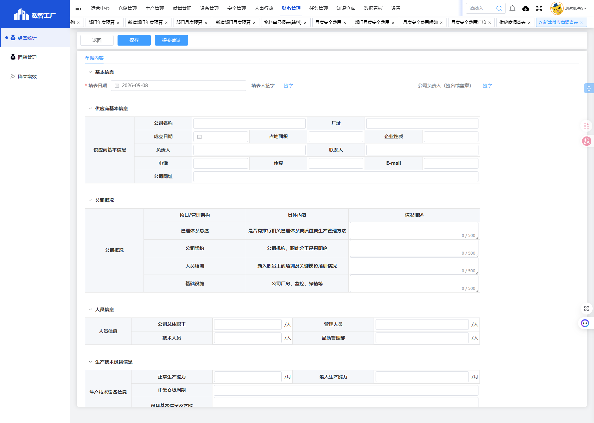

# 供应商调查表模块

## 一、模块概述

供应商调查表模块用于管理供应商的资质调查信息，包括供应商基本信息、公司概况、人员信息、生产技术设备信息、产品信息和财务信息等，实现供应商准入管理的规范化。

- **页面URL**：`#/financial-manage/operating/cangchu/supplier-survey`
- **完整URL**：`https://gdmms.y1b.cn:8424/#/financial-manage/operating/cangchu/supplier-survey`

## 二、功能定位

| 功能维度 | 说明 |
| :--- | :--- |
| **核心功能** | 供应商资质调查与准入管理 |
| **数据来源** | 供应商自主填报、采购人员录入 |
| **目标用户** | 采购人员、供应商管理员 |
| **输出形式** | 供应商调查报告 |

## 三、列表页面结构

### 3.1 搜索筛选字段

| 字段编号 | 字段名称 | 类型 | 必填 | 描述 |
| :--- | :--- | :--- | :--- | :--- |
| 1 | 填表日期 | 日期选择器 | 否 | 选择填表日期进行筛选 |
| 2 | 状态 | 下拉选择框 | 否 | 选择单据状态进行筛选 |

### 3.2 列表表格字段

| 字段编号 | 列名 | 类型 | 描述 |
| :--- | :--- | :--- | :--- |
| 1 | 单据编号 | 文本 | 单据编号 |
| 2 | 填表日期 | 日期 | 填表日期 |
| 3 | 制单人 | 文本 | 单据制单人员 |
| 4 | 创建时间 | 日期时间 | 单据创建时间 |
| 5 | 签字状态 | 文本 | 签字确认状态 |
| 6 | 状态 | 文本 | 单据当前状态 |
| 7 | 操作 | 按钮 | 编辑/删除/查看等操作 |

## 四、新增页面结构

### 4.1 操作按钮

| 按钮名称 | 描述 |
| :--- | :--- |
| 返回 | 返回列表页面 |
| 保存 | 保存草稿 |
| 提交确认 | 提交确认调查表 |

### 4.2 基本信息字段

| 字段编号 | 字段名称 | 类型 | 必填 | 描述 |
| :--- | :--- | :--- | :--- | :--- |
| 1 | 填表日期 | 日期选择器 | **是** | 填表日期，默认当天 |
| 2 | 填表人签字 | 签字按钮 | 否 | 填表人电子签名 |
| 3 | 公司负责人（签名或盖章） | 签字按钮 | 否 | 公司负责人电子签名 |

### 4.3 供应商基本信息字段

| 字段编号 | 字段名称 | 类型 | 必填 | 描述 |
| :--- | :--- | :--- | :--- | :--- |
| 1 | 公司名称 | 文本输入框 | 否 | 供应商公司名称 |
| 2 | 厂址 | 文本输入框 | 否 | 工厂地址 |
| 3 | 成立日期 | 日期选择器 | 否 | 公司成立日期 |
| 4 | 占地面积 | 文本输入框 | 否 | 公司占地面积 |
| 5 | 企业性质 | 文本输入框 | 否 | 企业性质（国企/民企/外企等） |
| 6 | 负责人 | 文本输入框 | 否 | 企业负责人 |
| 7 | 联系人 | 文本输入框 | 否 | 业务联系人 |
| 8 | 电话 | 文本输入框 | 否 | 联系电话 |
| 9 | 传真 | 文本输入框 | 否 | 传真号码 |
| 10 | E-mail | 文本输入框 | 否 | 电子邮箱 |
| 11 | 公司网址 | 文本输入框 | 否 | 公司网站地址 |

### 4.4 公司概况字段

| 字段编号 | 项目/管理架构 | 具体内容 | 类型 | 字数限制 |
| :--- | :--- | :--- | :--- | :--- |
| 1 | 管理体系总述 | 是否有推行相关管理体系或质量或生产管理方法 | 多行文本框 | 500字 |
| 2 | 公司架构 | 公司机构、职能分工是否明确 | 多行文本框 | 500字 |
| 3 | 人员培训 | 新入职员工的培训及关键岗位培训情况 | 多行文本框 | 500字 |
| 4 | 基础设施 | 公司厂房、监控、绿植等 | 多行文本框 | 500字 |

### 4.5 人员信息字段

| 字段编号 | 字段名称 | 类型 | 单位 | 描述 |
| :--- | :--- | :--- | :--- | :--- |
| 1 | 公司总体职工 | 文本输入框 | 人 | 公司总人数 |
| 2 | 管理人员 | 文本输入框 | 人 | 管理人员数量 |
| 3 | 技术人员 | 文本输入框 | 人 | 技术人员数量 |
| 4 | 品质管理部 | 文本输入框 | 人 | 品质管理人员数量 |

### 4.6 生产技术设备信息字段

| 字段编号 | 字段名称 | 类型 | 单位 | 描述 |
| :--- | :--- | :--- | :--- | :--- |
| 1 | 正常生产能力 | 文本输入框 | 月 | 正常月产能 |
| 2 | 最大生产能力 | 文本输入框 | 月 | 最大月产能 |
| 3 | 正常交货周期 | 文本输入框 | - | 正常交货周期 |
| 4 | 设备基本信息及产能 | 多行文本框 | - | 设备信息描述，500字 |

### 4.7 产品信息字段

| 字段编号 | 字段名称 | 类型 | 描述 |
| :--- | :--- | :--- | :--- |
| 1 | 主要产品及原材料 | 多行文本框 | 主要产品和原材料描述，500字 |
| 2 | 产品介绍 | 多行文本框 | 产品介绍描述，500字 |
| 3 | 产品遵守标准 | 复选框组 | 国际标准/国家标准/行业标准/企业标准 |
| 4 | 产品检验情况 | 多行文本框 | 产品检验情况描述，500字 |
| 5 | 产品标识、可追溯性 | 多行文本框 | 产品标识和可追溯性描述，500字 |

### 4.8 财务信息字段

| 字段编号 | 字段名称 | 类型 | 单位 | 描述 |
| :--- | :--- | :--- | :--- | :--- |
| 1 | 固定资产净值 | 文本输入框 | 万元 | 固定资产净值 |
| 2 | 营运资金 | 文本输入框 | 万元 | 营运资金 |
| 3 | 银行信用等级 | 文本输入框 | - | 银行信用等级 |

### 4.9 备注

注：提供相关资料包括：公司简介、公司三证、产品说明书、产品执行标准、内/外检验报告。

## 五、交互操作

1. **搜索**：选择填表日期或状态，点击"搜索"按钮查询数据
2. **重置**：点击"重置"按钮清空搜索条件
3. **新增**：点击"新增"按钮进入新建供应商调查表页面
4. **签字**：点击"签字"按钮进行电子签名
5. **保存**：点击"保存"按钮保存草稿
6. **提交确认**：点击"提交确认"按钮提交调查表
7. **返回**：点击"返回"按钮返回列表页面

## 六、截图记录

### 6.1 列表页面

### 6.2 新增表单

## 七、注意事项

1. 填表日期为必填项，默认为当天日期
2. 签字功能支持电子签名
3. 产品遵守标准为多选复选框
4. 多行文本框均有500字数限制
5. 提交确认后单据状态将变更
