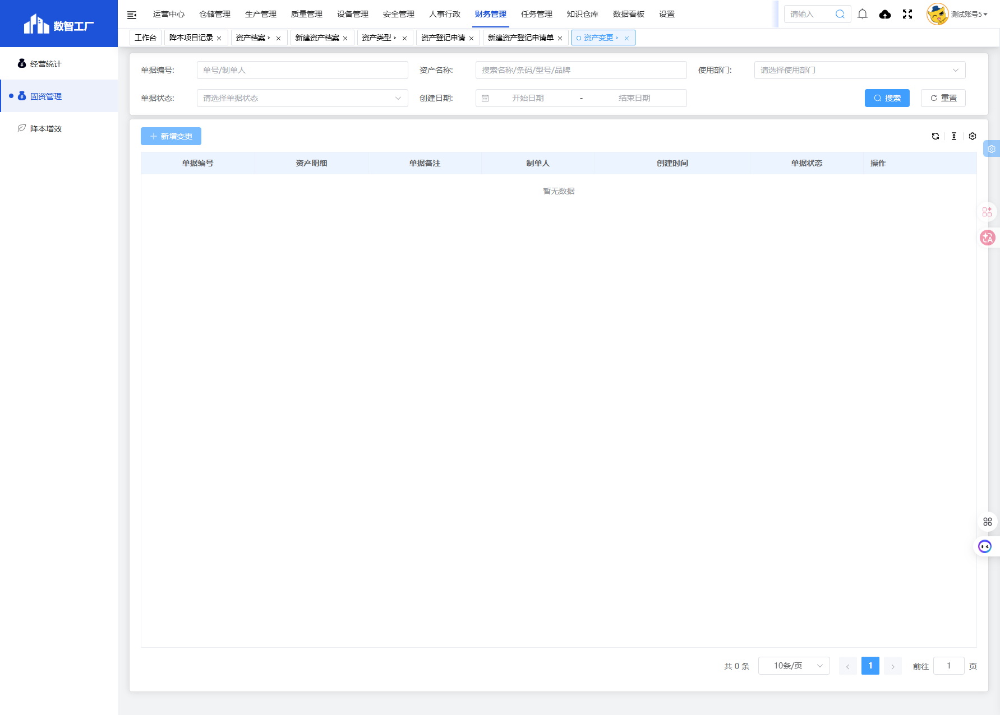

# 固资管理模块

## 一、模块概述

固资管理模块负责企业固定资产的全生命周期管理，包括资产档案管理、资产类型分类、资产登记申请、资产变更和资产报废处置等功能，实现固定资产从登记到报废的完整流程管理。

- **所属模块**：财务管理 > 固资管理
- **子模块列表**：资产档案、资产类型、资产登记申请、资产变更、资产报废处置

## 二、子模块结构

| 序号 | 子模块名称 | 页面URL | 功能说明 |
| :--- | :--- | :--- | :--- |
| 1 | 资产档案 | `#/financial-manage/index6/equipment` | 固定资产档案管理与查询 |
| 2 | 资产类型 | `#/financial-manage/index6/device-type` | 资产类型分类管理与配置 |
| 3 | 资产登记申请 | `#/financial-manage/index6/property-register-apply` | 固定资产登记申请管理 |
| 4 | 资产变更 | `#/financial-manage/index6/assets-manage/change` | 固定资产变更申请管理 |
| 5 | 资产报废处置 | `#/financial-manage/index6/assets-manage/scrap` | 固定资产报废处置申请管理 |

## 三、功能定位

| 功能维度 | 说明 |
| :--- | :--- |
| **核心功能** | 固定资产全生命周期管理 |
| **数据来源** | 资产采购记录、财务系统数据 |
| **目标用户** | 资产管理专员、财务人员 |
| **输出形式** | 资产台账、折旧报表、盘点报告 |

## 四、子模块详细说明

### 4.1 资产档案

资产档案模块用于管理企业固定资产的完整信息，包括设备基本信息、使用情况、购置信息等，实现资产的全生命周期管理。

- **核心功能**：资产档案增删改查、标签打印、批量导入导出
- **必填字段**：唯一码、资产名称、资产类型、使用状态、使用部门、使用负责人、资本化日期
- **详情文档**：[资产档案.md](资产档案.md)

### 4.2 资产类型

资产类型模块用于管理固定资产的分类体系，包括定义资产类型名称、所属部门、关联模块菜单显示等，实现资产分类的标准化管理。

- **核心功能**：资产类型层级管理、关联模块配置
- **必填字段**：资产类型名称、所属部门、关联模块菜单显示
- **详情文档**：[资产类型.md](资产类型.md)

### 4.3 资产登记申请

资产登记申请模块用于提交固定资产登记申请，包括填写资产明细、使用部门、使用负责人等信息，实现资产登记流程的规范化管理。

- **核心功能**：资产登记申请、审核流程
- **必填字段**：使用部门、使用负责人、资产明细（资产名称、数量、使用状态、资产类型）
- **详情文档**：[资产登记申请.md](资产登记申请.md)

### 4.4 资产变更

资产变更模块用于管理固定资产的变更申请，包括填写变更日期、变更原因、变更资产明细等信息，实现资产变更流程的规范化管理。

- **核心功能**：资产变更申请、审核流程
- **必填字段**：变更日期、变更原因、变更明细（使用状态、使用部门、使用负责人、使用位置）
- **详情文档**：[资产变更.md](资产变更.md)

### 4.5 资产报废处置

资产报废处置模块用于管理固定资产的报废申请，包括填写处置日期、业务类型、报废原因、处置人等信息，实现资产报废流程的规范化管理。

- **核心功能**：资产报废处置申请、审核流程
- **必填字段**：处置日期、业务类型、报废原因、处置人
- **详情文档**：[资产报废处置.md](资产报废处置.md)

## 五、业务流程

```
资产类型配置 → 资产登记申请 → 资产档案建立 → 资产变更 → 资产报废处置
```

1. **资产类型配置**：先配置资产分类体系
2. **资产登记申请**：提交资产登记申请，经审核通过后自动创建资产档案
3. **资产档案管理**：对已建立的资产档案进行查询、编辑、打印标签等操作
4. **资产变更**：当资产使用状态、部门、负责人、位置等发生变化时，提交变更申请
5. **资产报废处置**：当资产达到报废条件时，提交报废处置申请

## 六、截图记录

### 6.1 资产档案列表页面


### 6.2 资产类型列表页面


### 6.3 资产登记申请列表页面


### 6.4 资产变更列表页面



### 6.5 资产报废处置列表页面


## 七、注意事项

1. 资产唯一码需保持唯一性，避免重复
2. 资产类型需先配置再进行资产登记
3. 资产变更和报废处置均需经过审核流程
4. 报废处置业务类型分为正常报废和延迟报废
5. 资产档案中折旧方法默认为平均年限法
