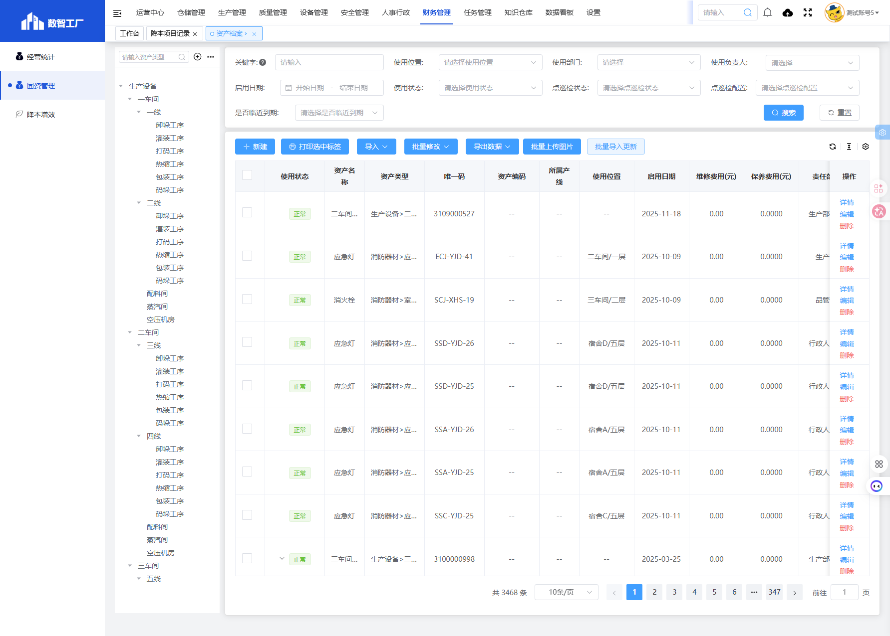
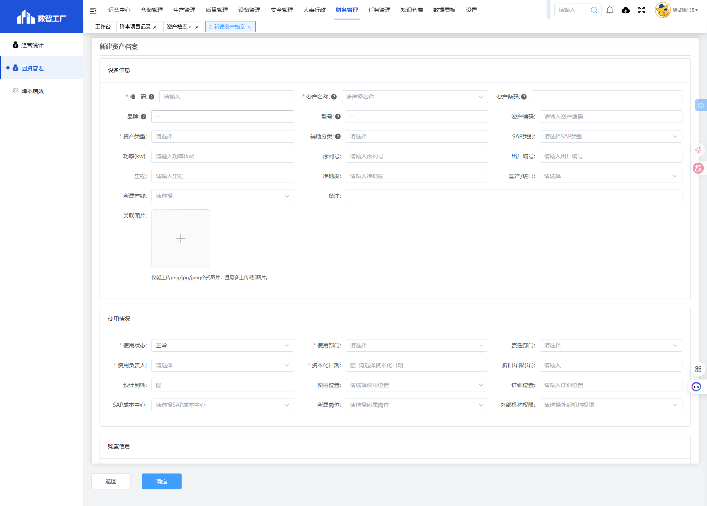

# 资产档案模块

## 一、模块概述

资产档案模块用于管理企业固定资产的完整信息，包括设备基本信息、使用情况、购置信息等，实现资产的全生命周期管理。

- **页面URL**：`#/financial-manage/index6/equipment`
- **完整URL**：`https://gdmms.y1b.cn:8424/#/financial-manage/index6/equipment`

## 二、功能定位

| 功能维度 | 说明 |
| :--- | :--- |
| **核心功能** | 固定资产档案管理与查询 |
| **数据来源** | 设备管理系统、采购系统 |
| **目标用户** | 资产管理专员、财务人员 |
| **输出形式** | 资产清单、资产标签打印 |

## 三、列表页面结构

### 3.1 资产类型树

| 一级分类 | 二级/三级分类示例 |
| :--- | :--- |
| 生产设备 | 一车间/一线/卸垛工序、灌装工序等 |
| 固定资产 | 配套设施、房屋建筑物、电子设备等 |
| 特种设备 | 电瓶叉车、柴油叉车、蒸汽管道等 |
| 消防器材 | 干粉灭火器、二氧化碳灭火器、应急灯等 |
| 仪器仪表 | 各类检测仪表 |

### 3.2 搜索筛选字段

| 字段编号 | 字段名称 | 类型 | 必填 | 描述 |
| :--- | :--- | :--- | :--- | :--- |
| 1 | 关键字 | 文本输入框 | 否 | 输入关键字进行搜索 |
| 2 | 使用位置 | 文本输入框 | 否 | 使用位置筛选 |
| 3 | 使用部门 | 文本输入框 | 否 | 使用部门筛选 |
| 4 | 使用负责人 | 下拉选择框 | 否 | 使用负责人筛选 |
| 5 | 启用日期-开始日期 | 日期选择器 | 否 | 启用日期开始范围 |
| 6 | 启用日期-结束日期 | 日期选择器 | 否 | 启用日期结束范围 |
| 7 | 使用状态 | 下拉选择框 | 否 | 使用状态筛选 |
| 8 | 点巡检状态 | 下拉选择框 | 否 | 点巡检状态筛选 |
| 9 | 点巡检配置 | 下拉选择框 | 否 | 点巡检配置筛选 |
| 10 | 是否临近到期 | 下拉选择框 | 否 | 是否临近到期筛选 |

### 3.3 操作按钮

| 按钮名称 | 描述 |
| :--- | :--- |
| 搜索 | 执行搜索 |
| 重置 | 清空搜索条件 |
| 新建 | 新建资产档案 |
| 打印选中标签 | 打印选中资产的标签 |
| 导入 | 导入资产数据 |
| 批量修改 | 批量修改资产信息 |
| 导出数据 | 导出资产数据 |
| 批量上传图片 | 批量上传资产图片 |
| 批量导入更新 | 批量导入更新资产数据 |

### 3.4 列表表格字段

| 字段编号 | 列名 | 类型 | 描述 |
| :--- | :--- | :--- | :--- |
| 1 | 使用状态 | 文本 | 资产使用状态（正常等） |
| 2 | 资产名称 | 文本 | 资产名称 |
| 3 | 资产类型 | 文本 | 资产类型路径 |
| 4 | 唯一码 | 文本 | 资产唯一标识码 |
| 5 | 资产编码 | 文本 | 资产编码 |
| 6 | 所属产线 | 文本 | 所属产线 |
| 7 | 使用位置 | 文本 | 使用位置 |
| 8 | 启用日期 | 日期 | 启用日期 |
| 9 | 维修费用(元) | 数值 | 累计维修费用 |
| 10 | 保养费用(元) | 数值 | 累计保养费用 |
| 11 | 责任部门 | 文本 | 责任部门 |
| 12 | 使用部门 | 文本 | 使用部门 |
| 13 | 使用负责人 | 文本 | 使用负责人 |
| 14 | 点巡检配置 | 文本 | 点巡检配置状态 |
| 15 | 点巡检状态 | 文本 | 点巡检状态 |
| 16 | 操作 | 按钮 | 详情/编辑/删除 |

## 四、新增页面结构

### 4.1 操作按钮

| 按钮名称 | 描述 |
| :--- | :--- |
| 返回 | 返回列表页面 |
| 确定 | 保存资产档案 |

### 4.2 设备信息字段

| 字段编号 | 字段名称 | 类型 | 必填 | 默认值 | 描述 |
| :--- | :--- | :--- | :--- | :--- | :--- |
| 1 | 唯一码 | 文本输入框 | **是** | 空 | 资产唯一标识码 |
| 2 | 资产名称 | 下拉选择框 | **是** | 空 | 选择资产名称 |
| 3 | 资产条码 | 文本输入框 | 否 | 空 | 资产条码 |
| 4 | 品牌 | 文本输入框 | 否 | 空 | 品牌 |
| 5 | 型号 | 文本输入框 | 否 | 空 | 型号 |
| 6 | 资产编码 | 文本输入框 | 否 | 空 | 资产编码 |
| 7 | 资产类型 | 文本输入框 | **是** | 只读 | 资产类型 |
| 8 | 辅助分类 | 文本输入框 | 否 | 空 | 辅助分类 |
| 9 | SAP类别 | 下拉选择框 | 否 | 空 | SAP类别 |
| 10 | 功率(kw) | 文本输入框 | 否 | 空 | 功率 |
| 11 | 序列号 | 文本输入框 | 否 | 空 | 序列号 |
| 12 | 出厂编号 | 文本输入框 | 否 | 空 | 出厂编号 |
| 13 | 里程 | 文本输入框 | 否 | 空 | 里程 |
| 14 | 准确度 | 文本输入框 | 否 | 空 | 准确度 |
| 15 | 国产/进口 | 下拉选择框 | 否 | 空 | 国产或进口 |
| 16 | 所属产线 | 下拉选择框 | 否 | 空 | 所属产线 |
| 17 | 备注 | 文本输入框 | 否 | 空 | 备注 |
| 18 | 关联图片 | 图片上传 | 否 | 空 | 最多上传3张图片 |

### 4.3 使用情况字段

| 字段编号 | 字段名称 | 类型 | 必填 | 默认值 | 描述 |
| :--- | :--- | :--- | :--- | :--- | :--- |
| 1 | 使用状态 | 下拉选择框 | **是** | 正常 | 使用状态 |
| 2 | 使用部门 | 文本输入框 | **是** | 空 | 使用部门 |
| 3 | 责任部门 | 文本输入框 | 否 | 空 | 责任部门 |
| 4 | 使用负责人 | 下拉选择框 | **是** | 空 | 使用负责人 |
| 5 | 资本化日期 | 日期选择器 | **是** | 空 | 资本化日期 |
| 6 | 折旧年限(年) | 文本输入框 | 否 | 空 | 折旧年限 |
| 7 | 预计到期 | 日期选择器 | 否 | 空 | 预计到期日期 |
| 8 | 使用位置 | 文本输入框 | 否 | 空 | 使用位置 |
| 9 | 详细位置 | 文本输入框 | 否 | 空 | 详细位置 |
| 10 | SAP成本中心 | 下拉选择框 | 否 | 空 | SAP成本中心 |
| 11 | 所属岗位 | 下拉选择框 | 否 | 空 | 所属岗位 |
| 12 | 外部机构权限 | 下拉选择框 | 否 | 空 | 外部机构权限 |

### 4.4 购置信息字段

| 字段编号 | 字段名称 | 类型 | 必填 | 默认值 | 描述 |
| :--- | :--- | :--- | :--- | :--- | :--- |
| 1 | 供应商 | 下拉选择框 | 否 | 空 | 供应商 |
| 2 | 生产厂家 | 下拉选择框 | 否 | 空 | 生产厂家 |
| 3 | 采购人员 | 下拉选择框 | 否 | 空 | 采购人员 |
| 4 | 数量 | 文本输入框 | 否 | 1 | 数量 |
| 5 | 原始价值(元) | 文本输入框 | 否 | 0 | 原始价值 |
| 6 | 残值率(%) | 文本输入框 | 否 | 空 | 残值率 |
| 7 | 残值 | 文本输入框 | 否 | 自动计算 | 残值（自动计算） |
| 8 | 折旧方法 | 下拉选择框 | 否 | 平均年限法 | 折旧方法 |
| 9 | 净值 | 文本输入框 | 否 | 自动计算 | 净值（自动计算） |
| 10 | 累计折旧 | 文本输入框 | 否 | 自动计算 | 累计折旧（自动计算） |
| 11 | 会计分类 | 下拉选择框 | 否 | 空 | 会计分类 |

### 4.5 关联附件

| 操作 | 描述 |
| :--- | :--- |
| 上传 | 上传附件文件 |
| 删除选中 | 删除选中的附件 |

### 4.6 关联子设备

| 操作 | 描述 |
| :--- | :--- |
| 选择设备 | 选择关联的子设备 |
| 删除选中 | 删除选中的子设备 |

## 五、交互操作

1. **搜索**：输入关键字、选择筛选条件，点击"搜索"按钮查询数据
2. **重置**：点击"重置"按钮清空搜索条件
3. **新建**：点击"新建"按钮进入新建资产档案页面
4. **详情**：点击"详情"按钮查看资产详细信息
5. **编辑**：点击"编辑"按钮编辑资产信息
6. **删除**：点击"删除"按钮删除资产
7. **打印选中标签**：勾选资产后点击"打印选中标签"按钮打印标签
8. **导入**：点击"导入"按钮导入资产数据
9. **批量修改**：勾选资产后点击"批量修改"按钮批量修改信息
10. **导出数据**：点击"导出数据"按钮导出资产数据
11. **确定**：在新增页面点击"确定"按钮保存资产档案
12. **返回**：点击"返回"按钮返回列表页面

## 六、截图记录

### 6.1 列表页面

### 6.2 新增表单

## 七、注意事项

1. 唯一码、资产名称、资产类型、使用状态、使用部门、使用负责人、资本化日期为必填项
2. 关联图片仅能上传png/jpg/jpeg格式，且最多上传3张
3. 残值、净值、累计折旧为自动计算字段
4. 折旧方法默认为平均年限法
5. 可通过资产类型树进行快速筛选
