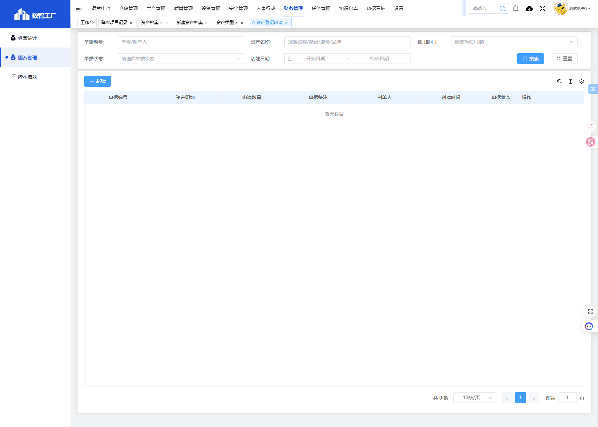
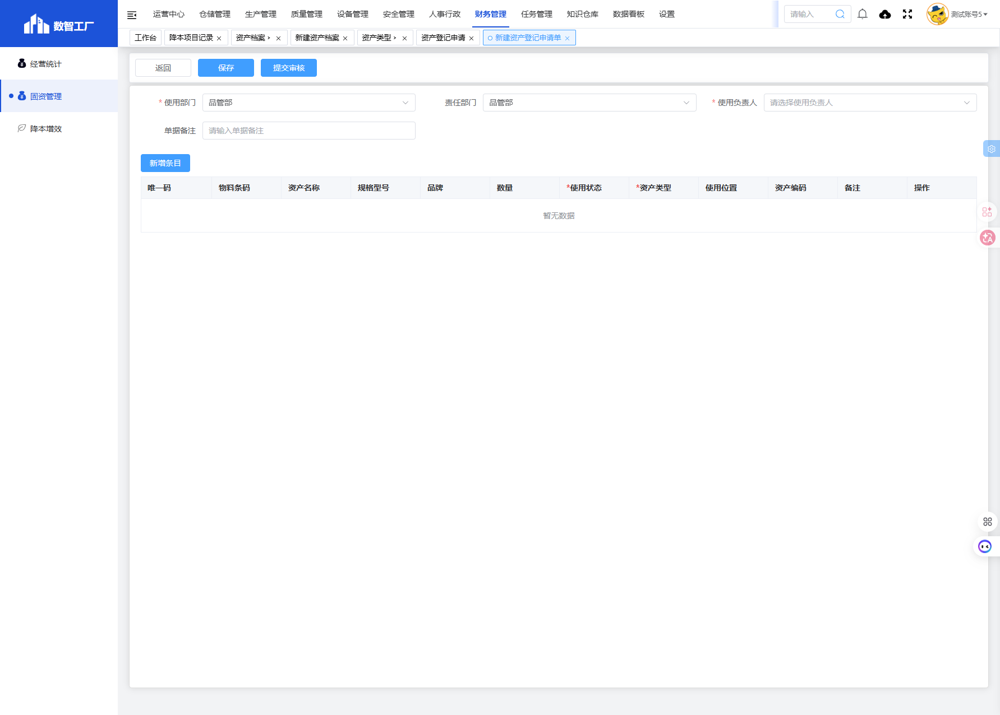

# 资产登记申请模块

## 一、模块概述

资产登记申请模块用于提交固定资产登记申请，包括填写资产明细、使用部门、使用负责人等信息，实现资产登记流程的规范化管理。

- **页面URL**：`#/financial-manage/index6/property-register-apply`
- **完整URL**：`https://gdmms.y1b.cn:8424/#/financial-manage/index6/property-register-apply`

## 二、功能定位

| 功能维度 | 说明 |
| :--- | :--- |
| **核心功能** | 固定资产登记申请管理 |
| **数据来源** | 申请人填写 |
| **目标用户** | 资产管理员、各部门资产申请人 |
| **输出形式** | 资产登记申请单 |

## 三、列表页面结构

### 3.1 搜索筛选字段

| 字段编号 | 字段名称 | 类型 | 必填 | 描述 |
| :--- | :--- | :--- | :--- | :--- |
| 1 | 单据编号 | 文本输入框 | 否 | 输入单据编号进行搜索 |
| 2 | 资产名称 | 文本输入框 | 否 | 输入资产名称进行搜索 |
| 3 | 使用部门 | 文本输入框 | 否 | 使用部门（只读） |
| 4 | 单据状态 | 下拉选择框 | 否 | 选择单据状态进行筛选 |
| 5 | 创建日期-开始日期 | 日期选择器 | 否 | 创建日期开始范围 |
| 6 | 创建日期-结束日期 | 日期选择器 | 否 | 创建日期结束范围 |

### 3.2 操作按钮

| 按钮名称 | 描述 |
| :--- | :--- |
| 重置 | 清空搜索条件 |
| 搜索 | 执行搜索 |
| 新建 | 新建资产登记申请 |

### 3.3 列表表格字段

| 字段编号 | 列名 | 类型 | 描述 |
| :--- | :--- | :--- | :--- |
| 1 | 单据编号 | 文本 | 单据编号 |
| 2 | 资产明细 | 文本 | 资产明细信息 |
| 3 | 申请数量 | 数值 | 申请数量 |
| 4 | 单据备注 | 文本 | 单据备注 |
| 5 | 制单人 | 文本 | 制单人员 |
| 6 | 创建时间 | 日期时间 | 创建时间 |
| 7 | 单据状态 | 文本 | 单据当前状态 |
| 8 | 操作 | 按钮 | 编辑/删除/查看等操作 |

## 四、新增页面结构

### 4.1 操作按钮

| 按钮名称 | 描述 |
| :--- | :--- |
| 返回 | 返回列表页面 |
| 保存 | 保存草稿 |
| 提交审核 | 提交审核 |

### 4.2 基本信息字段

| 字段编号 | 字段名称 | 类型 | 必填 | 默认值 | 描述 |
| :--- | :--- | :--- | :--- | :--- | :--- |
| 1 | 使用部门 | 文本输入框 | **是** | 当前部门 | 使用部门 |
| 2 | 责任部门 | 文本输入框 | 否 | 当前部门 | 责任部门 |
| 3 | 使用负责人 | 下拉选择框 | **是** | 空 | 使用负责人 |
| 4 | 单据备注 | 文本输入框 | 否 | 空 | 单据备注 |

### 4.3 资产明细表格字段

| 字段编号 | 列名 | 类型 | 必填 | 描述 |
| :--- | :--- | :--- | :--- | :--- |
| 1 | 唯一码 | 文本输入框 | 否 | 资产唯一标识码 |
| 2 | 物料条码 | 文本输入框 | 否 | 物料条码 |
| 3 | 资产名称 | 文本输入框 | **是** | 资产名称 |
| 4 | 规格型号 | 文本输入框 | 否 | 规格型号 |
| 5 | 品牌 | 文本输入框 | 否 | 品牌 |
| 6 | 数量 | 数值输入框 | **是** | 数量 |
| 7 | 使用状态 | 下拉选择框 | **是** | 使用状态 |
| 8 | 资产类型 | 下拉选择框 | **是** | 资产类型 |
| 9 | 使用位置 | 文本输入框 | 否 | 使用位置 |
| 10 | 资产编码 | 文本输入框 | 否 | 资产编码 |
| 11 | 备注 | 文本输入框 | 否 | 备注 |
| 12 | 操作 | 按钮 | - | 删除行 |

### 4.4 操作按钮

| 按钮名称 | 描述 |
| :--- | :--- |
| 新增条目 | 添加资产明细行 |

## 五、交互操作

1. **搜索**：输入单据编号/资产名称、选择单据状态、设置日期范围，点击"搜索"按钮查询数据
2. **重置**：点击"重置"按钮清空搜索条件
3. **新建**：点击"新建"按钮进入新建资产登记申请页面
4. **新增条目**：点击"新增条目"按钮添加资产明细行
5. **保存**：点击"保存"按钮保存草稿
6. **提交审核**：点击"提交审核"按钮提交审核
7. **返回**：点击"返回"按钮返回列表页面

## 六、截图记录

### 6.1 列表页面

### 6.2 新增表单

## 七、注意事项

1. 使用部门、使用负责人为必填项
2. 资产明细中的资产名称、数量、使用状态、资产类型为必填项
3. 使用部门默认显示当前用户所属部门
4. 可添加多条资产明细
