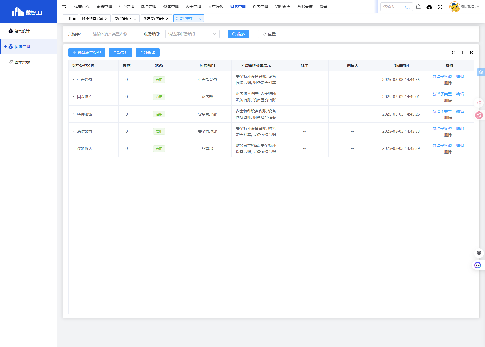
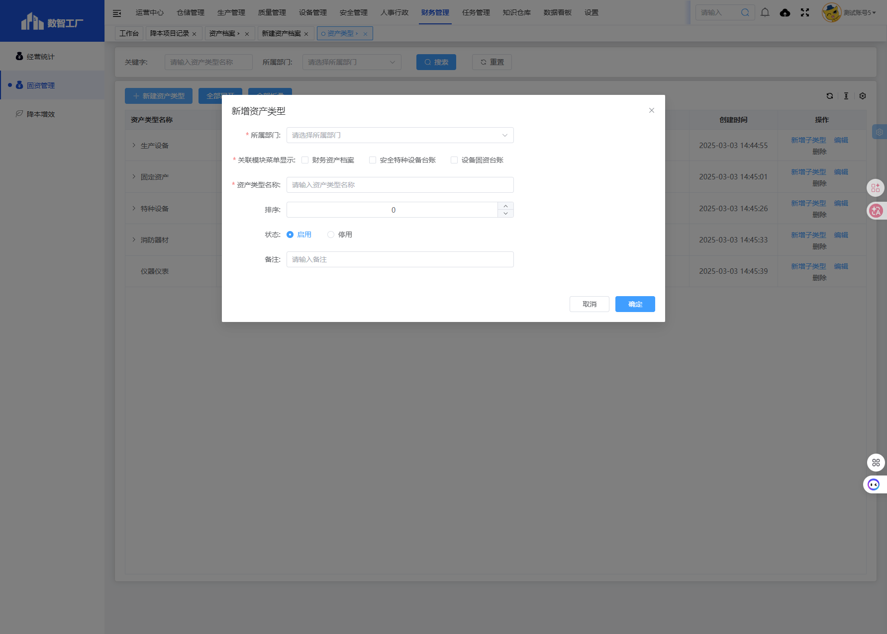

# 资产类型模块

## 一、模块概述

资产类型模块用于管理固定资产的分类体系，包括定义资产类型名称、所属部门、关联模块菜单显示等，实现资产分类的标准化管理。

- **页面URL**：`#/financial-manage/index6/device-type`
- **完整URL**：`https://gdmms.y1b.cn:8424/#/financial-manage/index6/device-type`

## 二、功能定位

| 功能维度 | 说明 |
| :--- | :--- |
| **核心功能** | 资产类型分类管理与配置 |
| **数据来源** | 管理员手动配置 |
| **目标用户** | 资产管理专员、系统管理员 |
| **输出形式** | 资产类型列表、资产分类层级 |

## 三、列表页面结构

### 3.1 搜索筛选字段

| 字段编号 | 字段名称 | 类型 | 必填 | 描述 |
| :--- | :--- | :--- | :--- | :--- |
| 1 | 关键字 | 文本输入框 | 否 | 输入关键字进行搜索 |
| 2 | 所属部门 | 下拉选择框 | 否 | 选择所属部门进行筛选 |

### 3.2 操作按钮

| 按钮名称 | 描述 |
| :--- | :--- |
| 搜索 | 执行搜索 |
| 重置 | 清空搜索条件 |
| 新建资产类型 | 新建资产类型 |
| 全部展开 | 展开所有子类型 |
| 全部折叠 | 折叠所有子类型 |

### 3.3 列表表格字段

| 字段编号 | 列名 | 类型 | 描述 |
| :--- | :--- | :--- | :--- |
| 1 | 资产类型名称 | 文本 | 资产类型名称 |
| 2 | 排序 | 数值 | 排序序号 |
| 3 | 状态 | 文本 | 状态（启用/停用） |
| 4 | 所属部门 | 文本 | 所属部门 |
| 5 | 关联模块菜单显示 | 文本 | 关联的模块菜单 |
| 6 | 备注 | 文本 | 备注说明 |
| 7 | 创建人 | 文本 | 创建人员 |
| 8 | 创建时间 | 日期时间 | 创建时间 |
| 9 | 操作 | 按钮 | 新增子类型/编辑/删除 |

### 3.4 现有资产类型数据

| 资产类型名称 | 状态 | 所属部门 | 关联模块菜单 |
| :--- | :--- | :--- | :--- |
| 生产设备 | 启用 | 生产部设备 | 安全特种设备台账, 设备固资台账, 财务资产档案 |
| 固定资产 | 启用 | 财务部 | 财务资产档案, 安全特种设备台账, 设备固资台账 |
| 特种设备 | 启用 | 安全管理部 | 安全特种设备台账, 设备固资台账, 财务资产档案 |
| 消防器材 | 启用 | 安全管理部 | 安全特种设备台账, 财务资产档案, 设备固资台账 |
| 仪器仪表 | 启用 | 品管部 | 财务资产档案, 安全特种设备台账, 设备固资台账 |

## 四、新增页面结构

### 4.1 操作按钮

| 按钮名称 | 描述 |
| :--- | :--- |
| 取消 | 取消新增操作 |
| 确定 | 保存资产类型 |

### 4.2 表单字段

| 字段编号 | 字段名称 | 类型 | 必填 | 默认值 | 描述 |
| :--- | :--- | :--- | :--- | :--- | :--- |
| 1 | 资产类型名称 | 文本输入框 | **是** | 空 | 资产类型名称 |
| 2 | 所属部门 | 下拉选择框 | **是** | 空 | 所属部门 |
| 3 | 排序 | 数值输入框 | 否 | 0 | 排序序号 |
| 4 | 状态 | 单选框 | 否 | 启用 | 启用/停用 |
| 5 | 关联模块菜单显示 | 复选框组 | **是** | 空 | 可多选 |
| 6 | 备注 | 文本输入框 | 否 | 空 | 备注说明 |

### 4.3 关联模块菜单选项

| 选项名称 | 描述 |
| :--- | :--- |
| 财务资产档案 | 在财务资产档案模块显示 |
| 安全特种设备台账 | 在安全特种设备台账模块显示 |
| 设备固资台账 | 在设备固资台账模块显示 |

## 五、交互操作

1. **搜索**：输入关键字、选择所属部门，点击"搜索"按钮查询数据
2. **重置**：点击"重置"按钮清空搜索条件
3. **新建资产类型**：点击"新建资产类型"按钮弹出新增对话框
4. **新增子类型**：点击"新增子类型"按钮添加子类型
5. **编辑**：点击"编辑"按钮编辑资产类型信息
6. **删除**：点击"删除"按钮删除资产类型
7. **全部展开**：点击"全部展开"按钮展开所有子类型
8. **全部折叠**：点击"全部折叠"按钮折叠所有子类型
9. **确定**：在新增对话框点击"确定"按钮保存资产类型
10. **取消**：点击"取消"按钮关闭新增对话框

## 六、截图记录

### 6.1 列表页面

### 6.2 新增表单

## 七、注意事项

1. 资产类型名称、所属部门、关联模块菜单显示为必填项
2. 关联模块菜单显示支持多选
3. 可通过新增子类型建立层级关系
4. 排序字段用于控制显示顺序
