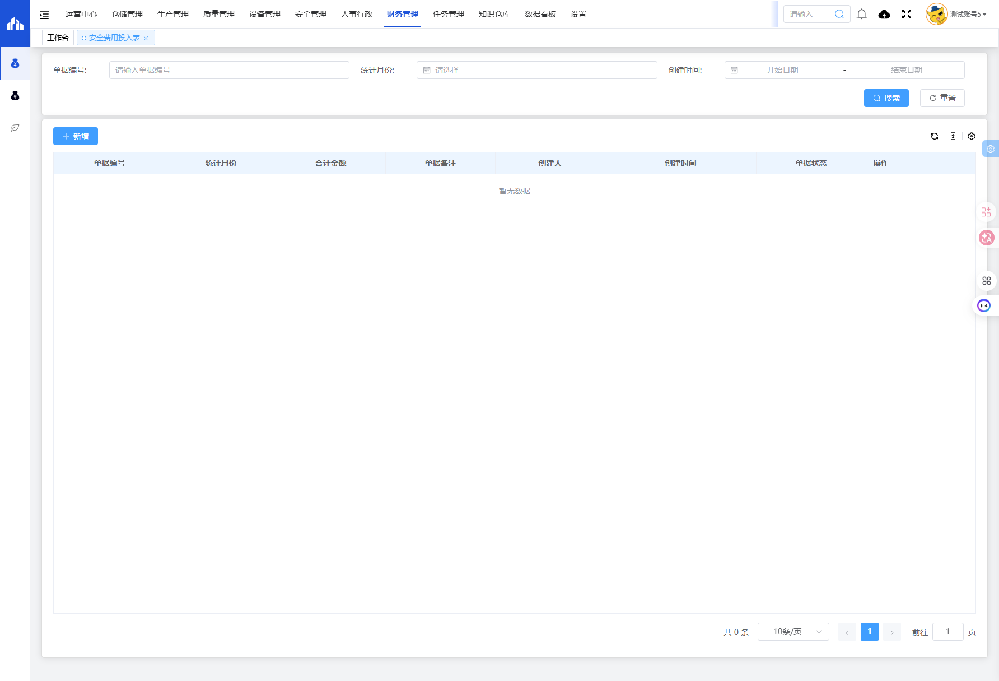
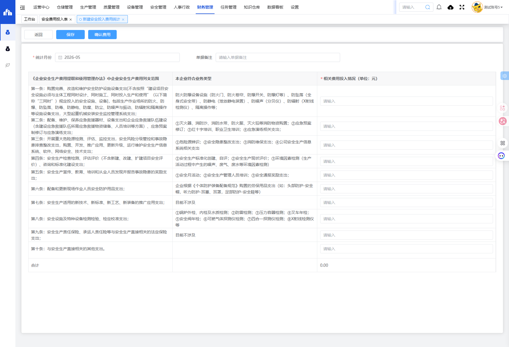
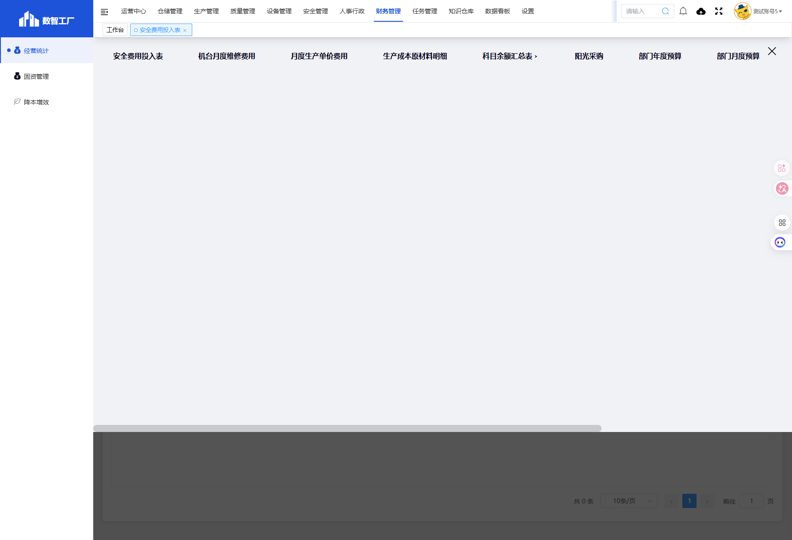

# 安全费用投入表模块

## 一、模块概述

安全费用投入表模块用于统计和管理企业安全费用的投入情况，依据《企业安全生产费用提取和使用管理办法》中企业安全生产费用列支范围，逐条记录各项安全费用投入，确保安全费用的合理使用和合规管理。

- **页面URL**：`#/financial-manage/operating/statistics`
- **完整URL**：`https://gdmms.y1b.cn:8424/#/financial-manage/operating/statistics`

## 二、功能定位

| 功能维度 | 说明 |
| :--- | :--- |
| **核心功能** | 安全费用投入统计与管理 |
| **数据来源** | 财务系统、安全管理系统 |
| **目标用户** | 安全管理人员、财务人员 |
| **输出形式** | 安全费用报表、投入分析报告 |
| **法规依据** | 《企业安全生产费用提取和使用管理办法》 |

## 三、列表页面结构

### 3.1 页面布局

```
┌─────────────────────────────────────────────────────────────┐
│                   安全费用投入表 - 列表页面                  │
├─────────────────────────────────────────────────────────────┤
│  【搜索筛选区域】                                            │
│  ├─ 单据编号（文本输入框）                                  │
│  ├─ 统计月份（月份选择器）                                  │
│  ├─ 创建时间（日期范围选择器）                              │
│  ├─ 重置按钮                                               │
│  └─ 搜索按钮                                               │
├─────────────────────────────────────────────────────────────┤
│  【操作按钮区域】                                            │
│  ├─ 新增按钮                                               │
│  ├─ 更多操作（下拉菜单）                                    │
│  └─ 刷新按钮                                               │
├─────────────────────────────────────────────────────────────┤
│  【数据表格区域】                                            │
│  ├─ 单据编号 | 统计月份 | 合计金额 | 单据备注              │
│  │  创建人 | 创建时间 | 单据状态 | 操作                    │
│  └─ 分页控件                                               │
└─────────────────────────────────────────────────────────────┘
```

### 3.2 搜索筛选字段

| 字段编号 | 字段名称 | 类型 | 必填 | 描述 |
| :--- | :--- | :--- | :--- | :--- |
| 1 | 单据编号 | 文本输入框 | 否 | 输入单据编号进行搜索 |
| 2 | 统计月份 | 月份选择器 | 否 | 选择统计月份进行筛选 |
| 3 | 创建时间-开始日期 | 日期选择器 | 否 | 创建时间起始范围 |
| 4 | 创建时间-结束日期 | 日期选择器 | 否 | 创建时间结束范围 |

### 3.3 列表表格字段

| 字段编号 | 列名 | 类型 | 描述 |
| :--- | :--- | :--- | :--- |
| 1 | 单据编号 | 文本 | 安全费用投入单据编号 |
| 2 | 统计月份 | 文本 | 费用统计月份 |
| 3 | 合计金额 | 数值 | 安全费用合计金额 |
| 4 | 单据备注 | 文本 | 单据备注说明 |
| 5 | 创建人 | 文本 | 单据创建人员 |
| 6 | 创建时间 | 日期时间 | 单据创建时间 |
| 7 | 单据状态 | 文本 | 单据当前状态 |
| 8 | 操作 | 按钮 | 编辑/删除/查看等操作 |

### 3.4 分页控件

| 控件名称 | 类型 | 描述 |
| :--- | :--- | :--- |
| 每页条数选择 | 下拉框 | 可选10条/页等 |
| 上一页 | 按钮 | 翻到上一页 |
| 页码 | 列表 | 显示当前页码 |
| 下一页 | 按钮 | 翻到下一页 |
| 前往 | 输入框 | 跳转到指定页码 |

## 四、新增页面结构

### 4.1 页面布局

```
┌─────────────────────────────────────────────────────────────┐
│              新建安全投入费用统计 - 新增页面                  │
├─────────────────────────────────────────────────────────────┤
│  【顶部操作按钮】                                            │
│  ├─ 返回按钮                                               │
│  ├─ 保存按钮                                               │
│  └─ 确认费用按钮                                           │
├─────────────────────────────────────────────────────────────┤
│  【基本信息区域】                                            │
│  ├─ *统计月份（月份选择器，必填）                           │
│  └─ 单据备注（文本输入框）                                  │
├─────────────────────────────────────────────────────────────┤
│  【费用投入明细区域】                                        │
│  ├─ 《企业安全生产费用提取和使用管理办法》费用列支范围       │
│  ├─ 本企业符合业务类型                                      │
│  ├─ *相关费用投入情况（单位：元）                           │
│  │  ├─ 第一条：安全防护设施设备支出                         │
│  │  ├─ 第二条：应急救援器材设备支出                         │
│  │  ├─ 第三条：重大危险源检测评估监控支出                   │
│  │  ├─ 第四条：安全生产检查检测评估评价支出                 │
│  │  ├─ 第五条：安全生产宣传教育培训支出                     │
│  │  ├─ 第六条：安全防护用品支出                             │
│  │  ├─ 第七条：新技术新标准新工艺新装备支出                 │
│  │  ├─ 第八条：安全设施及特种设备检测检验支出               │
│  │  ├─ 第九条：安全生产责任保险支出                         │
│  │  └─ 第十条：与安全生产直接相关的其他支出                 │
│  └─ 合计金额                                               │
└─────────────────────────────────────────────────────────────┘
```

### 4.2 基本信息字段

| 字段编号 | 字段名称 | 类型 | 必填 | 默认值 | 描述 |
| :--- | :--- | :--- | :--- | :--- | :--- |
| 1 | 统计月份 | 月份选择器 | **是** | 当前月份 | 选择费用统计的月份 |
| 2 | 单据备注 | 文本输入框 | 否 | 空 | 填写单据备注说明 |

### 4.3 费用投入明细字段（依据《企业安全生产费用提取和使用管理办法》）

| 字段编号 | 条款名称 | 本企业符合业务类型 | 类型 | 必填 | 描述 |
| :--- | :--- | :--- | :--- | :--- | :--- |
| 1 | 第一条 | 防火防爆设备设施（防火门、防火卷帘、防爆开关、防爆灯等）、防坠落（全身式安全带）、防静电（泄放静电装置）、防噪声（分贝仪）、防辐射（X射线检测仪）、隔离操作等 | 数值输入 | 否 | 购置完善、改造和维护安全防护设施设备支出 |
| 2 | 第二条 | ①灭火器、消防沙、消防水带、防火服、灭火毯等消防物资购置；②应急预案修订；③红十字培训、职业卫生培训；④应急演练相关支出 | 数值输入 | 否 | 应急救援器材、设备支出和应急演练支出 |
| 3 | 第三条 | ①危险源辨识；②安全隐患整改支出；③消防维保支出；④公司安全生产信息系统相关支出 | 数值输入 | 否 | 重大危险源检测、评估、监控支出，安全风险分级管控和事故隐患排查整改支出 |
| 4 | 第四条 | ①安全生产标准化创建、自评；②安全生产现状评价；③环境因素检测（生产活动过程中产生的噪声、废气、废水等环境因素检测） | 数值输入 | 否 | 安全生产检查检测、评估评价、咨询和标准化建设支出 |
| 5 | 第五条 | ①安全月活动；②安全生产管理人员培训；③安全通报奖励支出 | 数值输入 | 否 | 安全生产宣传、教育、培训和从业人员发现并报告事故隐患的奖励支出 |
| 6 | 第六条 | 企业根据《个体防护装备配备规范》购置的劳保用品支出（如：头部防护-安全帽，听力防护-耳塞、耳罩，足部防护-安全鞋等） | 数值输入 | 否 | 配备和更新现场作业人员安全防护用品支出 |
| 7 | 第七条 | 目前不涉及 | 数值输入 | 否 | 安全生产适用的新技术、新标准、新工艺、新装备的推广应用支出 |
| 8 | 第八条 | ①锅炉外检、内检及水质检测；②防雷检测；③压力容器检测；④叉车年检；⑤安全阀年检；⑥可燃气体探测仪检测；⑦四合一探测仪检测；⑧X射线检测仪等 | 数值输入 | 否 | 安全设施及特种设备检测检验、检定校准支出 |
| 9 | 第九条 | 目前不涉及 | 数值输入 | 否 | 安全生产责任保险、承运人责任险等与安全生产直接相关的法定保险支出 |
| 10 | 第十条 | （空） | 数值输入 | 否 | 与安全生产直接相关的其他支出 |
| 11 | 合计 | - | 自动计算 | - | 自动汇总以上十条费用合计金额 |

### 4.4 各条款详细说明

#### 第一条：购置完善、改造和维护安全防护设施设备支出

> 不含按照"建设项目安全设施必须与主体工程同时设计、同时施工、同时投入生产和使用"（以下简称"三同时"）规定投入的安全设施、设备，包括生产作业场所的防火、防爆、防坠落、防毒、防静电、防腐、防尘、防噪声与振动、防辐射和隔离操作等设施设备支出，大型起重机械安装安全监控管理系统支出。

**本企业符合业务类型**：防火防爆设备设施（防火门、防火卷帘、防爆开关、防爆灯等）、防坠落（全身式安全带）、防静电（泄放静电装置）、防噪声（分贝仪）、防辐射（X射线检测仪）、隔离操作等

#### 第二条：应急救援器材设备支出

> 配备、维护、保养应急救援器材、设备支出和企业应急救援队伍建设（含建设应急救援队伍所需应急救援物资储备、人员培训等方面）、应急预案制修订与应急演练支出。

**本企业符合业务类型**：①灭火器、消防沙、消防水带、防火服、灭火毯等消防物资购置；②应急预案修订；③红十字培训、职业卫生培训；④应急演练相关支出

#### 第三条：重大危险源检测评估监控支出

> 开展重大危险源检测、评估、监控支出，安全风险分级管控和事故隐患排查整改支出，购置、开发、推广应用、更新升级、运行维护安全生产信息系统、软件、网络安全、技术支出。

**本企业符合业务类型**：①危险源辨识；②安全隐患整改支出；③消防维保支出；④公司安全生产信息系统相关支出

#### 第四条：安全生产检查检测评估评价支出

> 安全生产检查检测、评估评价（不含新建、改建、扩建项目安全评价）、咨询和标准化建设支出。

**本企业符合业务类型**：①安全生产标准化创建、自评；②安全生产现状评价；③环境因素检测（生产活动过程中产生的噪声、废气、废水等环境因素检测）

#### 第五条：安全生产宣传教育培训支出

> 安全生产宣传、教育、培训和从业人员发现并报告事故隐患的奖励支出。

**本企业符合业务类型**：①安全月活动；②安全生产管理人员培训；③安全通报奖励支出

#### 第六条：安全防护用品支出

> 配备和更新现场作业人员安全防护用品支出。

**本企业符合业务类型**：企业根据《个体防护装备配备规范》购置的劳保用品支出（如：头部防护-安全帽，听力防护-耳塞、耳罩，足部防护-安全鞋等）

#### 第七条：新技术新标准新工艺新装备支出

> 安全生产适用的新技术、新标准、新工艺、新装备的推广应用支出。

**本企业符合业务类型**：目前不涉及

#### 第八条：安全设施及特种设备检测检验支出

> 安全设施及特种设备检测检验、检定校准支出。

**本企业符合业务类型**：①锅炉外检、内检及水质检测；②防雷检测；③压力容器检测；④叉车年检；⑤安全阀年检；⑥可燃气体探测仪检测；⑦四合一探测仪检测；⑧X射线检测仪等

#### 第九条：安全生产责任保险支出

> 安全生产责任保险、承运人责任险等与安全生产直接相关的法定保险支出。

**本企业符合业务类型**：目前不涉及

#### 第十条：其他支出

> 与安全生产直接相关的其他支出。

**本企业符合业务类型**：（无具体说明）

## 五、交互操作

### 5.1 列表页面操作

1. **搜索**：输入单据编号、选择统计月份或创建时间范围，点击"搜索"按钮查询数据
2. **重置**：点击"重置"按钮清空搜索条件
3. **新增**：点击"新增"按钮进入新建安全投入费用统计页面
4. **更多操作**：点击更多操作按钮可进行批量操作
5. **刷新**：点击刷新按钮更新列表数据

### 5.2 新增页面操作

1. **填写统计月份**：选择费用统计月份（必填）
2. **填写单据备注**：输入备注说明（选填）
3. **填写费用投入**：逐条输入各条款的费用金额
4. **保存**：点击"保存"按钮保存草稿
5. **确认费用**：点击"确认费用"按钮提交确认
6. **返回**：点击"返回"按钮返回列表页面

## 六、截图记录

### 6.1 列表页面初始状态



### 6.2 列表页面（搜索后）


### 6.3 新增表单页面上部


### 6.4 新增表单页面中部



### 6.5 新增表单页面下部


### 6.6 新增表单完整页面


### 6.7 财务管理菜单结构



## 七、注意事项

1. 安全费用需专款专用，确保投入合规
2. 费用投入依据《企业安全生产费用提取和使用管理办法》进行分类
3. 统计月份为必填项，默认为当前月份
4. 合计金额由系统自动计算，无需手动输入
5. 第七条和第九条目前不涉及，金额默认为0
6. 确认费用操作后单据状态将变更，请确保数据准确后再确认
