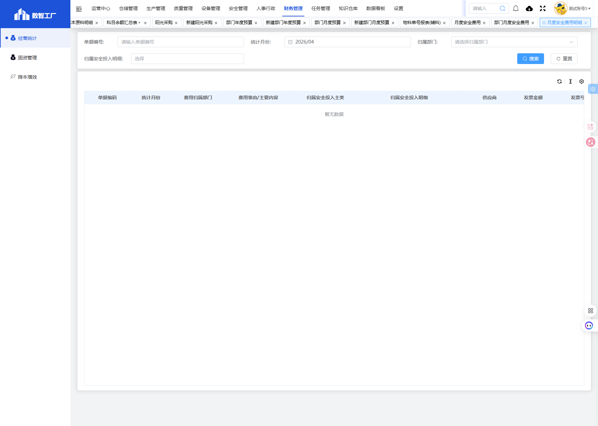

# 月度安全费用明细模块

## 一、模块概述

月度安全费用明细模块用于展示各部门月度安全费用的详细记录，包括费用事由、归属安全投入主类和明细、供应商、发票金额和发票号码等信息，实现安全费用支出的透明化管理。

- **页面URL**：`#/financial-manage/operating/monthly-safety/monthly_safe_cost_summary`
- **完整URL**：`https://gdmms.y1b.cn:8424/#/financial-manage/operating/monthly-safety/monthly_safe_cost_summary`

## 二、功能定位

| 功能维度 | 说明 |
| :--- | :--- |
| **核心功能** | 月度安全费用明细查询与展示 |
| **数据来源** | 部门月度安全费用数据 |
| **目标用户** | 财务人员、安全管理员 |
| **输出形式** | 安全费用明细报表 |

## 三、页面结构

### 3.1 搜索筛选字段

| 字段编号 | 字段名称 | 类型 | 必填 | 描述 |
| :--- | :--- | :--- | :--- | :--- |
| 1 | 单据编号 | 文本输入框 | 否 | 输入单据编号进行搜索 |
| 2 | 统计月份 | 月份选择器 | 否 | 选择统计月份进行筛选，默认上月 |
| 3 | 归属部门 | 文本输入框 | 否 | 输入归属部门进行筛选 |
| 4 | 归属安全投入明细 | 文本输入框(只读) | 否 | 选择安全投入明细分类进行筛选 |

### 3.2 报表表格字段

| 字段编号 | 列名 | 类型 | 描述 |
| :--- | :--- | :--- | :--- |
| 1 | 单据编码 | 文本 | 单据编号 |
| 2 | 统计月份 | 文本 | 费用统计月份 |
| 3 | 费用归属部门 | 文本 | 费用所属部门 |
| 4 | 费用事由/主要内容 | 文本 | 费用事由或主要内容描述 |
| 5 | 归属安全投入主类 | 文本 | 安全投入主分类 |
| 6 | 归属安全投入明细 | 文本 | 安全投入明细分类 |
| 7 | 供应商 | 文本 | 供应商名称 |
| 8 | 发票金额 | 数值 | 发票金额 |
| 9 | 发票号码 | 文本 | 发票号码 |

## 四、交互操作

1. **搜索**：输入单据编号、选择统计月份、归属部门或安全投入明细，点击"搜索"按钮查询数据
2. **重置**：点击"重置"按钮清空搜索条件

## 五、截图记录

### 5.1 列表页面

## 六、注意事项

1. 该页面为只读报表页面，无新增功能
2. 数据来源于部门月度安全费用录入
3. 归属安全投入明细字段为只读，需通过弹窗选择
