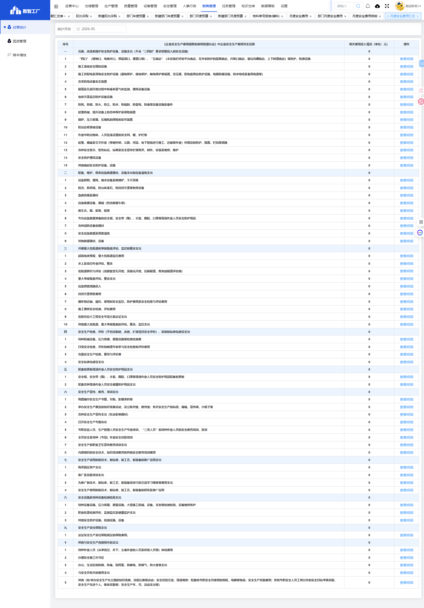

# 月度安全费用汇总模块

## 一、模块概述

月度安全费用汇总模块用于按《企业安全生产费用提取和使用管理办法》中企业安全生产费用列支范围，汇总展示各类安全费用的投入情况，实现安全费用的分类统计和合规管理。

- **页面URL**：`#/financial-manage/operating/monthly-safety/monthly_safe_cost_summary-list`
- **完整URL**：`https://gdmms.y1b.cn:8424/#/financial-manage/operating/monthly-safety/monthly_safe_cost_summary-list`

## 二、功能定位

| 功能维度 | 说明 |
| :--- | :--- |
| **核心功能** | 月度安全费用分类汇总与合规展示 |
| **数据来源** | 部门月度安全费用数据 |
| **目标用户** | 财务人员、安全管理员、合规管理人员 |
| **输出形式** | 安全费用汇总报表 |

## 三、页面结构

### 3.1 搜索筛选字段

| 字段编号 | 字段名称 | 类型 | 必填 | 描述 |
| :--- | :--- | :--- | :--- | :--- |
| 1 | 统计月份 | 月份选择器 | 否 | 选择统计月份进行筛选，默认当前月份 |

### 3.2 汇总表格字段

| 字段编号 | 列名 | 类型 | 描述 |
| :--- | :--- | :--- | :--- |
| 1 | 序号 | 文本 | 分类序号（一~十） |
| 2 | 《企业安全生产费用提取和使用管理办法》中企业安全生产费用列支范围 | 文本 | 安全费用列支范围大类描述 |
| 3 | 相关费用投入情况（单位：元） | 数值 | 该分类下的费用投入金额 |
| 4 | 操作 | 按钮 | 查看明细 |

### 3.3 安全费用分类明细

| 大类序号 | 大类名称 | 明细项数 |
| :--- | :--- | :--- |
| 一 | 完善、改造和维护安全防护设备、设施支出（不含"三同时"要求初期投入的安全设施) | 15项 |
| 二 | 配备、维护、保养应急救援器材、设备支出和应急演练支出 | 9项 |
| 三 | 开展重大危险源和事故隐患评估、监控和整改支出 | 10项 |
| 四 | 安全生产检查、评价（不包括新建、改建、扩建项目安全评价）、咨询和标准化建设支出 | 4项 |
| 五 | 配备和更新现场作业人员安全防护用品支出 | 2项 |
| 六 | 安全生产宣传、教育、培训支出 | 8项 |
| 七 | 安全生产适用的新技术、新标准、新工艺、新装备的推广应用支出 | 4项 |
| 八 | 安全设施及特种设备检测检验支出 | 3项 |
| 九 | 安全生产责任保险支出 | 1项 |
| 十 | 其他与安全生产直接相关的支出 | 5项 |

### 3.4 一级分类明细项

#### 一、完善、改造和维护安全防护设备、设施支出

| 序号 | 明细项 |
| :--- | :--- |
| 1 | "四口"（楼梯口、电梯井口、预留洞口、通道口等）、"五临边"（未安装栏杆的平台临边、无外架防护的层面临边、升降口临边、基坑沟槽临边、上下斜道临边）等防护、防滑设施 |
| 2 | 施工场地安全围挡设施 |
| 3 | 施工供配电及用电安全防护设施（漏电保护、接地保护、触电保护等装置，变压器、配电盘周边防护设施，电器防爆设施，防水电缆及备用电源等） |
| 4 | 各类机电设备安全装置 |
| 5 | 隧道及孔洞幵挖过程中有毒有害气体监测、通风设备设施 |
| 6 | 地质灾害监控防护设备设施 |
| 7 | 防风、防腐、防火、防尘、防水、防辐射、防雷电、防毒等设备设施及备件 |
| 8 | 起重机械、提升设备上的各种保护及保险装置 |
| 9 | 锅炉、压力容器、压缩机的保险和信号装置 |
| 10 | 防治边帮滑坡设备 |
| 11 | 作业中防治物体、人员坠落设置的安全网、棚、护栏等 |
| 12 | 起重、爆破及交叉作业（穿越村镇、公路、河流、地下管线进行施工、运输等作业）所增设的防护、隔离、栏挡等措施 |
| 13 | 各种安全警示、警告标志、标牌及安全宣传栏等购买、制作、安装及维修、维护 |
| 14 | 安全防护通讯设备 |
| 15 | 其他临时安全防护设备、设施 |

#### 二、配备、维护、保养应急救援器材、设备支出和应急演练支出

| 序号 | 明细项 |
| :--- | :--- |
| 1 | 应急照明、通风、抽水设备及锹镐铲、千斤顶等 |
| 2 | 防洪、防坍塌、防山体落石、防自然灾害等物资设备 |
| 3 | 急救药箱及器材 |
| 4 | 应急救援设备、器械（包括救援车等） |
| 5 | 救生衣、圈、船等 |
| 6 | 专为应急救援准备的安全帽、安全带（绳）、手套、雨鞋、口罩等现场作业人员安全防护用品 |
| 7 | 各种消防设备和器材 |
| 8 | 安全应急救援及预案演练 |
| 9 | 其他救援器材、设备 |

#### 三、开展重大危险源和事故隐患评估、监控和整改支出

| 序号 | 明细项 |
| :--- | :--- |
| 1 | 超前地质预报，重大危险源监控费用 |
| 2 | 水上及高空作业评估、整改 |
| 3 | 危险源辨识与评估（高路堑坚石开挖、深基坑幵挖、瓦斯隧道、既有线隧道评估等) |
| 4 | 重大事故隐患评估、整改支出 |
| 5 | 应急预案措施投入 |
| 6 | 自然灾害预警费用 |
| 7 | 爆炸物运输、储存、使用时安全监控、防护费用及安全检查与评估费用 |
| 8 | 施工便桥安全检测、评估费用 |
| 9 | 危险性较大工程安全专项方案论证支出 |
| 10 | 其他重大危险源、重大事故隐患的评估、整改、监控支出 |

#### 四、安全生产检查、评价、咨询和标准化建设支出

| 序号 | 明细项 |
| :--- | :--- |
| 1 | 特种机械设备、压力容器、避雷设施等检查检测费 |
| 2 | 日常安全检查、评价和聘请专家参与安全检查和评价费用 |
| 3 | 各级安全生产检查、督导与评价费 |
| 4 | 安全标准化建设支出 |

#### 五、配备和更新现场作业人员安全防护用品支出

| 序号 | 明细项 |
| :--- | :--- |
| 1 | 安全帽、安全带（绳）、手套、雨鞋、口罩等现场作业人员安全防护用品配备和更新 |
| 2 | 配备各种现场作业人员安全健康防护用品支出 |

#### 六、安全生产宣传、教育、培训支出

| 序号 | 明细项 |
| :--- | :--- |
| 1 | 购置编印安全生产书籍、刊物、影像资料等 |
| 2 | 举办安全生产展览和知识竞赛活动，设立陈列室、教育室；有关安全生产的标语、横幅、宣传画、小册子等 |
| 3 | 各种安全生产宣传支出（包含影响器材） |
| 4 | 召开安全生产专题会议 |
| 5 | 专职安监人员、生产管理人员安全生产专业培训，"三类人员"和特种作业人员的安全教育培训、复训 |
| 6 | 全员安全及特种（专项）作业安全技能培训 |
| 7 | 安全生产和职业卫生宣传教育培训支出 |
| 8 | 内部组织的安全技术、知识培训教育和其他安全教育培训费用 |

#### 七、安全生产适用的新技术、新标准、新工艺、新装备的推广应用支出

| 序号 | 明细项 |
| :--- | :--- |
| 1 | 购买固定资产支出 |
| 2 | 推广及技能培训支出 |
| 3 | 为推广新技术，新标准，新工艺，新装备而进行的交流学习观摩等费用支出 |
| 4 | 安全生产使用的新技术，新标准，新工艺，新装备的研发及推广应用 |

#### 八、安全设施及特种设备检测检验支出

| 序号 | 明细项 |
| :--- | :--- |
| 1 | 特种设备设施、压力容器、避雷设施、大型施工机械、设备、支架等检测检验、设备维修养护 |
| 2 | 职业危害检测评价、监测监控及健康监护支出 |
| 3 | 其他安全防护设施、检测设施、设备 |

#### 九、安全生产责任保险支出

| 序号 | 明细项 |
| :--- | :--- |
| 1 | 法定安全生产责任保险规定的保险费用 |

#### 十、其他与安全生产直接相关的支出

| 序号 | 明细项 |
| :--- | :--- |
| 1 | 特种作业人员（从事高空、井下、尘毒作业的人员及炊管人员等）体检费用 |
| 2 | 办理安全施工许可证 |
| 3 | 办公、生活区的防腐、防毒、防四害、防触电、防煤气、防火患等支出 |
| 4 | 与安全员有关的费用支出 |
| 5 | 其他（如:举办安全生产为主题的知识竞赛、技能比赛等活动；安全经验交流、现场观摩；配备给专职安全员使用的相机、电脑等物品；安全生产奖励费用等） |

## 四、交互操作

1. **搜索**：选择统计月份，点击"搜索"按钮查询数据
2. **查看明细**：点击"查看明细"按钮查看该分类下的详细费用记录

## 五、截图记录

### 5.1 列表页面

## 六、注意事项

1. 该页面为只读报表页面，无新增功能
2. 费用分类依据《企业安全生产费用提取和使用管理办法》
3. 共分十大类，61个明细项
4. 每个明细项均可点击"查看明细"查看具体费用记录
