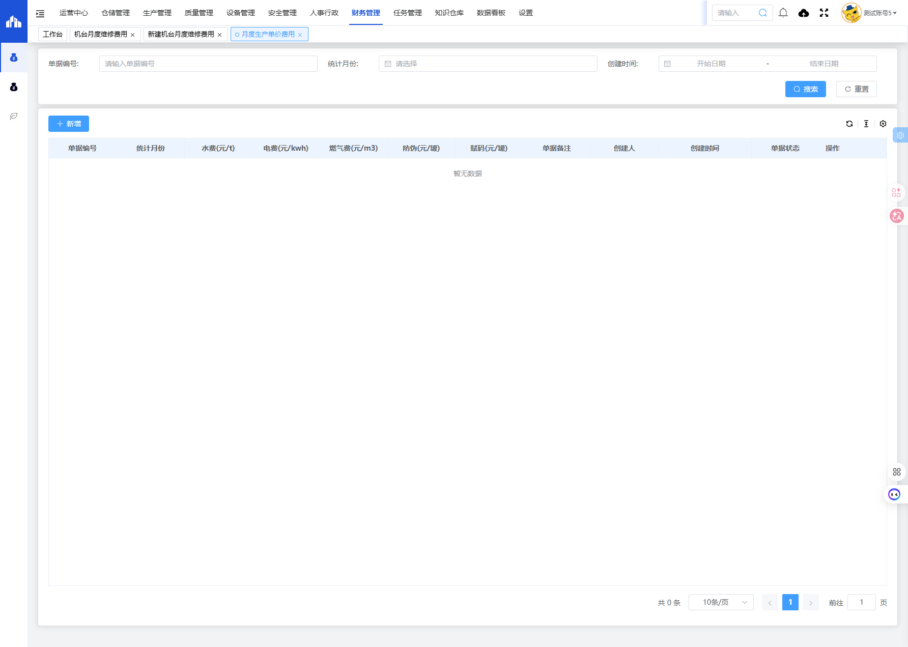
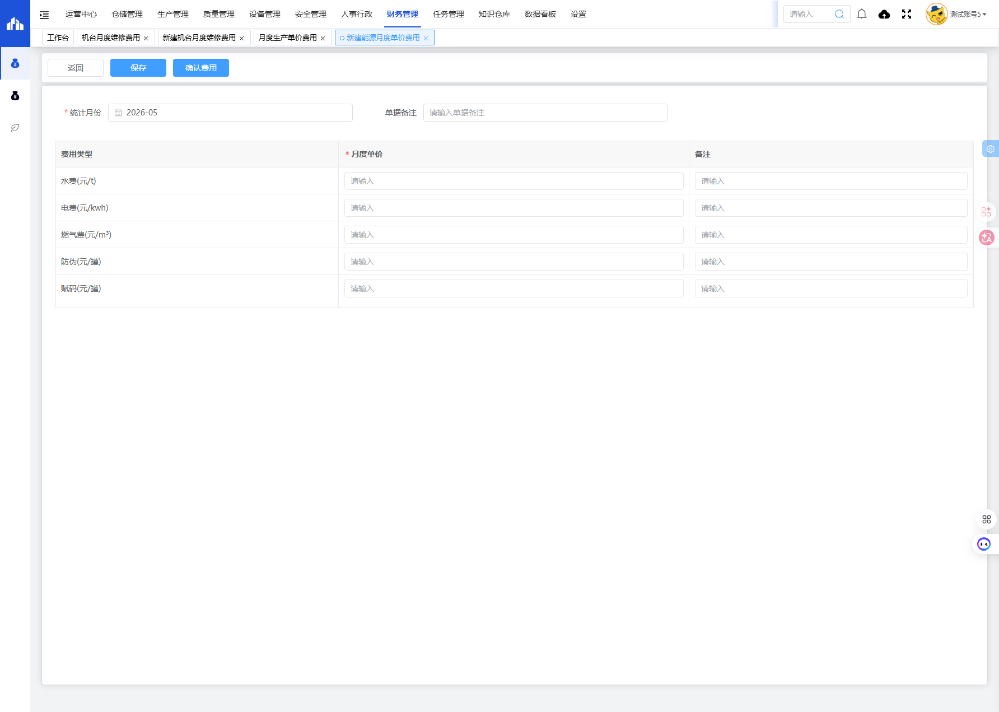

# 月度生产单价费用模块

## 一、模块概述

月度生产单价费用模块用于统计和管理每月生产过程中各类能源及服务的单价费用，包括水费、电费、燃气费、防伪费、赋码费等，实现生产成本单价的跟踪和管理。

- **页面URL**：`#/financial-manage/operating/energy-price`
- **完整URL**：`https://gdmms.y1b.cn:8424/#/financial-manage/operating/energy-price`

## 二、功能定位

| 功能维度 | 说明 |
| :--- | :--- |
| **核心功能** | 月度生产单价费用统计与管理 |
| **数据来源** | 供应商账单、能源计量数据 |
| **目标用户** | 财务人员、生产管理人员 |
| **输出形式** | 单价费用报表、成本趋势分析 |

## 三、列表页面结构

### 3.1 搜索筛选字段

| 字段编号 | 字段名称 | 类型 | 必填 | 描述 |
| :--- | :--- | :--- | :--- | :--- |
| 1 | 单据编号 | 文本输入框 | 否 | 输入单据编号进行搜索 |
| 2 | 统计月份 | 月份选择器 | 否 | 选择统计月份进行筛选 |
| 3 | 创建时间-开始日期 | 日期选择器 | 否 | 创建时间起始范围 |
| 4 | 创建时间-结束日期 | 日期选择器 | 否 | 创建时间结束范围 |

### 3.2 列表表格字段

| 字段编号 | 列名 | 类型 | 描述 |
| :--- | :--- | :--- | :--- |
| 1 | 单据编号 | 文本 | 单价费用单据编号 |
| 2 | 统计月份 | 文本 | 费用统计月份 |
| 3 | 水费(元/t) | 数值 | 每吨水费单价 |
| 4 | 电费(元/kwh) | 数值 | 每度电费单价 |
| 5 | 燃气费(元/m³) | 数值 | 每立方米燃气费单价 |
| 6 | 防伪(元/罐) | 数值 | 每罐防伪费用单价 |
| 7 | 赋码(元/罐) | 数值 | 每罐赋码费用单价 |
| 8 | 单据备注 | 文本 | 单据备注说明 |
| 9 | 创建人 | 文本 | 单据创建人员 |
| 10 | 创建时间 | 日期时间 | 单据创建时间 |
| 11 | 单据状态 | 文本 | 单据当前状态 |
| 12 | 操作 | 按钮 | 编辑/删除/查看等操作 |

## 四、新增页面结构

### 4.1 基本信息字段

| 字段编号 | 字段名称 | 类型 | 必填 | 默认值 | 描述 |
| :--- | :--- | :--- | :--- | :--- | :--- |
| 1 | 统计月份 | 月份选择器 | **是** | 当前月份 | 选择费用统计的月份 |
| 2 | 单据备注 | 文本输入框 | 否 | 空 | 填写单据备注说明 |

### 4.2 操作按钮

| 按钮名称 | 描述 |
| :--- | :--- |
| 返回 | 返回列表页面 |
| 保存 | 保存草稿 |
| 确认费用 | 提交确认费用 |

### 4.3 费用明细字段

| 字段编号 | 费用类型 | 单位 | 类型 | 必填 | 描述 |
| :--- | :--- | :--- | :--- | :--- | :--- |
| 1 | 水费 | 元/t | 数值输入 | **是** | 每吨水费单价 |
| 2 | 电费 | 元/kwh | 数值输入 | **是** | 每度电费单价 |
| 3 | 燃气费 | 元/m³ | 数值输入 | **是** | 每立方米燃气费单价 |
| 4 | 防伪 | 元/罐 | 数值输入 | **是** | 每罐防伪费用单价 |
| 5 | 赋码 | 元/罐 | 数值输入 | **是** | 每罐赋码费用单价 |

每项费用均包含"月度单价"和"备注"两个输入字段。

## 五、交互操作

### 5.1 列表页面操作

1. **搜索**：输入单据编号、选择统计月份或创建时间范围，点击"搜索"按钮查询数据
2. **重置**：点击"重置"按钮清空搜索条件
3. **新增**：点击"新增"按钮进入新建月度生产单价费用页面
4. **更多操作**：点击更多操作按钮可进行批量操作
5. **刷新**：点击刷新按钮更新列表数据

### 5.2 新增页面操作

1. **填写统计月份**：选择费用统计月份（必填）
2. **填写单据备注**：输入备注说明（选填）
3. **填写费用单价**：逐项输入各费用类型的月度单价和备注
4. **保存**：点击"保存"按钮保存草稿
5. **确认费用**：点击"确认费用"按钮提交确认
6. **返回**：点击"返回"按钮返回列表页面

## 六、截图记录

### 6.1 列表页面

### 6.2 新增表单

## 七、注意事项

1. 统计月份为必填项，默认为当前月份
2. 所有费用单价均为必填项
3. 确认费用操作后单据状态将变更，请确保数据准确后再确认
4. 费用类型包括水费、电费、燃气费、防伪费、赋码费五项
