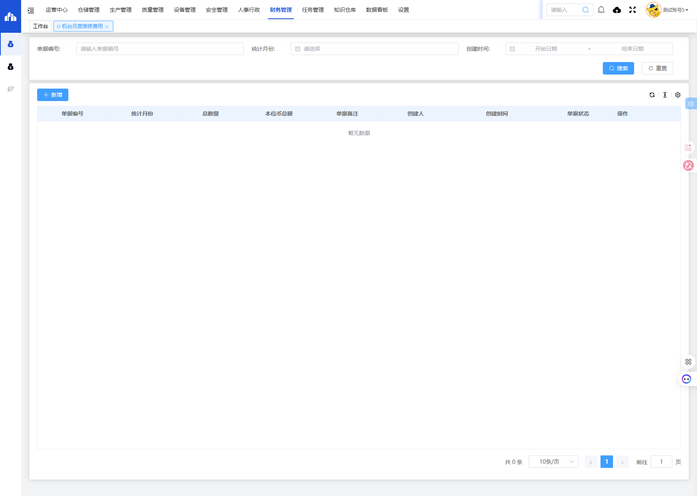
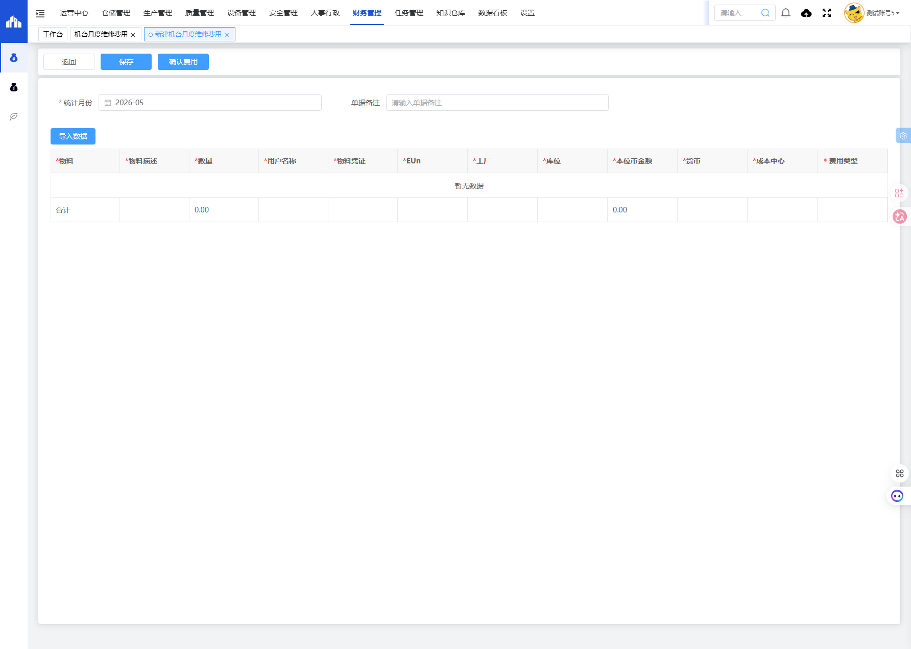

# 机台月度维修费用模块

## 一、模块概述

机台月度维修费用模块用于统计和管理各机台每月的维修费用，记录维修物料、费用类型、成本中心等信息，实现维修成本的精细化管理。

- **页面URL**：`#/financial-manage/operating/machine-cost`
- **完整URL**：`https://gdmms.y1b.cn:8424/#/financial-manage/operating/machine-cost`

## 二、功能定位

| 功能维度 | 说明 |
| :--- | :--- |
| **核心功能** | 机台月度维修费用统计与管理 |
| **数据来源** | SAP系统物料数据、维修工单 |
| **目标用户** | 设备管理人员、财务人员 |
| **输出形式** | 维修费用报表、成本分析报告 |

## 三、列表页面结构

### 3.1 搜索筛选字段

| 字段编号 | 字段名称 | 类型 | 必填 | 描述 |
| :--- | :--- | :--- | :--- | :--- |
| 1 | 单据编号 | 文本输入框 | 否 | 输入单据编号进行搜索 |
| 2 | 统计月份 | 月份选择器 | 否 | 选择统计月份进行筛选 |
| 3 | 创建时间-开始日期 | 日期选择器 | 否 | 创建时间起始范围 |
| 4 | 创建时间-结束日期 | 日期选择器 | 否 | 创建时间结束范围 |

### 3.2 列表表格字段

| 字段编号 | 列名 | 类型 | 描述 |
| :--- | :--- | :--- | :--- |
| 1 | 单据编号 | 文本 | 维修费用单据编号 |
| 2 | 统计月份 | 文本 | 费用统计月份 |
| 3 | 总数量 | 数值 | 维修物料总数量 |
| 4 | 本位币总额 | 数值 | 本位币合计金额 |
| 5 | 单据备注 | 文本 | 单据备注说明 |
| 6 | 创建人 | 文本 | 单据创建人员 |
| 7 | 创建时间 | 日期时间 | 单据创建时间 |
| 8 | 单据状态 | 文本 | 单据当前状态 |
| 9 | 操作 | 按钮 | 编辑/删除/查看等操作 |

## 四、新增页面结构

### 4.1 基本信息字段

| 字段编号 | 字段名称 | 类型 | 必填 | 默认值 | 描述 |
| :--- | :--- | :--- | :--- | :--- | :--- |
| 1 | 统计月份 | 月份选择器 | **是** | 当前月份 | 选择费用统计的月份 |
| 2 | 单据备注 | 文本输入框 | 否 | 空 | 填写单据备注说明 |

### 4.2 操作按钮

| 按钮名称 | 描述 |
| :--- | :--- |
| 返回 | 返回列表页面 |
| 保存 | 保存草稿 |
| 确认费用 | 提交确认费用 |
| 导入数据 | 从SAP导入物料数据 |

### 4.3 明细表格字段

| 字段编号 | 列名 | 类型 | 必填 | 描述 |
| :--- | :--- | :--- | :--- | :--- |
| 1 | 物料 | 文本 | **是** | SAP物料编码 |
| 2 | 物料描述 | 文本 | **是** | 物料名称描述 |
| 3 | 数量 | 数值 | **是** | 使用数量 |
| 4 | 用户名称 | 文本 | **是** | 使用人/部门名称 |
| 5 | 物料凭证 | 文本 | **是** | SAP物料凭证号 |
| 6 | EUn | 文本 | **是** | 计量单位 |
| 7 | 工厂 | 文本 | **是** | 工厂代码 |
| 8 | 库位 | 文本 | **是** | 仓库库位 |
| 9 | 本位币金额 | 数值 | **是** | 本位币金额 |
| 10 | 货币 | 文本 | **是** | 币种 |
| 11 | 成本中心 | 文本 | **是** | 成本中心代码 |
| 12 | 费用类型 | 文本 | **是** | 费用分类 |

### 4.4 合计行

| 字段 | 值 |
| :--- | :--- |
| 合计本位币金额 | 自动计算 |

## 五、交互操作

### 5.1 列表页面操作

1. **搜索**：输入单据编号、选择统计月份或创建时间范围，点击"搜索"按钮查询数据
2. **重置**：点击"重置"按钮清空搜索条件
3. **新增**：点击"新增"按钮进入新建机台月度维修费用页面
4. **更多操作**：点击更多操作按钮可进行批量操作
5. **刷新**：点击刷新按钮更新列表数据

### 5.2 新增页面操作

1. **填写统计月份**：选择费用统计月份（必填）
2. **填写单据备注**：输入备注说明（选填）
3. **导入数据**：点击"导入数据"按钮从SAP导入物料数据
4. **填写明细**：逐条输入或导入物料明细信息
5. **保存**：点击"保存"按钮保存草稿
6. **确认费用**：点击"确认费用"按钮提交确认
7. **返回**：点击"返回"按钮返回列表页面

## 六、截图记录

### 6.1 列表页面

### 6.2 新增表单

## 七、注意事项

1. 物料数据可通过"导入数据"功能从SAP系统导入
2. 统计月份为必填项，默认为当前月份
3. 本位币金额合计由系统自动计算
4. 确认费用操作后单据状态将变更，请确保数据准确后再确认
5. 所有明细字段均为必填项
