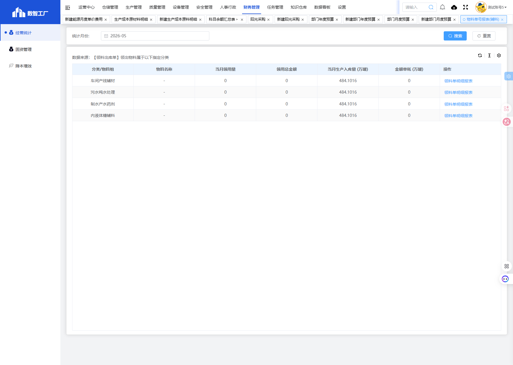

# 物料单号报表(辅料)模块

## 一、模块概述

物料单号报表(辅料)模块用于统计和展示辅料物料的领用情况，按物料组分类汇总当月领用量、领用总金额、当月生产入库量和金额单耗，实现辅料消耗的实时监控和分析。

- **页面URL**：`#/financial-manage/operating/material-order-number`
- **完整URL**：`https://gdmms.y1b.cn:8424/#/financial-manage/operating/material-order-number`

## 二、功能定位

| 功能维度 | 说明 |
| :--- | :--- |
| **核心功能** | 辅料物料领用统计与单耗分析 |
| **数据来源** | 领料出库单数据 |
| **目标用户** | 财务人员、生产管理人员 |
| **输出形式** | 辅料消耗报表、单耗分析报告 |

## 三、页面结构

### 3.1 搜索筛选字段

| 字段编号 | 字段名称 | 类型 | 必填 | 描述 |
| :--- | :--- | :--- | :--- | :--- |
| 1 | 统计月份 | 月份选择器 | 否 | 选择统计月份进行筛选，默认当前月份 |

### 3.2 数据说明

数据来源：【领料出库单】领出物料属于以下指定分类

### 3.3 报表表格字段

| 字段编号 | 列名 | 类型 | 描述 |
| :--- | :--- | :--- | :--- |
| 1 | 分类/物料组 | 文本 | 物料分类或物料组名称 |
| 2 | 物料名称 | 文本 | 物料名称 |
| 3 | 当月领用量 | 数值 | 当月领用数量 |
| 4 | 领用总金额 | 数值 | 领用总金额 |
| 5 | 当月生产入库量 (万罐) | 数值 | 当月生产入库量（万罐） |
| 6 | 金额单耗 (万罐) | 数值 | 每万罐金额单耗 |
| 7 | 操作 | 按钮 | 领料单明细报表 |

### 3.4 物料分类

| 分类编号 | 分类名称 | 描述 |
| :--- | :--- | :--- |
| 1 | 车间产线辅材 | 生产车间产线使用的辅助材料 |
| 2 | 污水吨水处理 | 污水处理使用的药剂 |
| 3 | 制水产水药剂 | 制水处理使用的药剂 |
| 4 | 内液体糖辅料 | 液体糖生产使用的辅料 |

## 四、交互操作

1. **搜索**：选择统计月份，点击"搜索"按钮查询数据
2. **重置**：点击"重置"按钮清空搜索条件
3. **领料单明细报表**：点击"领料单明细报表"按钮查看该物料组的详细领料记录

## 五、截图记录

### 5.1 列表页面

## 六、注意事项

1. 数据来源于领料出库单中指定分类的物料
2. 金额单耗 = 领用总金额 / 当月生产入库量（万罐）
3. 当月生产入库量单位为万罐
4. 该页面为只读报表页面，无新增功能
