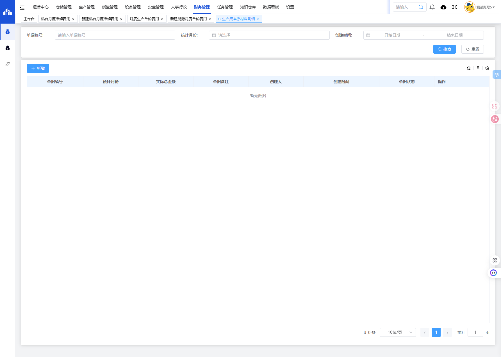
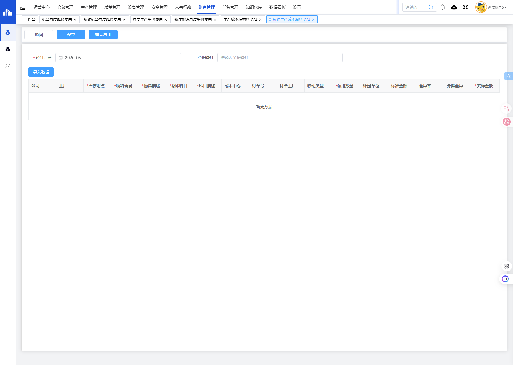

# 生产成本原材料明细模块

## 一、模块概述

生产成本原材料明细模块用于统计和管理生产过程中原材料的领用成本明细，记录物料编码、总账科目、成本中心、领用数量、实际金额等信息，实现生产成本的精细化管理。

- **页面URL**：`#/financial-manage/operating/raw-cost`
- **完整URL**：`https://gdmms.y1b.cn:8424/#/financial-manage/operating/raw-cost`

## 二、功能定位

| 功能维度 | 说明 |
| :--- | :--- |
| **核心功能** | 生产成本原材料领用明细统计与管理 |
| **数据来源** | SAP系统物料凭证数据 |
| **目标用户** | 财务人员、生产管理人员 |
| **输出形式** | 原材料成本报表、成本分析报告 |

## 三、列表页面结构

### 3.1 搜索筛选字段

| 字段编号 | 字段名称 | 类型 | 必填 | 描述 |
| :--- | :--- | :--- | :--- | :--- |
| 1 | 单据编号 | 文本输入框 | 否 | 输入单据编号进行搜索 |
| 2 | 统计月份 | 月份选择器 | 否 | 选择统计月份进行筛选 |
| 3 | 创建时间-开始日期 | 日期选择器 | 否 | 创建时间起始范围 |
| 4 | 创建时间-结束日期 | 日期选择器 | 否 | 创建时间结束范围 |

### 3.2 列表表格字段

| 字段编号 | 列名 | 类型 | 描述 |
| :--- | :--- | :--- | :--- |
| 1 | 单据编号 | 文本 | 原材料明细单据编号 |
| 2 | 统计月份 | 文本 | 费用统计月份 |
| 3 | 实际总金额 | 数值 | 实际领用总金额 |
| 4 | 单据备注 | 文本 | 单据备注说明 |
| 5 | 创建人 | 文本 | 单据创建人员 |
| 6 | 创建时间 | 日期时间 | 单据创建时间 |
| 7 | 单据状态 | 文本 | 单据当前状态 |
| 8 | 操作 | 按钮 | 编辑/删除/查看等操作 |

## 四、新增页面结构

### 4.1 基本信息字段

| 字段编号 | 字段名称 | 类型 | 必填 | 默认值 | 描述 |
| :--- | :--- | :--- | :--- | :--- | :--- |
| 1 | 统计月份 | 月份选择器 | **是** | 当前月份 | 选择费用统计的月份 |
| 2 | 单据备注 | 文本输入框 | 否 | 空 | 填写单据备注说明 |

### 4.2 操作按钮

| 按钮名称 | 描述 |
| :--- | :--- |
| 返回 | 返回列表页面 |
| 保存 | 保存草稿 |
| 确认费用 | 提交确认费用 |
| 导入数据 | 从SAP导入物料数据 |

### 4.3 明细表格字段

| 字段编号 | 列名 | 类型 | 必填 | 描述 |
| :--- | :--- | :--- | :--- | :--- |
| 1 | 公司 | 文本 | 否 | 公司代码 |
| 2 | 工厂 | 文本 | 否 | 工厂代码 |
| 3 | 库存地点 | 文本 | **是** | 仓库库存地点 |
| 4 | 物料编码 | 文本 | **是** | SAP物料编码 |
| 5 | 物料描述 | 文本 | **是** | 物料名称描述 |
| 6 | 总账科目 | 文本 | **是** | 总账科目代码 |
| 7 | 科目描述 | 文本 | **是** | 总账科目名称 |
| 8 | 成本中心 | 文本 | 否 | 成本中心代码 |
| 9 | 订单号 | 文本 | 否 | 生产订单号 |
| 10 | 订单工厂 | 文本 | 否 | 订单所属工厂 |
| 11 | 移动类型 | 文本 | 否 | SAP移动类型代码 |
| 12 | 领用数量 | 数值 | **是** | 实际领用数量 |
| 13 | 计量单位 | 文本 | 否 | 计量单位 |
| 14 | 标准金额 | 数值 | 否 | 标准成本金额 |
| 15 | 差异率 | 数值 | 否 | 标准与实际差异率 |
| 16 | 分摊差异 | 数值 | 否 | 分摊差异金额 |
| 17 | 实际金额 | 数值 | **是** | 实际领用金额 |

## 五、交互操作

### 5.1 列表页面操作

1. **搜索**：输入单据编号、选择统计月份或创建时间范围，点击"搜索"按钮查询数据
2. **重置**：点击"重置"按钮清空搜索条件
3. **新增**：点击"新增"按钮进入新建生产成本原材料明细页面
4. **更多操作**：点击更多操作按钮可进行批量操作
5. **刷新**：点击刷新按钮更新列表数据

### 5.2 新增页面操作

1. **填写统计月份**：选择费用统计月份（必填）
2. **填写单据备注**：输入备注说明（选填）
3. **导入数据**：点击"导入数据"按钮从SAP导入物料数据
4. **填写明细**：逐条输入或导入物料明细信息
5. **保存**：点击"保存"按钮保存草稿
6. **确认费用**：点击"确认费用"按钮提交确认
7. **返回**：点击"返回"按钮返回列表页面

## 六、截图记录

### 6.1 列表页面

### 6.2 新增表单

## 七、注意事项

1. 物料数据可通过"导入数据"功能从SAP系统导入
2. 统计月份为必填项，默认为当前月份
3. 实际金额为必填项，标准金额、差异率、分摊差异为系统自动计算
4. 确认费用操作后单据状态将变更，请确保数据准确后再确认
5. 库存地点、物料编码、物料描述、总账科目、科目描述、领用数量、实际金额为必填字段
