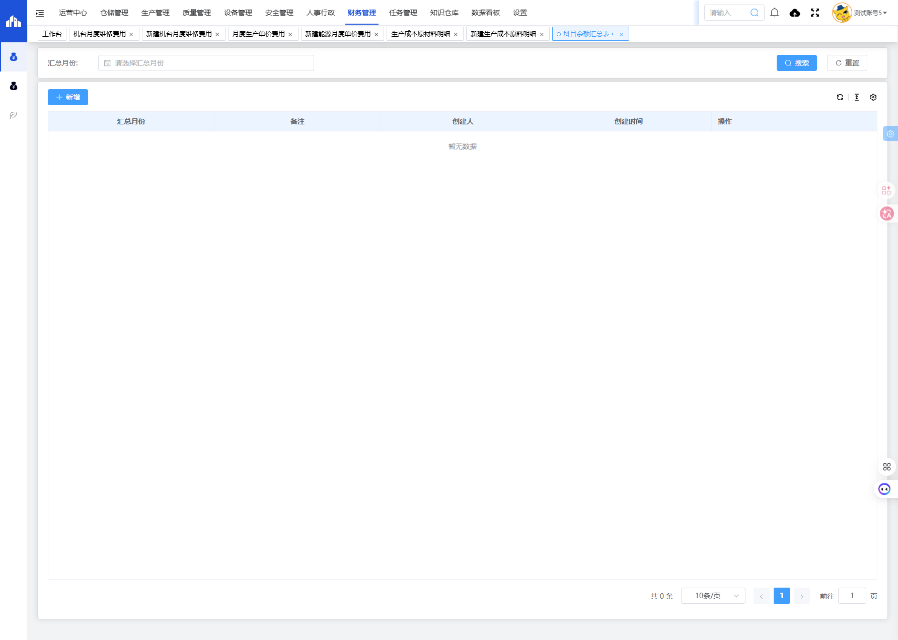
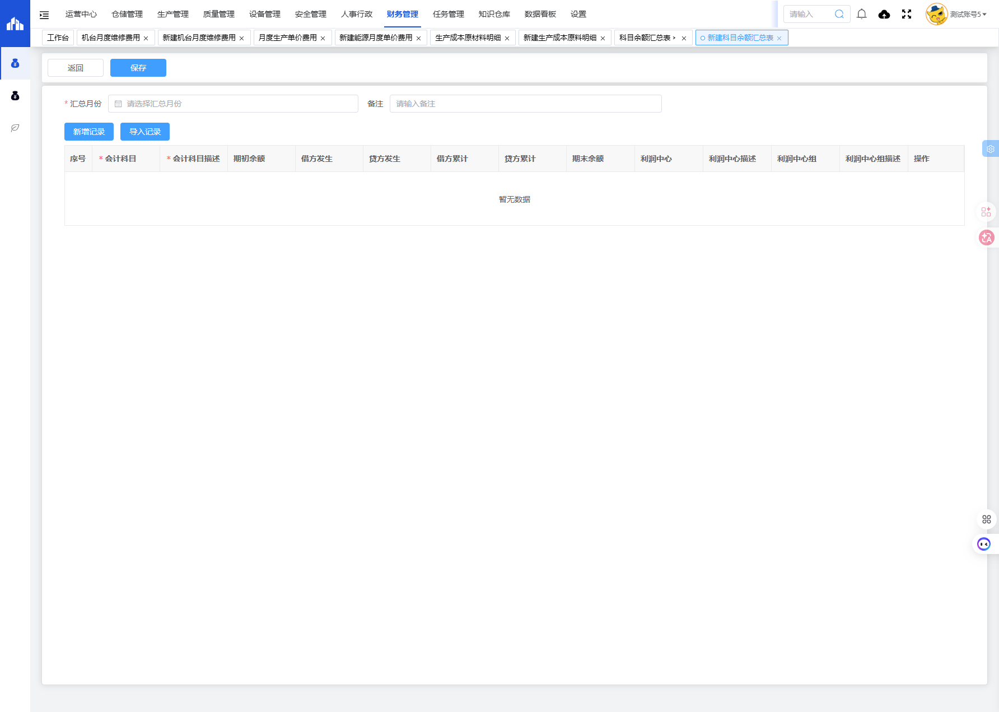

# 科目余额汇总表模块

## 一、模块概述

科目余额汇总表模块用于汇总和管理各会计科目的期初余额、借贷方发生额、累计发生额及期末余额，支持按利润中心进行分类汇总，实现财务科目余额的集中管理。

- **页面URL**：`#/financial-manage/operating/tax-summary`
- **完整URL**：`https://gdmms.y1b.cn:8424/#/financial-manage/operating/tax-summary`

## 二、功能定位

| 功能维度 | 说明 |
| :--- | :--- |
| **核心功能** | 会计科目余额汇总统计与管理 |
| **数据来源** | SAP系统总账数据 |
| **目标用户** | 财务人员、审计人员 |
| **输出形式** | 科目余额汇总报表 |

## 三、列表页面结构

### 3.1 搜索筛选字段

| 字段编号 | 字段名称 | 类型 | 必填 | 描述 |
| :--- | :--- | :--- | :--- | :--- |
| 1 | 汇总月份 | 月份选择器 | 否 | 选择汇总月份进行筛选 |

### 3.2 列表表格字段

| 字段编号 | 列名 | 类型 | 描述 |
| :--- | :--- | :--- | :--- |
| 1 | 汇总月份 | 文本 | 汇总月份 |
| 2 | 备注 | 文本 | 备注说明 |
| 3 | 创建人 | 文本 | 单据创建人员 |
| 4 | 创建时间 | 日期时间 | 单据创建时间 |
| 5 | 操作 | 按钮 | 编辑/删除/查看等操作 |

## 四、新增页面结构

### 4.1 基本信息字段

| 字段编号 | 字段名称 | 类型 | 必填 | 描述 |
| :--- | :--- | :--- | :--- | :--- |
| 1 | 汇总月份 | 月份选择器 | **是** | 选择汇总月份 |
| 2 | 备注 | 文本输入框 | 否 | 填写备注说明 |

### 4.2 操作按钮

| 按钮名称 | 描述 |
| :--- | :--- |
| 返回 | 返回列表页面 |
| 保存 | 保存数据 |
| 新增记录 | 新增一条科目余额记录 |
| 导入记录 | 从SAP导入科目余额数据 |

### 4.3 明细表格字段

| 字段编号 | 列名 | 类型 | 必填 | 描述 |
| :--- | :--- | :--- | :--- | :--- |
| 1 | 序号 | 数值 | 否 | 记录序号 |
| 2 | 会计科目 | 文本 | **是** | 会计科目代码 |
| 3 | 会计科目描述 | 文本 | **是** | 会计科目名称描述 |
| 4 | 期初余额 | 数值 | 否 | 期初余额 |
| 5 | 借方发生 | 数值 | 否 | 本期借方发生额 |
| 6 | 贷方发生 | 数值 | 否 | 本期贷方发生额 |
| 7 | 借方累计 | 数值 | 否 | 年初至今借方累计发生额 |
| 8 | 贷方累计 | 数值 | 否 | 年初至今贷方累计发生额 |
| 9 | 期末余额 | 数值 | 否 | 期末余额 |
| 10 | 利润中心 | 文本 | 否 | 利润中心代码 |
| 11 | 利润中心描述 | 文本 | 否 | 利润中心名称描述 |
| 12 | 利润中心组 | 文本 | 否 | 利润中心组代码 |
| 13 | 利润中心组描述 | 文本 | 否 | 利润中心组名称描述 |
| 14 | 操作 | 按钮 | - | 编辑/删除 |

## 五、交互操作

1. **搜索**：选择汇总月份，点击"搜索"按钮查询数据
2. **重置**：点击"重置"按钮清空搜索条件
3. **新增**：点击"新增"按钮进入新建科目余额汇总表页面
4. **新增记录**：在新增页面点击"新增记录"按钮添加科目余额明细
5. **导入记录**：点击"导入记录"按钮从SAP导入数据
6. **保存**：点击"保存"按钮保存数据
7. **返回**：点击"返回"按钮返回列表页面

## 六、截图记录

### 6.1 列表页面

### 6.2 新增表单

## 七、注意事项

1. 汇总月份为必填项
2. 会计科目和会计科目描述为必填字段
3. 科目余额数据可通过"导入记录"功能从SAP系统导入
4. 期初余额、借贷方发生额、累计发生额、期末余额为数值型字段
