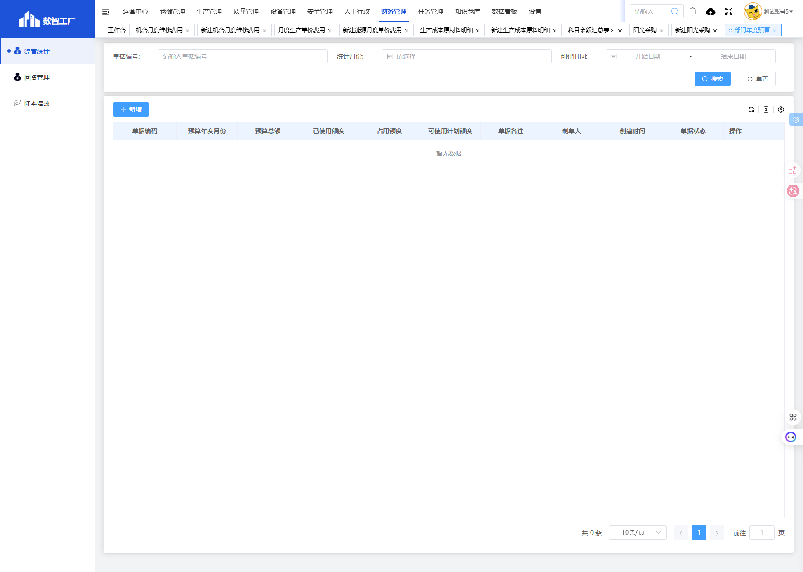
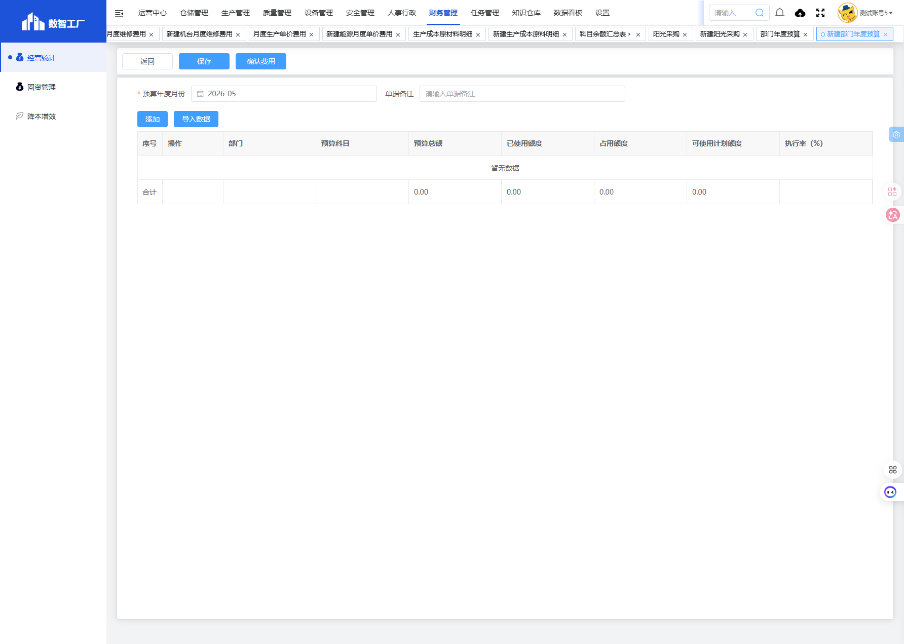

# 部门年度预算模块

## 一、模块概述

部门年度预算模块用于管理各部门的年度预算额度，跟踪预算使用情况，包括已使用额度、占用额度和可使用计划额度，实现预算执行率的实时监控。

- **页面URL**：`#/financial-manage/operating/dept-annual-budget`
- **完整URL**：`https://gdmms.y1b.cn:8424/#/financial-manage/operating/dept-annual-budget`

## 二、功能定位

| 功能维度 | 说明 |
| :--- | :--- |
| **核心功能** | 部门年度预算额度管理与执行监控 |
| **数据来源** | 预算编制数据、费用报销数据 |
| **目标用户** | 财务人员、部门负责人 |
| **输出形式** | 预算执行报表、预算分析报告 |

## 三、列表页面结构

### 3.1 搜索筛选字段

| 字段编号 | 字段名称 | 类型 | 必填 | 描述 |
| :--- | :--- | :--- | :--- | :--- |
| 1 | 单据编号 | 文本输入框 | 否 | 输入单据编号进行搜索 |
| 2 | 统计月份 | 月份选择器 | 否 | 选择统计月份进行筛选 |
| 3 | 创建时间-开始日期 | 日期选择器 | 否 | 创建时间起始范围 |
| 4 | 创建时间-结束日期 | 日期选择器 | 否 | 创建时间结束范围 |

### 3.2 列表表格字段

| 字段编号 | 列名 | 类型 | 描述 |
| :--- | :--- | :--- | :--- |
| 1 | 单据编码 | 文本 | 预算单据编号 |
| 2 | 预算年度月份 | 文本 | 预算所属年度月份 |
| 3 | 预算总额 | 数值 | 部门预算总额 |
| 4 | 已使用额度 | 数值 | 已使用的预算额度 |
| 5 | 占用额度 | 数值 | 已占用的预算额度 |
| 6 | 可使用计划额度 | 数值 | 剩余可使用额度 |
| 7 | 单据备注 | 文本 | 单据备注说明 |
| 8 | 制单人 | 文本 | 单据制单人员 |
| 9 | 创建时间 | 日期时间 | 单据创建时间 |
| 10 | 单据状态 | 文本 | 单据当前状态 |
| 11 | 操作 | 按钮 | 编辑/删除/查看等操作 |

## 四、新增页面结构

### 4.1 基本信息字段

| 字段编号 | 字段名称 | 类型 | 必填 | 默认值 | 描述 |
| :--- | :--- | :--- | :--- | :--- | :--- |
| 1 | 预算年度月份 | 月份选择器 | **是** | 当前月份 | 选择预算年度月份 |
| 2 | 单据备注 | 文本输入框 | 否 | 空 | 填写单据备注说明 |

### 4.2 操作按钮

| 按钮名称 | 描述 |
| :--- | :--- |
| 返回 | 返回列表页面 |
| 保存 | 保存草稿 |
| 确认费用 | 提交确认预算 |
| 添加 | 添加一条预算明细 |
| 导入数据 | 导入预算数据 |

### 4.3 预算明细表格字段

| 字段编号 | 列名 | 类型 | 必填 | 描述 |
| :--- | :--- | :--- | :--- | :--- |
| 1 | 序号 | 数值 | 否 | 记录序号 |
| 2 | 操作 | 按钮 | - | 编辑/删除 |
| 3 | 部门 | 文本 | **是** | 预算所属部门 |
| 4 | 预算科目 | 文本 | **是** | 预算科目名称 |
| 5 | 预算总额 | 数值 | **是** | 部门预算总额 |
| 6 | 已使用额度 | 数值 | 否 | 已使用预算额度 |
| 7 | 占用额度 | 数值 | 否 | 已占用预算额度 |
| 8 | 可使用计划额度 | 数值 | 否 | 剩余可使用额度 |
| 9 | 执行率（%） | 数值 | 否 | 预算执行率百分比 |
| 10 | 合计 | 数值 | 否 | 合计金额 |

## 五、交互操作

1. **搜索**：输入单据编号、选择统计月份或创建时间范围，点击"搜索"按钮查询数据
2. **重置**：点击"重置"按钮清空搜索条件
3. **新增**：点击"新增"按钮进入新建部门年度预算页面
4. **添加明细**：点击"添加"按钮新增预算明细行
5. **导入数据**：点击"导入数据"按钮导入预算数据
6. **保存**：点击"保存"按钮保存草稿
7. **确认费用**：点击"确认费用"按钮提交确认
8. **返回**：点击"返回"按钮返回列表页面

## 六、截图记录

### 6.1 列表页面

### 6.2 新增表单

## 七、注意事项

1. 预算年度月份为必填项，默认为当前月份
2. 预算总额、已使用额度、占用额度、可使用计划额度由系统自动计算
3. 执行率 = 已使用额度 / 预算总额 × 100%
4. 确认费用操作后单据状态将变更
