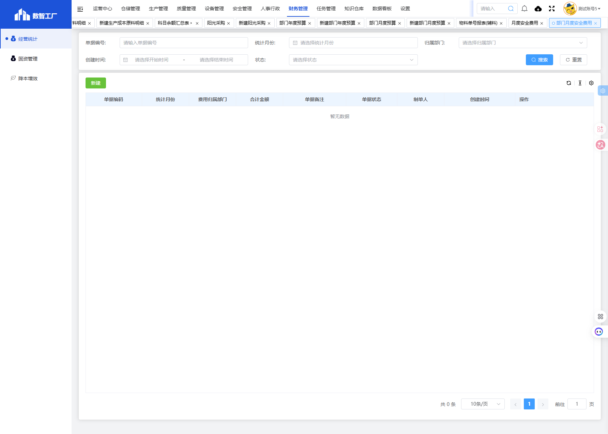

# 部门月度安全费用模块

## 一、模块概述

部门月度安全费用模块用于管理各部门的月度安全费用投入情况，包括费用归属部门、合计金额、单据状态等信息，实现部门安全费用的精细化管理和跟踪。

- **页面URL**：`#/financial-manage/operating/monthly-safety/dept_monthly_safe_cost`
- **完整URL**：`https://gdmms.y1b.cn:8424/#/financial-manage/operating/monthly-safety/dept_monthly_safe_cost`

## 二、功能定位

| 功能维度 | 说明 |
| :--- | :--- |
| **核心功能** | 部门月度安全费用录入与管理 |
| **数据来源** | 部门安全费用报销数据 |
| **目标用户** | 财务人员、安全管理员、部门负责人 |
| **输出形式** | 部门安全费用报表 |

## 三、列表页面结构

### 3.1 搜索筛选字段

| 字段编号 | 字段名称 | 类型 | 必填 | 描述 |
| :--- | :--- | :--- | :--- | :--- |
| 1 | 单据编号 | 文本输入框 | 否 | 输入单据编号进行搜索 |
| 2 | 统计月份 | 月份选择器 | 否 | 选择统计月份进行筛选 |
| 3 | 归属部门 | 文本输入框 | 否 | 输入归属部门进行筛选 |
| 4 | 创建时间-开始时间 | 日期选择器 | 否 | 创建时间起始范围 |
| 5 | 创建时间-结束时间 | 日期选择器 | 否 | 创建时间结束范围 |
| 6 | 状态 | 下拉选择框 | 否 | 选择单据状态进行筛选 |

### 3.2 列表表格字段

| 字段编号 | 列名 | 类型 | 描述 |
| :--- | :--- | :--- | :--- |
| 1 | 单据编码 | 文本 | 单据编号 |
| 2 | 统计月份 | 文本 | 费用统计月份 |
| 3 | 费用归属部门 | 文本 | 费用所属部门 |
| 4 | 合计金额 | 数值 | 安全费用合计金额 |
| 5 | 单据备注 | 文本 | 单据备注说明 |
| 6 | 单据状态 | 文本 | 单据当前状态 |
| 7 | 制单人 | 文本 | 单据制单人员 |
| 8 | 创建时间 | 日期时间 | 单据创建时间 |
| 9 | 操作 | 按钮 | 编辑/删除/查看等操作 |

## 四、交互操作

1. **搜索**：输入单据编号、选择统计月份、归属部门、创建时间范围或状态，点击"搜索"按钮查询数据
2. **重置**：点击"重置"按钮清空搜索条件
3. **新建**：点击"新建"按钮进入新建部门月度安全费用页面

## 五、截图记录

### 5.1 列表页面

## 六、注意事项

1. 部门月度安全费用需按月录入
2. 合计金额由系统自动计算
3. 单据状态包括草稿、已确认等
