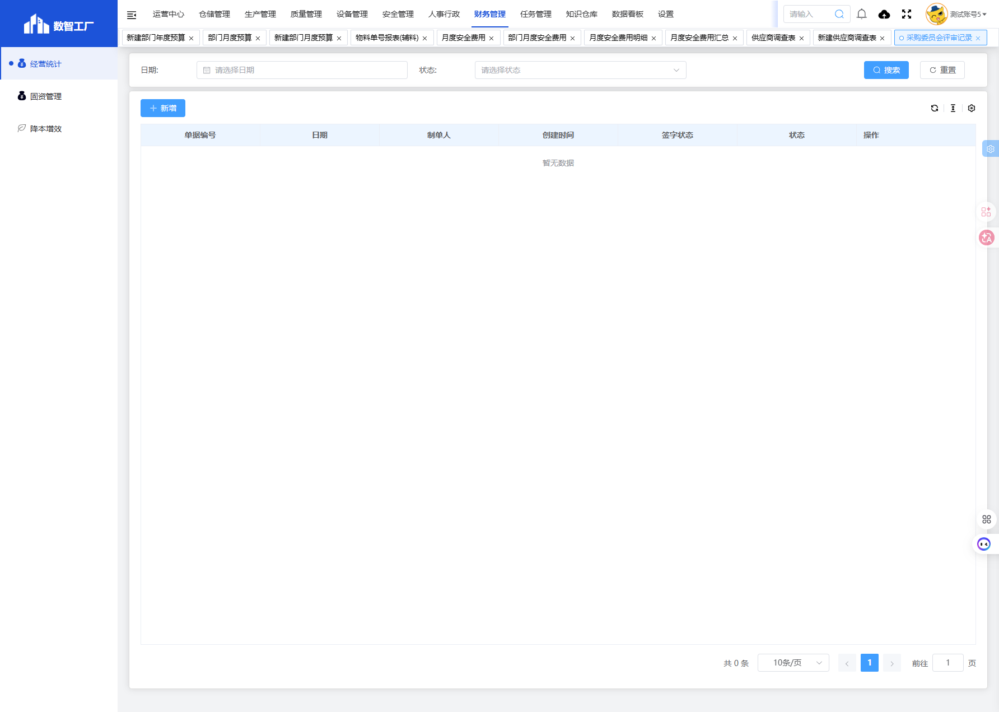
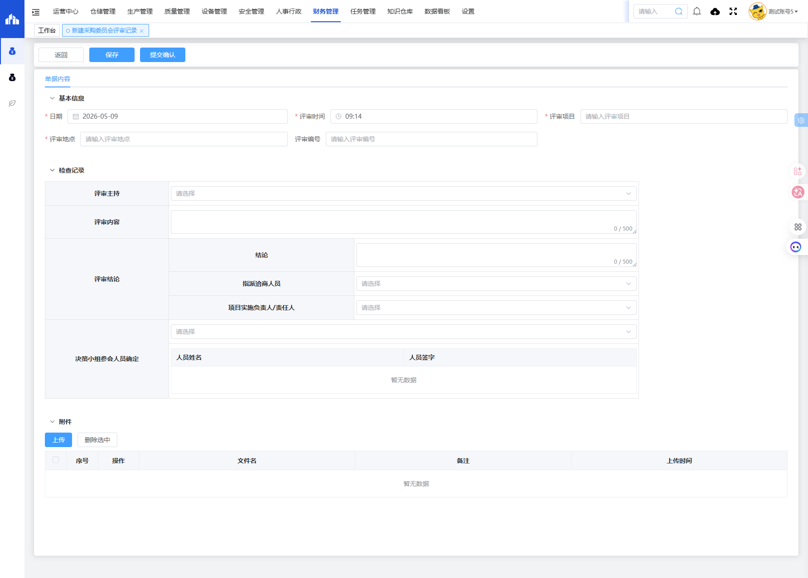

# 采购委员会评审记录模块

## 一、模块概述

采购委员会评审记录模块用于管理采购项目的委员会评审过程记录，包括评审时间、评审项目、评审内容、评审结论、参会人员等信息，实现采购决策的规范化和可追溯性。

- **页面URL**：`#/financial-manage/operating/cangchu/management-review-record`
- **完整URL**：`https://gdmms.y1b.cn:8424/#/financial-manage/operating/cangchu/management-review-record`

## 二、功能定位

| 功能维度 | 说明 |
| :--- | :--- |
| **核心功能** | 采购委员会评审过程记录与管理 |
| **数据来源** | 采购委员会评审会议 |
| **目标用户** | 采购人员、委员会成员 |
| **输出形式** | 评审记录报告 |

## 三、列表页面结构

### 3.1 搜索筛选字段

| 字段编号 | 字段名称 | 类型 | 必填 | 描述 |
| :--- | :--- | :--- | :--- | :--- |
| 1 | 日期 | 日期选择器 | 否 | 选择评审日期进行筛选 |
| 2 | 状态 | 下拉选择框 | 否 | 选择单据状态进行筛选 |

### 3.2 列表表格字段

| 字段编号 | 列名 | 类型 | 描述 |
| :--- | :--- | :--- | :--- |
| 1 | 单据编号 | 文本 | 单据编号 |
| 2 | 日期 | 日期 | 评审日期 |
| 3 | 制单人 | 文本 | 单据制单人员 |
| 4 | 创建时间 | 日期时间 | 单据创建时间 |
| 5 | 签字状态 | 文本 | 签字确认状态 |
| 6 | 状态 | 文本 | 单据当前状态 |
| 7 | 操作 | 按钮 | 编辑/删除/查看等操作 |

## 四、新增页面结构

### 4.1 操作按钮

| 按钮名称 | 描述 |
| :--- | :--- |
| 返回 | 返回列表页面 |
| 保存 | 保存草稿 |
| 提交确认 | 提交确认评审记录 |

### 4.2 基本信息字段

| 字段编号 | 字段名称 | 类型 | 必填 | 默认值 | 描述 |
| :--- | :--- | :--- | :--- | :--- | :--- |
| 1 | 日期 | 日期选择器 | **是** | 当前日期 | 评审日期 |
| 2 | 评审时间 | 时间选择器 | **是** | 当前时间 | 评审时间 |
| 3 | 评审项目 | 文本输入框 | **是** | 空 | 评审项目名称 |
| 4 | 评审地点 | 文本输入框 | **是** | 空 | 评审会议地点 |
| 5 | 评审编号 | 文本输入框 | 否 | 空 | 评审编号 |

### 4.3 检查记录字段

| 字段编号 | 字段名称 | 类型 | 必填 | 描述 |
| :--- | :--- | :--- | :--- | :--- |
| 1 | 评审主持 | 下拉选择框 | 否 | 选择评审主持人 |
| 2 | 评审内容 | 多行文本框 | 否 | 评审内容描述，500字 |
| 3 | 评审结论-结论 | 多行文本框 | 否 | 评审结论描述，500字 |
| 4 | 指派洽商人员 | 下拉选择框 | 否 | 选择洽商人员 |
| 5 | 项目实施负责人/责任人 | 下拉选择框 | 否 | 选择项目实施负责人 |
| 6 | 决策小组参会人员确定 | 下拉选择框 | 否 | 选择参会人员 |

### 4.4 参会人员签字表格

| 字段编号 | 列名 | 类型 | 描述 |
| :--- | :--- | :--- | :--- |
| 1 | 人员姓名 | 文本 | 参会人员姓名 |
| 2 | 人员签字 | 签字 | 参会人员电子签名 |

### 4.5 附件区域

| 字段编号 | 列名 | 类型 | 描述 |
| :--- | :--- | :--- | :--- |
| 1 | 序号 | 数值 | 附件序号 |
| 2 | 操作 | 按钮 | 下载/删除 |
| 3 | 文件名 | 文本 | 附件文件名 |
| 4 | 备注 | 文本 | 附件备注 |
| 5 | 上传时间 | 日期时间 | 附件上传时间 |

## 五、交互操作

1. **搜索**：选择日期或状态，点击"搜索"按钮查询数据
2. **重置**：点击"重置"按钮清空搜索条件
3. **新增**：点击"新增"按钮进入新建评审记录页面
4. **保存**：点击"保存"按钮保存草稿
5. **提交确认**：点击"提交确认"按钮提交评审记录
6. **上传附件**：点击"上传"按钮上传附件文件
7. **删除附件**：勾选附件后点击"删除选中"按钮删除
8. **返回**：点击"返回"按钮返回列表页面

## 六、截图记录

### 6.1 列表页面

### 6.2 新增表单

## 七、注意事项

1. 日期和评审时间为必填项，默认为当前日期和时间
2. 评审项目为必填项
3. 参会人员签字支持电子签名
4. 评审内容和评审结论均有500字数限制
5. 提交确认后单据状态将变更
