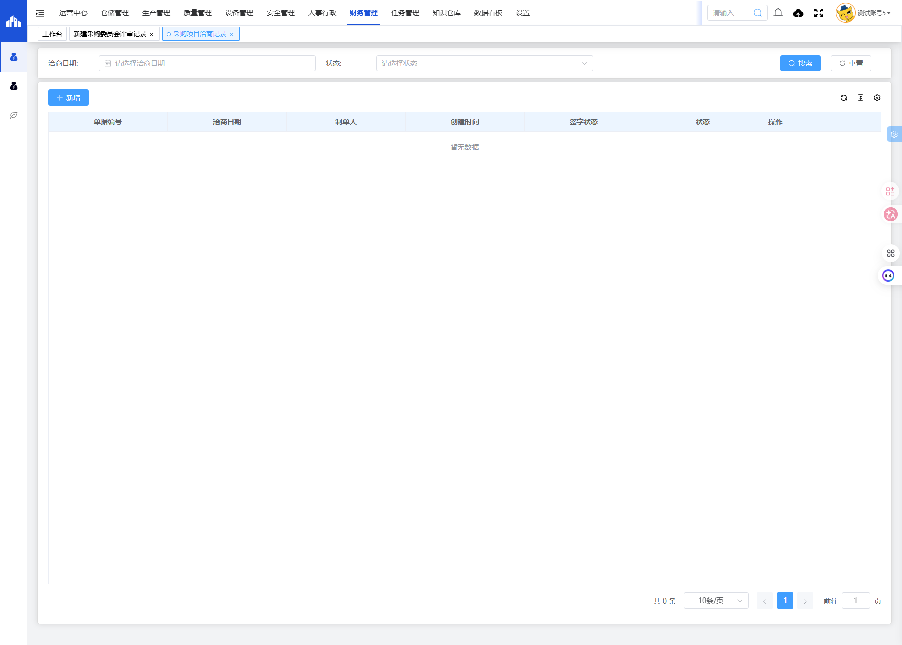
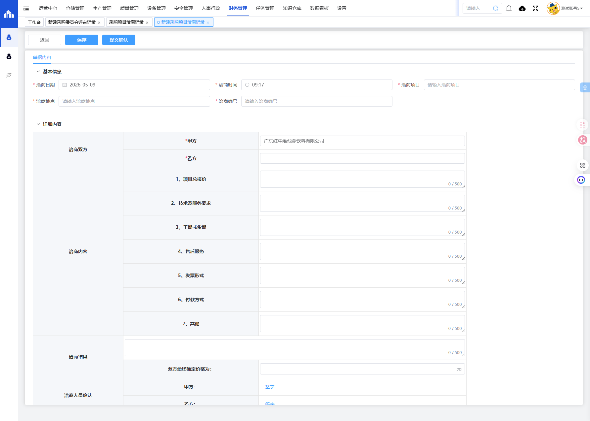

# 采购项目洽商记录模块

## 一、模块概述

采购项目洽商记录模块用于管理采购项目的洽商过程记录，包括洽商日期、洽商项目、洽商内容、洽商结果等信息，实现采购洽商过程的规范化和可追溯性。

- **页面URL**：`#/financial-manage/operating/cangchu/negotiation-record`
- **完整URL**：`https://gdmms.y1b.cn:8424/#/financial-manage/operating/cangchu/negotiation-record`

## 二、功能定位

| 功能维度 | 说明 |
| :--- | :--- |
| **核心功能** | 采购项目洽商过程记录与管理 |
| **数据来源** | 采购洽商会议 |
| **目标用户** | 采购人员、供应商 |
| **输出形式** | 洽商记录报告 |

## 三、列表页面结构

### 3.1 搜索筛选字段

| 字段编号 | 字段名称 | 类型 | 必填 | 描述 |
| :--- | :--- | :--- | :--- | :--- |
| 1 | 洽商日期 | 日期选择器 | 否 | 选择洽商日期进行筛选 |
| 2 | 状态 | 下拉选择框 | 否 | 选择单据状态进行筛选 |

### 3.2 列表表格字段

| 字段编号 | 列名 | 类型 | 描述 |
| :--- | :--- | :--- | :--- |
| 1 | 单据编号 | 文本 | 单据编号 |
| 2 | 洽商日期 | 日期 | 洽商日期 |
| 3 | 制单人 | 文本 | 单据制单人员 |
| 4 | 创建时间 | 日期时间 | 单据创建时间 |
| 5 | 签字状态 | 文本 | 签字确认状态 |
| 6 | 状态 | 文本 | 单据当前状态 |
| 7 | 操作 | 按钮 | 编辑/删除/查看等操作 |

## 四、新增页面结构

### 4.1 操作按钮

| 按钮名称 | 描述 |
| :--- | :--- |
| 返回 | 返回列表页面 |
| 保存 | 保存草稿 |
| 提交确认 | 提交确认洽商记录 |

### 4.2 基本信息字段

| 字段编号 | 字段名称 | 类型 | 必填 | 默认值 | 描述 |
| :--- | :--- | :--- | :--- | :--- | :--- |
| 1 | 洽商日期 | 日期选择器 | **是** | 当前日期 | 洽商日期 |
| 2 | 洽商时间 | 时间选择器 | **是** | 当前时间 | 洽商时间 |
| 3 | 洽商项目 | 文本输入框 | **是** | 空 | 洽商项目名称 |
| 4 | 洽商地点 | 文本输入框 | **是** | 空 | 洽商会议地点 |
| 5 | 洽商编号 | 文本输入框 | **是** | 空 | 洽商编号 |

### 4.3 详细内容字段

#### 洽商双方

| 字段编号 | 字段名称 | 类型 | 必填 | 默认值 | 描述 |
| :--- | :--- | :--- | :--- | :--- | :--- |
| 1 | 甲方 | 文本输入框 | **是** | 广东红牛维他命饮料有限公司 | 甲方公司名称 |
| 2 | 乙方 | 文本输入框 | **是** | 空 | 乙方公司名称 |

#### 洽商内容

| 字段编号 | 字段名称 | 类型 | 字数限制 | 描述 |
| :--- | :--- | :--- | :--- | :--- |
| 1 | 项目总报价 | 多行文本框 | 500字 | 项目总报价信息 |
| 2 | 技术及服务要求 | 多行文本框 | 500字 | 技术及服务要求描述 |
| 3 | 工期或货期 | 多行文本框 | 500字 | 工期或货期要求 |
| 4 | 售后服务 | 多行文本框 | 500字 | 售后服务条款 |
| 5 | 发票形式 | 多行文本框 | 500字 | 发票形式要求 |
| 6 | 付款方式 | 多行文本框 | 500字 | 付款方式约定 |
| 7 | 其他 | 多行文本框 | 500字 | 其他洽商内容 |

#### 洽商结果

| 字段编号 | 字段名称 | 类型 | 字数限制 | 描述 |
| :--- | :--- | :--- | :--- | :--- |
| 1 | 洽商结果 | 多行文本框 | 500字 | 洽商结果描述 |
| 2 | 双方最终确定价格 | 文本输入框 | - | 最终确定价格（元） |

#### 洽商人员确认

| 字段编号 | 字段名称 | 类型 | 描述 |
| :--- | :--- | :--- | :--- |
| 1 | 甲方签字 | 签字按钮 | 甲方电子签名 |
| 2 | 乙方签字 | 签字按钮 | 乙方电子签名 |

## 五、交互操作

1. **搜索**：选择洽商日期或状态，点击"搜索"按钮查询数据
2. **重置**：点击"重置"按钮清空搜索条件
3. **新增**：点击"新增"按钮进入新建洽商记录页面
4. **保存**：点击"保存"按钮保存草稿
5. **提交确认**：点击"提交确认"按钮提交洽商记录
6. **签字**：点击"签字"按钮进行甲方/乙方电子签名
7. **返回**：点击"返回"按钮返回列表页面

## 六、截图记录

### 6.1 列表页面

### 6.2 新增表单

## 七、注意事项

1. 洽商日期、洽商时间、洽商项目、洽商地点、洽商编号均为必填项
2. 甲方默认为"广东红牛维他命饮料有限公司"
3. 洽商内容共7项，每项均有500字数限制
4. 双方最终确定价格单位为元
5. 甲方和乙方均需签字确认
6. 提交确认后单据状态将变更
