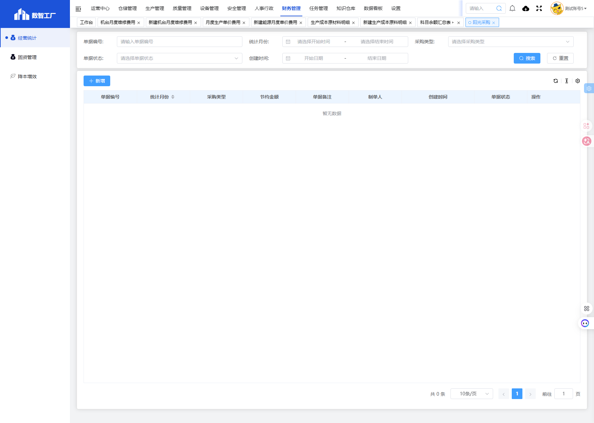
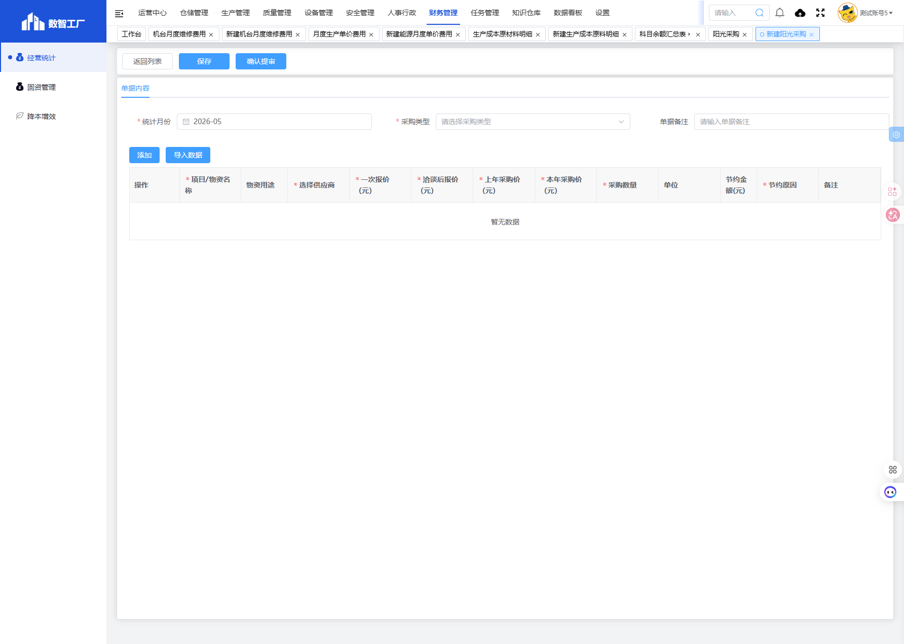

# 阳光采购模块

## 一、模块概述

阳光采购模块用于管理和记录采购过程中的比价、洽商信息，跟踪采购价格变动，计算采购节约金额，实现采购过程的透明化和降本管理。

- **页面URL**：`#/financial-manage/operating/sun-buy`
- **完整URL**：`https://gdmms.y1b.cn:8424/#/financial-manage/operating/sun-buy`

## 二、功能定位

| 功能维度 | 说明 |
| :--- | :--- |
| **核心功能** | 阳光采购记录管理与节约金额统计 |
| **数据来源** | 采购洽商记录、供应商报价 |
| **目标用户** | 采购人员、财务人员 |
| **输出形式** | 采购节约报表、比价分析报告 |

## 三、列表页面结构

### 3.1 搜索筛选字段

| 字段编号 | 字段名称 | 类型 | 必填 | 描述 |
| :--- | :--- | :--- | :--- | :--- |
| 1 | 单据编号 | 文本输入框 | 否 | 输入单据编号进行搜索 |
| 2 | 统计月份-开始时间 | 日期选择器 | 否 | 统计月份起始范围 |
| 3 | 统计月份-结束时间 | 日期选择器 | 否 | 统计月份结束范围 |
| 4 | 采购类型 | 下拉选择框 | 否 | 选择采购类型进行筛选 |
| 5 | 单据状态 | 下拉选择框 | 否 | 选择单据状态进行筛选 |
| 6 | 创建时间-开始日期 | 日期选择器 | 否 | 创建时间起始范围 |
| 7 | 创建时间-结束日期 | 日期选择器 | 否 | 创建时间结束范围 |

### 3.2 列表表格字段

| 字段编号 | 列名 | 类型 | 描述 |
| :--- | :--- | :--- | :--- |
| 1 | 单据编号 | 文本 | 采购单据编号 |
| 2 | 统计月份 | 文本 | 采购统计月份 |
| 3 | 采购类型 | 文本 | 采购类型分类 |
| 4 | 节约金额 | 数值 | 采购节约金额 |
| 5 | 单据备注 | 文本 | 单据备注说明 |
| 6 | 制单人 | 文本 | 单据制单人员 |
| 7 | 创建时间 | 日期时间 | 单据创建时间 |
| 8 | 单据状态 | 文本 | 单据当前状态 |
| 9 | 操作 | 按钮 | 编辑/删除/查看等操作 |

## 四、新增页面结构

### 4.1 基本信息字段

| 字段编号 | 字段名称 | 类型 | 必填 | 默认值 | 描述 |
| :--- | :--- | :--- | :--- | :--- | :--- |
| 1 | 统计月份 | 月份选择器 | **是** | 当前月份 | 选择采购统计月份 |
| 2 | 采购类型 | 下拉选择框 | **是** | 空 | 选择采购类型 |
| 3 | 单据备注 | 文本输入框 | 否 | 空 | 填写单据备注说明 |

### 4.2 操作按钮

| 按钮名称 | 描述 |
| :--- | :--- |
| 返回列表 | 返回列表页面 |
| 保存 | 保存草稿 |
| 确认提审 | 提交审核 |
| 添加 | 添加一条采购明细 |
| 导入数据 | 导入采购数据 |

### 4.3 采购明细表格字段

| 字段编号 | 列名 | 类型 | 必填 | 描述 |
| :--- | :--- | :--- | :--- | :--- |
| 1 | 操作 | 按钮 | - | 删除行 |
| 2 | 项目/物资名称 | 文本 | **是** | 采购项目或物资名称 |
| 3 | 物资用途 | 文本 | 否 | 物资使用用途说明 |
| 4 | 选择供应商 | 下拉选择 | **是** | 选择供应商 |
| 5 | 一次报价（元） | 数值 | **是** | 供应商首次报价 |
| 6 | 洽谈后报价（元） | 数值 | **是** | 洽谈后最终报价 |
| 7 | 上年采购价（元） | 数值 | **是** | 上一年度采购价格 |
| 8 | 本年采购价（元） | 数值 | **是** | 本年度采购价格 |
| 9 | 采购数量 | 数值 | **是** | 采购数量 |
| 10 | 单位 | 文本 | 否 | 计量单位 |
| 11 | 节约金额(元) | 数值 | 否 | 采购节约金额（自动计算） |
| 12 | 节约原因 | 文本 | **是** | 采购节约原因说明 |
| 13 | 备注 | 文本 | 否 | 备注说明 |

## 五、交互操作

### 5.1 列表页面操作

1. **搜索**：输入单据编号、选择统计月份、采购类型、单据状态或创建时间范围，点击"搜索"按钮查询数据
2. **重置**：点击"重置"按钮清空搜索条件
3. **新增**：点击"新增"按钮进入新建阳光采购页面
4. **更多操作**：点击更多操作按钮可进行批量操作

### 5.2 新增页面操作

1. **填写统计月份**：选择采购统计月份（必填）
2. **选择采购类型**：选择采购类型（必填）
3. **填写单据备注**：输入备注说明（选填）
4. **添加明细**：点击"添加"按钮新增采购明细行
5. **导入数据**：点击"导入数据"按钮导入采购数据
6. **保存**：点击"保存"按钮保存草稿
7. **确认提审**：点击"确认提审"按钮提交审核
8. **返回列表**：点击"返回列表"按钮返回列表页面

## 六、截图记录

### 6.1 列表页面

### 6.2 新增表单

## 七、注意事项

1. 统计月份和采购类型为必填项
2. 节约金额由系统根据上年采购价和本年采购价自动计算
3. 确认提审操作后单据将进入审核流程
4. 采购明细中项目/物资名称、供应商、报价、采购数量、节约原因为必填字段
