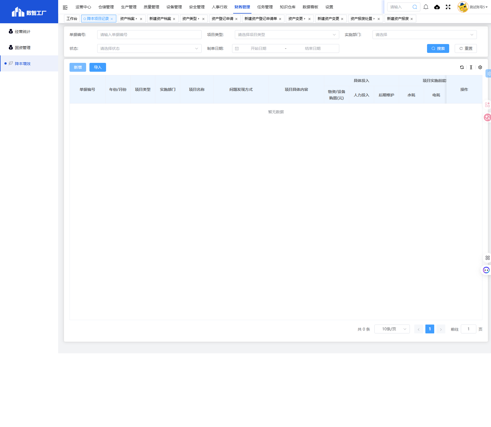

# 降本增效模块

## 一、模块概述

降本增效模块用于记录和管理企业降本项目，包括项目类型、实施部门、具体投入、能耗对比、达到效果等信息，实现降本增效项目的规范化管理和效果评估。

- **页面URL**：`#/financial-manage/jbzx/index7/lower-cost`
- **完整URL**：`https://gdmms.y1b.cn:8424/#/financial-manage/jbzx/index7/lower-cost`

## 二、功能定位

| 功能维度 | 说明 |
| :--- | :--- |
| **核心功能** | 降本项目记录管理与效果评估 |
| **数据来源** | 各部门申报 |
| **目标用户** | 成本管理人员、各部门负责人 |
| **输出形式** | 降本项目记录单 |

## 三、列表页面结构

### 3.1 搜索筛选字段

| 字段编号 | 字段名称 | 类型 | 必填 | 描述 |
| :--- | :--- | :--- | :--- | :--- |
| 1 | 单据编号 | 文本输入框 | 否 | 输入单据编号进行搜索 |
| 2 | 项目类型 | 下拉选择框 | 否 | 选择项目类型进行筛选 |
| 3 | 实施部门 | 文本输入框 | 否 | 实施部门筛选 |
| 4 | 状态 | 下拉选择框 | 否 | 选择单据状态进行筛选 |
| 5 | 制单日期-开始日期 | 日期选择器 | 否 | 制单日期开始范围 |
| 6 | 制单日期-结束日期 | 日期选择器 | 否 | 制单日期结束范围 |

### 3.2 操作按钮

| 按钮名称 | 描述 |
| :--- | :--- |
| 重置 | 清空搜索条件 |
| 搜索 | 执行搜索 |
| 新增 | 新建降本项目记录 |
| 导入 | 导入降本项目数据 |

### 3.3 列表表格字段

| 字段编号 | 列名 | 类型 | 描述 |
| :--- | :--- | :--- | :--- |
| 1 | 单据编号 | 文本 | 单据编号 |
| 2 | 年份/月份 | 文本 | 年份/月份 |
| 3 | 项目类型 | 文本 | 项目类型 |
| 4 | 实施部门 | 文本 | 实施部门 |
| 5 | 项目名称 | 文本 | 项目名称 |
| 6 | 问题发现方式 | 文本 | 问题发现方式 |
| 7 | 项目具体内容 | 文本 | 项目具体内容 |
| 8 | 具体投入 | 文本 | 具体投入信息 |
| 9 | 项目实施前能耗 | 文本 | 实施前能耗（水耗/电耗/燃气耗用） |
| 10 | 项目实施后能耗 | 文本 | 实施后能耗（水耗/电耗/燃气耗用） |
| 11 | 达到效果 | 文本 | 达到效果 |
| 12 | 效果描述 | 文本 | 效果描述 |
| 13 | 备注 | 文本 | 备注 |
| 14 | 单据状态 | 文本 | 单据状态 |
| 15 | 操作 | 按钮 | 编辑/删除/查看等操作 |

### 3.4 能耗明细列

| 字段编号 | 列名 | 描述 |
| :--- | :--- | :--- |
| 1 | 物资/设备购置(元) | 物资设备购置费用 |
| 2 | 人力投入 | 人力投入 |
| 3 | 后期维护 | 后期维护费用 |
| 4 | 水耗（实施前） | 项目实施前水耗 |
| 5 | 电耗（实施前） | 项目实施前电耗 |
| 6 | 燃气耗用（实施前） | 项目实施前燃气耗用 |
| 7 | 水耗（实施后） | 项目实施后水耗 |
| 8 | 电耗（实施后） | 项目实施后电耗 |
| 9 | 燃气耗用（实施后） | 项目实施后燃气耗用 |

## 四、新增页面结构

### 4.1 操作按钮

| 按钮名称 | 描述 |
| :--- | :--- |
| 返回列表 | 返回列表页面 |
| 暂存 | 保存草稿 |

### 4.2 基本信息字段

| 字段编号 | 字段名称 | 类型 | 必填 | 默认值 | 描述 |
| :--- | :--- | :--- | :--- | :--- | :--- |
| 1 | 年份/月份 | 日期选择器 | **是** | 空 | 年份/月份 |
| 2 | 项目类型 | 下拉选择框 | **是** | 空 | 项目类型 |
| 3 | 实施部门 | 文本输入框 | **是** | 空 | 实施部门 |
| 4 | 备注 | 文本输入框 | 否 | 空 | 备注 |

### 4.3 项目内容字段

| 字段编号 | 字段名称 | 类型 | 必填 | 描述 |
| :--- | :--- | :--- | :--- | :--- |
| 1 | 项目名称 | 多行文本框 | 否 | 项目名称 |
| 2 | 问题发现方式 | 多行文本框 | 否 | 问题发现方式 |
| 3 | 项目具体内容 | 多行文本框 | 否 | 项目具体内容 |

### 4.4 具体投入信息

| 字段编号 | 字段名称 | 类型 | 必填 | 描述 |
| :--- | :--- | :--- | :--- | :--- |
| 1 | 物资/设备购置(元) | 数值输入框 | 否 | 物资设备购置费用 |
| 2 | 人力投入(人/天) | 数值输入框 | 否 | 人力投入 |
| 3 | 后期维护 | 数值输入框 | 否 | 后期维护费用 |

### 4.5 项目实施前能耗

| 字段编号 | 字段名称 | 类型 | 必填 | 描述 |
| :--- | :--- | :--- | :--- | :--- |
| 1 | 水耗(t/天) | 数值输入框 | 否 | 项目实施前水耗 |
| 2 | 电耗(kwh/天) | 数值输入框 | 否 | 项目实施前电耗 |
| 3 | 燃气耗用(m³/天) | 数值输入框 | 否 | 项目实施前燃气耗用 |

### 4.6 项目实施后能耗

| 字段编号 | 字段名称 | 类型 | 必填 | 描述 |
| :--- | :--- | :--- | :--- | :--- |
| 1 | 水耗(t/天) | 数值输入框 | 否 | 项目实施后水耗 |
| 2 | 电耗(kwh/天) | 数值输入框 | 否 | 项目实施后电耗 |
| 3 | 燃气耗用(m³/天) | 数值输入框 | 否 | 项目实施后燃气耗用 |

### 4.7 达到效果

| 字段编号 | 字段名称 | 类型 | 必填 | 描述 |
| :--- | :--- | :--- | :--- | :--- |
| 1 | 达到效果类型 | 下拉选择框 | **是** | 达到效果类型 |
| 2 | 效果描述 | 多行文本框 | 否 | 效果描述 |

## 五、交互操作

1. **搜索**：输入单据编号、选择项目类型/状态、设置日期范围，点击"搜索"按钮查询数据
2. **重置**：点击"重置"按钮清空搜索条件
3. **新增**：点击"新增"按钮进入新建降本项目记录页面
4. **导入**：点击"导入"按钮导入降本项目数据
5. **暂存**：点击"暂存"按钮保存草稿
6. **返回列表**：点击"返回列表"按钮返回列表页面

## 六、截图记录

### 6.1 列表页面

### 6.2 新增表单

## 七、注意事项

1. 年份/月份、项目类型、实施部门、达到效果类型为必填项
2. 具体投入信息包含物资/设备购置、人力投入、后期维护三个维度
3. 能耗对比分为实施前和实施后，各包含水耗、电耗、燃气耗用三个指标
4. 项目名称、问题发现方式、项目具体内容、效果描述为多行文本输入
