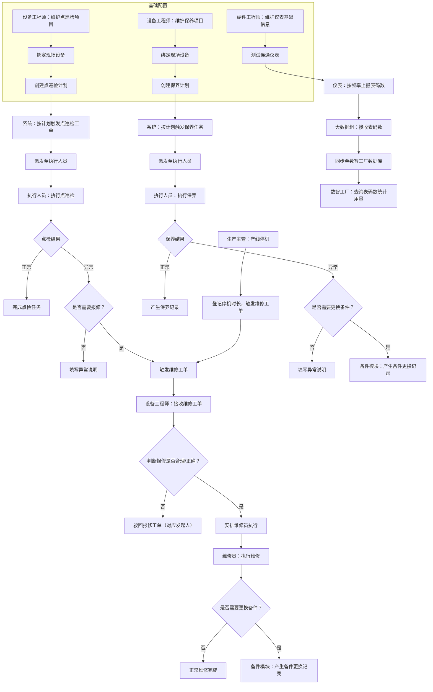
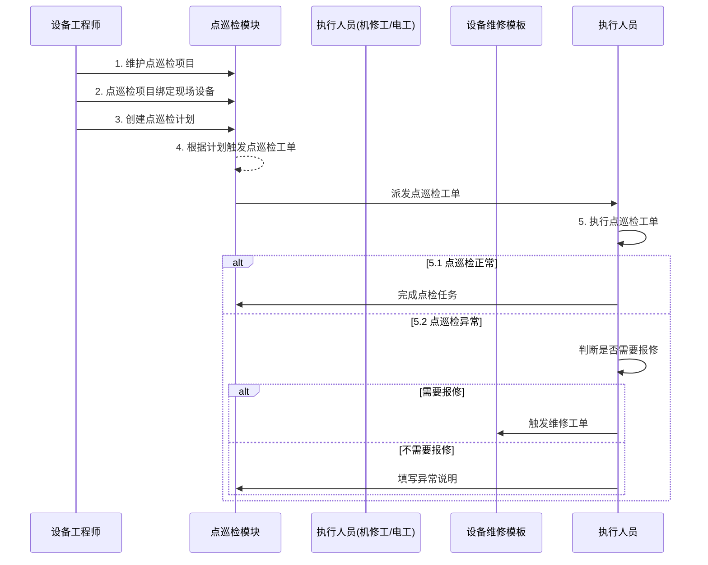
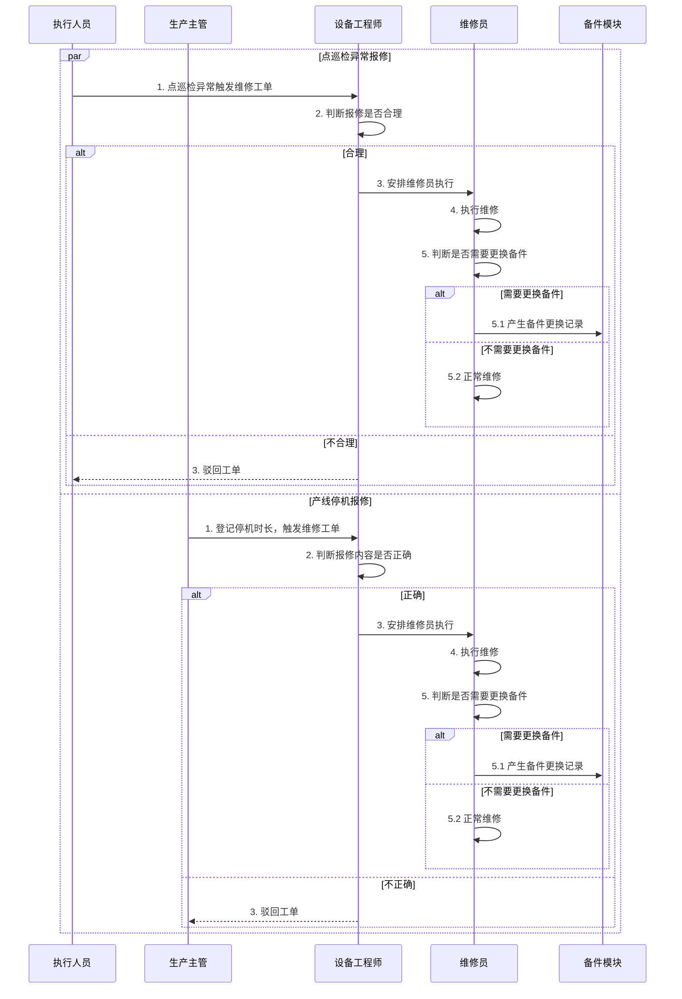
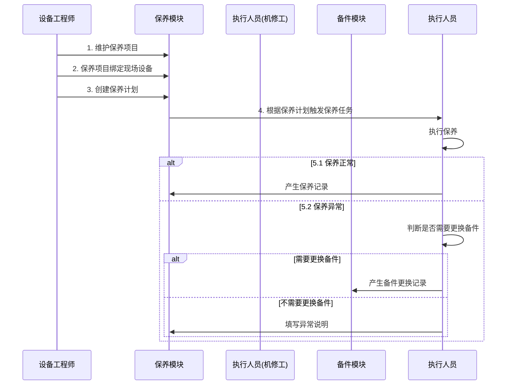
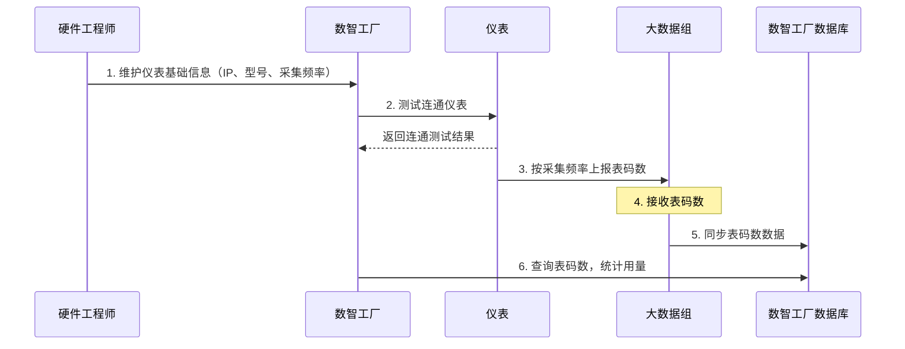
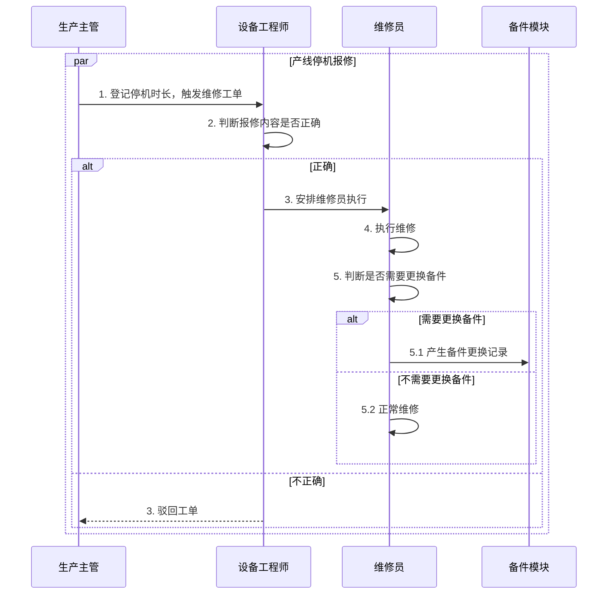

# 工厂端疑问确认清单

> **生成时间**：2026-04-26
> **疑问总数**：24个
> **已回答**：0个
> **待确认**：24个

***

## 重要说明

**请部门同事协助确认以下疑问，确保知识库信息的准确性。**

**确认方式**：

- ✅ 已确认：该疑问已有准确答案
- ❌ 不适用：该疑问不适用于当前业务
- ⏳ 待补充：需要补充资料后再确认

***

## 一、系统架构与定位（2个疑问）

### 疑问1：系统实施范围

**问题**：工厂端系统的实施范围是什么？

1.基地范围：本次实施覆盖广东基地、贵州基地、湖北基地、福建基地、江苏基地共 5 个生产基地；后续将根据业务规划评估是否扩展至其他基地。

2\. 业务与功能范围：在上述基地内，完整实施 \[如：仓储管理、生产管理、质量管理、设备管理、安全管理、人事行政、财务管理、任务管理等] 模块，不包含基地外的相关业务。

3\. 实施阶段：目标是在指定基地内完成系统部署、数据迁移、用户培训与上线运行。

**待确认内容**：

- [ ] 广东基地的系统实施情况

  广东基地各大模块已基本全部上线
- [ ] 贵州基地的系统实施情况

  贵州基地各大模块已基本全部上线
- [ ] 湖北基地的系统实施情况

  湖北基地各大模块已基本全部上线
- [ ] 福建基地的系统实施情况

  福建基地各大模块已基本全部上线
- [ ] 江苏基地的系统实施情况

  江苏基地还未开始

**确认状态**：✅ 已确认

**确认人**：\_\_\_\_任波涛、丁振平\_\_\_\_\_\_

**确认时间**：\_\_\_2026-04-27\_\_\_\_\_\_\_

**备注**：\_\_\_\_\_\_\_\_\_\_

***

### 疑问2：系统与SAP的关系

**问题**：工厂端系统与SAP系统的关系是什么？

工厂端数智工厂系统（DFS）与 SAP 系统是 “指令下发 - 现场执行 - 结果回传” 的上下游协作关系 ：SAP 作为业务端的计划与管控中枢，DFS 作为工厂端的现场执行载体，两者分工明确、数据互通，共同完成从计划到执行的业务闭环。

**待确认内容**：

- [ ] 工厂端系统是否独立于SAP系统？

  工厂端 DFS 系统为独立部署的现场执行系统，不依赖 SAP 系统运行，具备独立的生产执行、工序报工、现场数据采集等核心能力；但为了业务闭环，需要与 SAP 进行数据交互，并非完全无关联的独立运行。
- [ ] 工厂端系统与SAP系统的数据如何同步？

  两者通过接口实现双向数据同步，形成完整业务链路：

  &#x20;

  **SAP → DFS（指令下发）**：SAP 向 DFS 下发生产订单、物料主数据、BOM、工艺路线、计划排产等计划类信息，作为 DFS 现场执行的依据；

  **DFS → SAP（结果回传）**：DFS 将现场执行结果（生产报工、物料消耗、工时数据、完工入库、质量数据等）同步回 SAP，供 SAP 进行数据汇总、成本核算与业务管控。
- [ ] 工厂端系统是否替代了SAP的部分功能？

  工厂端 DFS 系统不替代 SAP 的核心业务功能（如财务核算、采购管理、库存总账管理、成本管控等），仅承接并细化 SAP 无法直接落地的车间现场执行类功能，可以实现DFS边生产SAP数据同步传输，是 SAP 计划在工厂现场的延伸与落地执行者，而非替代者。

**涉及系统**：数智工厂系统（DFS）、SAP系统

**确认状态**：✅ 已确认

**确认人**：\_\_\_\_\_任波涛、丁振平\_\_\_\_\_

**确认时间**：\_\_\_\_2026-04-27\_\_\_\_\_\_

**备注**：\_\_\_\_\_\_\_\_\_\_

***

## 二、角色与权限（3个疑问）

### 疑问3：工厂端角色体系

**问题**：工厂端有哪些角色？

贵州角色权限列表

| 序号 | 角色名称        | 所属部门     |
| :- | :---------- | :------- |
| 1  | 系统管理员       | -        |
| 2  | 各部门经理及以上    | 人事行政部    |
| 3  | 储运保洁        | -        |
| 4  | 主管及以上人员     | 人事行政部    |
| 5  | 各主管及文员      | 人事行政部    |
| 6  | 演示角色        | -        |
| 7  | 保洁岗位        | 生产部      |
| 8  | 码垛岗位        | 生产部      |
| 9  | 包装岗位        | 生产部      |
| 10 | 热缩岗位        | 生产部      |
| 11 | 打码岗位        | 生产部      |
| 12 | 灌装岗位        | 生产部      |
| 13 | 拆包          | 生产部      |
| 14 | 制水岗位        | 生产部      |
| 15 | 全员          | 人事行政部    |
| 16 | 设备全员        | 设备部      |
| 17 | 内审员         | 品管部      |
| 18 | 食品安全自查人员    | 品管部      |
| 19 | 特殊作业监护员     | 安全管理部    |
| 20 | 称料岗位        | 生产部      |
| 21 | 兼职安全员       | 安全管理部    |
| 22 | 品管部负责人      | 品管部      |
| 23 | SAP专员       | 生产部      |
| 24 | 配料岗位        | 生产部      |
| 25 | 化验员 -- 定量岗位 | 品管部      |
| 26 | 工程师         | 设备部      |
| 27 | 巡检岗位        | 生产部      |
| 28 | 法务专员        | 人事行政部    |
| 29 | 产线操作工       | 生产部      |
| 30 | 叉车司机        | 储运采购部    |
| 31 | 司机          | 行政人事部    |
| 32 | 厨师(仓库管理)    | 行政人事部>食堂 |
| 33 | 行政保洁        | 人事行政部    |
| 34 | 人事专员        | 人事行政部    |
| 35 | 食堂保洁        | 行政人事部>食堂 |
| 36 | 厨师          | 人事行政部>食堂 |
| 37 | 厨师长         | 人事行政部>食堂 |
| 38 | 生产主管        | 生产部      |
| 39 | 储运统计员       | 储运采购部    |
| 40 | 仓管员         | 储运采购部    |
| 41 | 化验员         | 品管部      |
| 42 | 化验主管 (QC)   | 品管部      |
| 43 | 内审主管 (QA)   | 品管部      |
| 44 | 锅炉工         | 设备部      |
| 45 | 设备工程师       | 设备部      |
| 46 | 电工          | 设备部      |
| 47 | 机修班长        | 设备部      |
| 48 | 机修工         | 设备部      |
| 49 | 设备部负责人      | 设备部      |
| 50 | 化验员(仓库管理)   | 品管部      |
| 51 | 扫码员         | 生产部      |
| 52 | 网络管理员       | 人事行政部    |
| 53 | 安全主管        | 安全管理部    |
| 54 | 税务会计        | 财务部      |
| 55 | 品管统计员       | 品管部      |
| 56 | 生产负责人       | 生产部      |
| 57 | 生产统计员       | 生产部      |
| 58 | 管理会计        | 财务部      |
| 59 | 成本会计        | 财务部      |
| 60 | 行政专员        | 人事行政部    |
| 61 | 人事行政部负责人    | 人事行政部    |
| 62 | 财务副总        | 公司领导     |
| 63 | 生产副总        | 公司领导     |
| 64 | 总经理         | 公司领导     |
| 65 | 储运采购部负责人    | 储运采购部    |
| 66 | 备件管理员       | 储运采购部    |
| 67 | 采购专员        | 储运采购部    |

广东角色权限列表：

| 序号 | 角色名称     | 所属部门    |
| :- | :------- | :------ |
| 1  | 系统管理员    | -       |
| 2  | 特种设备审批人员 | 安全管理部   |
| 3  | 培训相关权限   | -       |
| 4  | 劳保办公用品发放 | -       |
| 5  | 内外审整改    | 安全管理部   |
| 6  | 储运主管     | 储运采购部   |
| 7  | 储运经理     | 生产部>称料班 |
| 8  | 移库操作确认   | 品管部     |
| 9  | 周排查      | 品管部     |
| 10 | 日管控      | 安全管理部   |
| 11 | 巡检、扫码    | 生产部     |
| 12 | 财务专员     | 财务部     |
| 13 | 行政司机     | 行政人事部   |
| 14 | 行政专员     | 行政人事部   |
| 15 | 岗位操作工    | 生产部     |
| 16 | 测试       | -       |
| 17 | 叉车司机     | 储运采购部   |
| 18 | 仓管员      | 储运采购部   |
| 19 | 消防点检     | 安全管理部   |
| 20 | 隐患上报角色   | 安全管理部   |
| 21 | 水暖人员     | 生产部设备   |
| 22 | 设备机电人员   | 生产部设备   |
| 23 | 储运统计员    | 储运采购部   |
| 24 | 生产统计员    | 生产部     |
| 25 | 品管统计员    | 品管部     |
| 26 | 安全专员     | 安全管理部   |
| 27 | 设备工程师    | 生产部设备   |
| 28 | 储运主管     | 储运采购部   |
| 29 | 行政主管     | 行政人事部   |
| 30 | 生产主管     | 生产部     |
| 31 | 安全主管     | 安全管理部   |
| 32 | 财务经理     | 财务部     |
| 33 | 人事经理     | 行政人事部   |
| 34 | 储运经理     | 储运采购部   |
| 35 | 安全经理     | 安全管理部   |
| 36 | 设备经理     | 生产部设备   |
| 37 | 生产经理     | 生产部     |
| 38 | 副总经理     | 广东生产基地  |
| 39 | 总经理      | 广东生产基地  |
| 40 | 检验员      | 品管部     |
| 41 | 品管主管     | 品管部     |
| 42 | 品管经理     | -       |

福建角色权限列表

| 序号 | 角色名称       | 所属部门  |
| :- | :--------- | :---- |
| 1  | 系统管理员      | -     |
| 2  | 生产部-统计员    | 生产部   |
| 3  | 储运采购部-货品管理 | 储运采购部 |
| 4  | 开展培训权限     | 人事行政部 |
| 5  | 兼职安全员      | 安全管理部 |
| 6  | 考核细则导入     | 人事行政部 |
| 7  | 特种设备管理     | 安全管理部 |
| 8  | 品管部-统计员    | 品管部   |
| 9  | 储运采购部-统计员  | 储运采购部 |
| 10 | 生产部-灌装     | 生产部   |
| 11 | 员工基础权限     | 人事行政部 |
| 12 | 培训、绩效权限    | 人事行政部 |
| 13 | 生产部-巡检     | 生产部   |
| 14 | 生产部-制、污    | 生产部   |
| 15 | 生产部-热、包、码  | 生产部   |
| 16 | 生产部-打码     | 生产部   |
| 17 | 生产部-拆包     | 生产部   |
| 18 | 生产部-配料     | 生产部   |
| 19 | 生产部-称料     | 生产部   |
| 20 | 品管部-内审     | 品管部   |
| 21 | 生产部-扫码     | 生产部   |
| 22 | 财务部-会计     | 财务部   |
| 23 | 安全管理部-安全员  | 安全管理部 |
| 24 | 品管部-化验员    | 品管部   |
| 25 | 生产部-工程师    | 生产部   |
| 26 | 储运采购部-采购员  | 储运采购部 |
| 27 | 储运采购部-仓管员  | 储运采购部 |
| 28 | 储运采购部-叉车   | 储运采购部 |
| 29 | 统计员        | -     |
| 30 | 人事行政部-人事   | 人事行政部 |
| 31 | 人事行政部-行政   | 人事行政部 |
| 32 | 司机         | 人事行政部 |
| 33 | 生产部-保洁员    | 生产部   |
| 34 | 财务部-管理会计   | 财务部   |
| 35 | 品管部-化验室管理  | 品管部   |
| 36 | 品管部-内审管理   | 品管部   |
| 37 | 生产部-设备管理   | 生产部   |
| 38 | 生产部-生产管理   | 生产部   |
| 39 | 储运采购部-储运管理 | 储运采购部 |
| 40 | 安全管理部-负责人  | 安全管理部 |
| 41 | 品管部-负责人    | 品管部   |
| 42 | 生产部-负责人    | 生产部   |
| 43 | 储运采购部-负责人  | 储运采购部 |
| 44 | 人事行政部-负责人  | 人事行政部 |
| 45 | 高层领导       | 高层领导  |

湖北角色权限列表

<br />

| 序号 | 角色名称           | 所属部门                    |
| :- | :------------- | :---------------------- |
| 1  | 系统管理员          | 知识仓库                    |
| 2  | 计量管理           | -                       |
| 3  | 人事专员C          | 人事行政部>人事行政部办公室          |
| 4  | 人事专员B          | 人事行政部>人事行政部办公室          |
| 5  | 办公楼权限          | -                       |
| 6  | 培训组织角色         | -                       |
| 7  | 培训组织角色         | -                       |
| 8  | 基地管理角色         | -                       |
| 9  | 储运统计           | 储运采购部                   |
| 10 | 生产统计           | 生产部                     |
| 11 | 全员权限角色         | -                       |
| 12 | SAP            | 人事行政部>人事行政部办公室          |
| 13 | 仓库负责人          | 储运采购部                   |
| 14 | 法务专员           | 品管部检测组组长及专项负            |
| 15 | 品管部检测组组长及专项负责人 | -                       |
| 16 | 物业管理员          | 人事行政部>人事行政部办公室          |
| 17 | 兼职安全员          | -                       |
| 18 | 安全管理部经理        | 安全管理部                   |
| 19 | 总经理            | 领导层                     |
| 20 | 生产副总经理         | -                       |
| 21 | 生产部经理          | 生产部                     |
| 22 | 操作工-扫码         | 生产部>生产部三车间>生产部称料班       |
| 23 | 操作工-称料         | 生产部>生产部三车间>生产部称料班       |
| 24 | 称料主管           | 生产部                     |
| 25 | 操作工-水处理        | 生产部                     |
| 26 | 税务会计           | 财务部                     |
| 27 | 管理会计           | 财务部                     |
| 28 | 核算会计           | 财务部                     |
| 29 | 出纳             | 财务部                     |
| 30 | 管理会计主管         | 财务部                     |
| 31 | 厨师             | -                       |
| 32 | 厨师长            | 人事行政部>人事行政部食堂班          |
| 33 | 食堂保洁员          | -                       |
| 34 | 行政保洁员          | -                       |
| 35 | 司机             | 人事行政部>人事行政部办公室          |
| 36 | 行政专员           | -                       |
| 37 | 人事专员A          | 人事行政部>人事行政部办公室          |
| 38 | 化验员            | 品管部                     |
| 39 | 品管统计员          | 品管部>品管部办公室              |
| 40 | 品管部经理          | 品管部                     |
| 41 | 内审主管           | 品管部>品管部办公室              |
| 42 | 仓库保洁员          | 储运采购部                   |
| 43 | 叉车司机           | 储运采购部                   |
| 44 | 叉车司机班长         | 储运采购部                   |
| 45 | 仓管员            | -                       |
| 46 | 储运主管           | -                       |
| 47 | 采购主管           | 储运采购部>储运采购部办公室          |
| 48 | 储运采购部经理        | 财务部                     |
| 49 | 生产保洁员          | 生产部                     |
| 50 | 操作工-拆包         | 生产部                     |
| 51 | 操作工-机码         | 生产部                     |
| 52 | 操作工-配料         | 生产部                     |
| 53 | 操作工-热缩         | 生产部                     |
| 54 | 操作工-包装         | 生产部                     |
| 55 | 操作工-打码         | 生产部                     |
| 56 | 操作工-巡检员        | 生产部                     |
| 57 | 操作工-灌装         | 生产部                     |
| 58 | 生产主管           | 生产部                     |
| 59 | 锅炉工            | 生产部                     |
| 60 | 锅炉班长           | 生产部                     |
| 61 | 水暖工            | 生产部                     |
| 62 | 机修             | 生产部>生产部设备环节>生产部设备环节机 修班 |
| 63 | 机修班长           | 生产部>生产部设备环节>生产部设备环节机 修班 |
| 64 | 机械工程师          | 生产部                     |
| 65 | 电气             | 生产部>生产部设备环节>生产部设备环节电 气班 |
| 66 | 电气班长           | 生产部>生产部设备环节>生产部设备环节电 气班 |
| 67 | 电气工程师          | 生产部>生产部设备环节>生产部设备环节电 气班 |
| 68 | 财务副总经理         | 湖北生产基地                  |
| 69 | 行政副总经理         | -                       |
| 70 | 财务部管理员         | 财务部                     |
| 71 | 储运采购部管理员       | 储运采购部                   |
| 72 | 生产部管理员         | 生产部                     |
| 73 | 行政人事部管理员       | 人事行政部                   |
| 74 | 安全部管理员         | 安全管理部                   |
| 75 | 品管部管理员         | 品管部                     |

**待确认内容**：

- [ ] 生产部门有哪些角色？

  贵州
  | 序号 | 角色名称      | 所属部门   |
  | :- | :-------- | :----- |
  | 1  | 系统管理员     | -      |
  | 2  | 保洁岗位      | 生产部    |
  | 3  | 码堆岗位      | 生产部    |
  | 4  | 包装岗位      | 生产部    |
  | 5  | 热缩岗位      | 生产部    |
  | 6  | 打码岗位      | 生产部    |
  | 7  | 灌装岗位      | 生产部    |
  | 8  | 拆包        | 生产部    |
  | 9  | 制水岗位      | 生产部    |
  | 10 | 称料岗位      | 生产部    |
  | 11 | SAP专员     | 生产部    |
  | 12 | 配料岗位      | 生产部    |
  | 13 | 巡检岗位      | 生产部    |
  | 14 | 产线操作工     | 生产部    |
  | 15 | 生产主管      | 生产部    |
  | 16 | 扫码员       | 生产部    |
  | 17 | 生产负责人     | 生产部    |
  | 18 | 生产统计员     | 生产部    |
  | 广东 | <br />    | <br /> |
  | 序号 | 角色名称      | 所属部门   |
  | :- | :----     | :---   |
  | 1  | 系统管理员     | -      |
  | 2  | 巡检、扫码     | 生产部    |
  | 3  | 岗位操作工     | 生产部    |
  | 4  | 生产统计员     | 生产部    |
  | 5  | 生产主管      | 生产部    |
  | 6  | 生产经理      | 生产部    |
  | 福建 | <br />    | <br /> |
  | 序号 | 角色名称      | 所属部门   |
  | :- | :-------- | :---   |
  | 2  | 生产部-统计员   | 生产部    |
  | 3  | 生产部-灌装    | 生产部    |
  | 4  | 生产部-巡检    | 生产部    |
  | 5  | 生产部-制、污   | 生产部    |
  | 6  | 生产部-热、包、码 | 生产部    |
  | 7  | 生产部-打码    | 生产部    |
  | 8  | 生产部-拆包    | 生产部    |
  | 9  | 生产部-配料    | 生产部    |
  | 10 | 生产部-称料    | 生产部    |
  | 11 | 生产部-扫码    | 生产部    |
  | 12 | 生产部-工程师   | 生产部    |
  | 13 | 生产部-保洁员   | 生产部    |
  | 14 | 生产部-设备管理  | 生产部    |
  | 15 | 生产部-生产管理  | 生产部    |
  | 16 | 生产部-负责人   | 生产部    |
  | 湖北 | <br />    | <br /> |
  | 序号 | 角色名称      | 所属部门   |
  | :- | :------   | :---   |
  | 1  | 系统管理员     | -      |
  | 2  | 生产统计      | 生产部    |
  | 3  | 生产部经理     | 生产部    |
  | 4  | 操作工-扫码    | 生产部    |
  | 5  | 操作工-水处理   | 生产部    |
  | 6  | 生产保洁员     | 生产部    |
  | 7  | 操作工-拆包    | 生产部    |
  | 8  | 操作工-机码    | 生产部    |
  | 9  | 操作工-配料    | 生产部    |
  | 10 | 操作工-热缩    | 生产部    |
  | 11 | 操作工-包装    | 生产部    |
  | 12 | 操作工-打码    | 生产部    |
  | 13 | 操作工-巡检员   | 生产部    |
  | 14 | 操作工-灌装    | 生产部    |
  | 15 | 生产主管      | 生产部    |
  | 16 | 锅炉工       | 生产部    |
  | 17 | 锅炉班长      | 生产部    |
  | 18 | 水暖工       | 生产部    |
  | 19 | 机械工程师     | 生产部    |
  | 20 | 生产部管理员    | 生产部    |
- [ ] 质量部门有哪些角色？

  贵州
  | 序号     | 角色名称        | 所属部门                      | <br /> | <br /> |
  | :----- | :---------- | :------------------------ | :----- | :----- |
  | 1      | 系统管理员       | -                         | <br /> | <br /> |
  | 2      | 内审员         | 品管部                       | <br /> | <br /> |
  | 3      | 食品安全自查人员    | 品管部                       | <br /> | <br /> |
  | 4      | 品管部负责人      | 品管部                       | <br /> | <br /> |
  | 5      | 化验员 -- 定量岗位 | 品管部                       | <br /> | <br /> |
  | 6      | 化验员         | 品管部                       | <br /> | <br /> |
  | 7      | 化验主管 (QC)   | 品管部                       | <br /> | <br /> |
  | 8      | 内审主管 (QA)   | 品管部                       | <br /> | <br /> |
  | 9      | 化验员(仓库管理)   | 品管部                       | <br /> | <br /> |
  | 10     | 品管统计员       | 品管部                       | <br /> | <br /> |
  | 广东     | <br />      | <br />                    | <br /> | <br /> |
  | 序号     | 角色名称        | 授权信息                      | 启用     | 所属部门   |
  | :-     | :----       | :------------------------ | :---   | :---   |
  | 1      | 系统管理员       | 成员数: 1 位, 权限数: ALL 拥有全部权限 | 不可操作   | -      |
  | 2      | 周排查         | 成员数: 21 位, 权限数: 70 项      | 是      | 品管部    |
  | 3      | 日管控         | 成员数: 2 位, 权限数: 48 项       | 是      | 品管部    |
  | 4      | 品管统计员       | 成员数: 1 位, 权限数: 1903 项     | 是      | 品管部    |
  | 5      | 检验员         | 成员数: 27 位, 权限数: 1550 项    | 是      | 品管部    |
  | 6      | 品管主管        | 成员数: 2 位, 权限数: 1834 项     | 是      | 品管部    |
  | 7      | 品管经理        | 成员数: 1 位, 权限数: 1888 项     | 是      | 品管部    |
  | 福建     | <br />      | <br />                    | <br /> | <br /> |
  | 序号     | 角色名称        | 授权信息                      | 启用     | 所属部门   |
  | :-     | :--------   | :--------------------     | :---   | :---   |
  | 1      | 系统管理员       | 成员数:2位,权限数:ALL 拥有全部权限     | 不可操作   | -      |
  | 2      | 品管部-统计员     | 成员数:1位,权限数:18项            | 是      | 品管部    |
  | 3      | 品管部-内审      | 成员数:25位,权限数:222项          | 是      | 品管部    |
  | 4      | 品管部-化验员     | 成员数:13位,权限数:1596项         | 是      | 品管部    |
  | 5      | 品管部-化验室管理   | 成员数:4位,权限数:2269项          | 是      | 品管部    |
  | 6      | 品管部-内审管理    | 成员数:1位,权限数:1803项          | 是      | 品管部    |
  | 7      | 品管部-负责人     | 成员数:4位,权限数:2238项          | 是      | 品管部    |
  | 湖北     | <br />      | <br />                    | <br /> | <br /> |
  | 序号     | <br />      | <br />                    | <br /> | <br /> |
  | :----- | :-----      | :-----                    | <br /> | <br /> |
  | <br /> | 角色名称        | 所属部门                      | <br /> | <br /> |
  | 1      | 系统管理员       | -                         | <br /> | <br /> |
  | 2      | 化验员         | 品管部                       | <br /> | <br /> |
  | 3      | 品管部经理       | 品管部                       | <br /> | <br /> |
  | 4      | 品管部管理员      | 品管部                       | <br /> | <br /> |
- [ ] 设备部门有哪些角色？

  贵州
  | 序号                      | 角色名称   | 所属部门   |
  | :---------------------- | :----- | :----- |
  | 1                       | 系统管理员  | -      |
  | 2                       | 设备全员   | 设备部    |
  | 3                       | 工程师    | 设备部    |
  | 4                       | 锅炉工    | 设备部    |
  | 5                       | 设备工程师  | 设备部    |
  | 6                       | 电工     | 设备部    |
  | 7                       | 机修班长   | 设备部    |
  | 8                       | 机修工    | 设备部    |
  | 9                       | 设备部负责人 | 设备部    |
  | 广东                      | <br /> | <br /> |
  | 根据提供的图片信息,我总结了以下角色权限列表: | <br /> | <br /> |
  | 序号                      | 角色名称   | 所属部门   |
  | :-                      | :----- | :----  |
  | 1                       | 系统管理员  | -      |
  | 2                       | 水暖人员   | 生产部设备  |
  | 3                       | 设备机电人员 | 生产部设备  |
  | 4                       | 设备工程师  | 生产部设备  |
  | 5                       | 设备经理   | 生产部设备  |
- [ ] 仓储部门有哪些角色？

  贵州
  | 序号 | 角色名称     | 所属部门  |
  | :- | :------- | :---- |
  | 1  | 系统管理员    | -     |
  | 2  | 叉车司机     | 储运采购部 |
  | 3  | 储运统计员    | 储运采购部 |
  | 4  | 仓管员      | 储运采购部 |
  | 5  | 储运采购部负责人 | 储运采购部 |
  | 6  | 备件管理员    | 储运采购部 |
  | 7  | 采购专员     | 储运采购部 |

       广东

| 序号 | 角色名称   | 所属部门  |
| :- | :----- | :---- |
| 1  | 系统管理员  | -     |
| 2  | 奥瑞金仓管员 | 储运采购部 |
| 3  | 叉车司机   | 储运采购部 |
| 4  | 仓管员    | 储运采购部 |
| 5  | 储运统计员  | 储运采购部 |
| 6  | 储运主管   | 储运采购部 |
| 7  | 储运经理   | 储运采购部 |

福建：

| 序号 | 角色名称       | 所属部门  |
| :- | :--------- | :---- |
| 2  | 储运采购部-货品管理 | 储运采购部 |
| 3  | 储运采购部-统计员  | 储运采购部 |
| 4  | 储运采购部-采购员  | 储运采购部 |
| 5  | 储运采购部-仓管员  | 储运采购部 |
| 6  | 储运采购部-叉车   | 储运采购部 |
| 7  | 储运采购部-储运管理 | 储运采购部 |
| 8  | 储运采购部-负责人  | 储运采购部 |

湖北：

| 序号     | <br />   | <br /> |
| :----- | :------- | :----- |
| <br /> | 角色名称     | 所属部门   |
| 1      | 系统管理员    | -      |
| 2      | 储运统计     | 储运采购部  |
| 3      | 仓库保洁员    | 储运采购部  |
| 4      | 叉车司机     | 储运采购部  |
| 5      | 叉车司机班长   | 储运采购部  |
| 6      | 仓管员      | 储运采购部  |
| 7      | 储运采购部经理  | 储运采购部  |
| 8      | 储运采购部管理员 | 储运采购部  |

**涉及系统**：数智工厂系统（DFS）

**确认状态**：✅ 已确认

**确认人**：\_\_\_\_\_任波涛、罗朋\_\_\_\_\_

**确认时间**：\_\_\_\_2026-04-28\_\_\_\_\_\_

**备注**：\_\_\_\_\_\_\_\_\_\_

***

### 疑问4：各角色的权限边界

**问题**：各角色的权限边界是什么？

**待确认内容**：

- [ ] **生产部门**：生产计划员、生产调度员、生产操作员的权限有什么区别？

  各基地暂无生产计划员和生产调度员
- [ ] **质量部门**：质检员、质量主管的权限有什么区别？

  质检员的权限核心是 “按标准执行检验”，不具备决策和审批能力；

  质量主管的权限核心是 “对结果负责、对流程管控”，拥有最终判定权和管理权限。
- [ ] **设备部门**：设备管理员、设备维修员的权限有什么区别？

  设备管理员：可查看全部门设备数据、操作审批类功能、管理其他维修员账号

  设备维修员：仅可操作维修执行相关模块，无审批、数据统计与人员管理权限
- [ ] **仓储部门**：仓管员、仓库主管的权限有什么区别？

  【职责】

  仓管员：侧重于执行和操作，包括采购入库、发料出库、盘点、移库调拨、关键物料抽检报告、检查登记

  仓库主管：侧重于管理和决策，包括制定仓库管理制度与流程。指导仓管员完成指定作业执行和日常操作

  【权限范围】

  仓管员：以执行操作为主，可进行采购入库收货、发料、盘点、移库日常出入库操作，以及日常报表单据登记，没有删除和审批权限。有限的数据报表查看权限，可查看日常报表，不能下载报表和查看关键字段信息，如单价、总价

  仓库主管：拥有仓管员的所有操作权限，核心报表数据权限。以审批和关键操作权为主，可审批出入库单据、移库申请、日常登记单据审批和作废删除权限。同时拥有仓库板块基础资料和流程配置权限

**涉及系统**：数智工厂系统（DFS）

**确认状态**：✅ 已确认

**确认人**：\_\_\_罗朋、陈宏毅、陈欢、奉昕\_\_\_\_\_\_

**确认时间**：\_\_\_\_\_\_\_\_\_\_

**备注**：\_\_\_\_\_\_\_\_\_\_

***

### 疑问5：角色与组织架构的关系

**问题**：角色与组织架构的关系是什么？

组织架构是静态的部门层级框架，角色是依附在架构节点上的动态权责单元，二者是「骨架」和「血肉」的关系：

1. **架构定义角色的归属与边界**

   基地下分了储运采购部、人事行政部、财务部、生产部等部门，这就是架构的层级划分。所有角色（比如生产部的码垛岗、品管部的化验员）都必须归属到具体部门下，架构决定了角色的 “所属部门”，也限定了角色的权责范围。
2. **角色是架构的落地载体**

   架构只定义了部门和人数，而角色表（第二张图）里的每个角色，都明确了成员数、权限项，把部门职能拆解成了可执行的权责单元。比如生产部的 “生产主管”“码垛岗”，就是生产部职能的具体落地角色。
3. **二者一一对应、双向约束**

   架构里的每个部门，都对应着一张角色列表（比如设备部对应设备全员、设备工程师、机修工等角色）；

   角色的权限、汇报关系，都不能脱离架构的层级逻辑（比如 “公司领导” 角色，权限和汇报链路都在架构的最顶层）。

**待确认内容**：

- [ ] 工厂端组织架构是什么？

  **顶层**：基地（工厂整体）

  **一级部门**：
  - 公司领导
  - 储运采购部
  - 人事行政部
  - 财务部
  - 生产部
  - 设备部
  - 品管部
  - 安全管理部
  - 其他角色（演示角色、储运保洁）
- [ ] 各部门的管理关系是什么？

  **纵向管理链（指挥关系）**

  `公司领导（顶层） → 各部门 → 部门内角色`

  比如：公司领导 → 生产部 → 生产主管 → 一线操作工，形成自上而下的指挥与管理链路。

  **横向协作关系（支持关系）**

  生产部是核心业务部门，设备部、品管部、安全管理部为生产提供保障支持；

  储运采购部为生产提供物料、仓储保障；

  人事行政部、财务部为全基地提供人力、行政、财务支持。
- [ ] 各角色的汇报关系是什么？
  | 角色                 | <br /> | <br />          |
  | :----------------- | :----- | :-------------- |
  | <br />             | 所属部门   | 直接汇报对象          |
  | 总经理 / 生产副总 / 财务副总  | 公司领导   | （工厂最高决策层，统筹全基地） |
  | 储运采购部负责人           | 储运采购部  | 公司领导            |
  | 生产部负责人 / 生产主管      | 生产部    | 公司领导 / 生产副总     |
  | 设备部负责人 / 设备工程师     | 设备部    | 公司领导            |
  | 品管部负责人 / 化验员 / 品管员 | 品管部    | 公司领导            |
  | 安全管理部负责人 / 安全员     | 安全管理部  | 公司领导            |
  | 人事行政部负责人 / 人事专员    | 人事行政部  | 公司领导            |
  | 财务部负责人 / 税务会计      | 财务部    | 公司领导            |
  | 一线操作工 / 检验员 / 维修工  | 对应部门   | 部门主管 / 负责人      |

**涉及系统**：数智工厂系统（DFS）

**确认状态**：✅ 已确认

**确认人**：\_\_\_\_任波涛、丁振平\_\_\_\_\_\_

**确认时间**：\_\_\_\_\_2026-04-28\_\_\_\_\_

**备注**：\_\_\_\_\_\_\_\_\_\_

***

## 三、业务流程（5个疑问）

### <span style="color: #34cd32">疑问6：生产管理的完整流程</span>

**问题**：生产管理的完整流程是什么？

**待确认内容**：

- [ ] 生产计划如何生成？

  集团排产
- [ ] 生产任务如何分配？\
  基地根据集团提供的计划产量、产品类型，结合每班标准产量、CIP情况进行生产任务分配
- [ ] 生产执行如何记录？\
  生产过程以各岗位单据记录下来
- [ ] 生产报工如何完成？ \
  由统计员汇总，以日、周、月、季度、年维度报给生产经理

**涉及系统**：数智工厂系统（DFS）

**确认状态**：✅ 已确认

**确认人**：\_\_\_\_罗朋、任波涛\_\_\_\_\_\_

**确认时间**：\_\_\_\_2024-04-29\_\_\_\_\_\_

**备注**：\_\_\_\_\_\_\_\_\_\_

***

### <span style="color: #34cd32">疑问7：质量管理的完整流程</span>

**问题**：质量管理的完整流程是什么？

来料检验-过程检验-成品检验-质量追溯

**待确认内容**：

- [ ] 来料检验的完整流程是什么？

  **1. 供应商准入与物料分类**

  在检验开始之前，企业需基于对外部供应商所提供原材料产品质量的能力要求，建立供应商评价、选择、绩效考核及再评价的标准，对供应商进行准入管理。同时，按照原材料对产品质量和食品安全的影响程度进行分类管理：重要原辅料（如白砂糖等）从严控制，包装材料及其他辅助材料按标准管控，食品添加剂则需特别关注。

  **2. 入库报检**

  物料到厂后，仓库管理员通过扫码或RFID将来料信息（供应商信息、物料编码、生产日期、有效期等）录入系统，向质检部门发出报检申请。系统依据预设的质检方案和抽样标准，自动生成检验任务单。

  **3. 抽样与检验**

  检验员按抽样方案抽取样品，进行下列项目的检测：

  **理化指标检测**：白砂糖纯度、浓缩果汁糖度、pH值、水分活度等关键指标

  **微生物检测**：菌落总数、大肠菌群等，确保符合出厂限值

  **感官检验**：色泽、气味、滋味等直观品质

  **包装材料检验**：瓶胚、瓶盖、标签的尺寸、材质、印刷质量等

  检验数据通过移动端实时录入系统，与原材料批次号完整绑定。

  **4. 判定与处置**

  检验完成后，系统依据预设的合格范围自动计算不良率和判定结果。对于初次检验不合格的来料，启动不良品处理流程，通过MRB评审判定是退货、让步接收还是筛选使用，并记录处置结论和授权批准人员信息，确保可追溯性。

  **5. 入库放行**

  检验合格的物料经主管审批后，系统将检验结果写入ERP/WMS，仓库执行入库操作，物料批次信息同步至采购模块，实现供应商质量数据的自动积累。
- [ ] 过程检验的完整流程是什么？

  过程检验是在生产过程中进行的质量控制，核心在于实时监控和及时纠偏。

  **1. 在线自动检测**

  在饮料生产的自动化产线上，通过在线传感器和视觉检测系统实现实时监测：

  **工艺参数实时采集**：均质压力、UHT杀菌温度、灌装温度、冷却速率等通过传感器采集，超差立即报警

  **CIP**自动记录清洗程序、酸碱浓度、循环时间和温度，清洗不合格则系统自动锁定生产线，禁止排产

  **2. 定时巡检**

  检验员按预设频率（如每小时）对生产线进行巡检，检查内容包括：灌装间卫生等级、压差、温湿度、粒子数等环境指标，以及操作人员的GMP规范执行情况。巡检记录通过移动端实时填报，数据自动同步至质检系统。

  **3.半成品检验**

  配制好的糖浆、调配液等中间产品在转入下一工序前，需按批次抽样检测Brix值、pH值、溶解氧含量等关键指标，合格方可进入灌装工序。

  **4. 异常处置**

  当过程检验发现异常时，系统自动触发预警，记录异常发现和处置措施，并启动不合格品隔离与评审流程，形成“检验—判定—隔离—评审—处置—追溯”的闭环。
- [ ] 成品检验的完整流程是什么？

  成品检验是产品出厂前的最后一道质量闸口，确保只有合格产品才能进入市场。

  **1. 成品报检**

  生产完成后的成品入库时，系统依据生产工单号自动生成成品批次号，绑定原料批次号、关键工艺参数（杀菌温度/时间等）和操作人员信息，作为检验溯源锚点。仓库管理员提交成品报检申请。

  **2. 抽样与检验**

  执行以下检测：

  **感官检验**：在标准光源箱下由2名认证感官评价员独立打分，判定产品色泽、气味、口感是否正常

  **理化指标检测**：Brix值、pH值、二氧化碳气容量等KPI指标使用校准后的便携式仪器现场测定

  **微生物检测**：按GB 4789.1要求采样，检测菌落总数、大肠菌群、霉菌酵母等，确保符合出厂限值

  **包装完整性检查**：封盖密封性、标签附着、喷码可读性、包装箱外观等

  **3. 判定与放行**

  检验完成后，系统汇总各检测项目结果，自动生成检验报告。若全部项目合格，系统将检验状态更新为“合格”，成品批次允许入库并等待发货。若任一项目不合格，启动不合格品处置流程。
- [ ] 质量追溯的完整流程是什么？

  质量追溯体系的核心是实现从原材料到终端消费者的双向追踪溯源。

  **1. 批号赋码**

  质量追溯的基础是批号的唯一性编码。每一批来料被分配唯一的批次号（编码通常包含供应商代码、物料编码、入库日期和流水号），系统严格执行编码校验。在成品端，通过“一物一码”技术，为每托盘/每箱赋予唯一追溯码，内含生产线、班次、时间戳等信息，，确保产品链关键质量信息全覆盖。

  **2. 过程数据关联**

  原材料进入产线后，每一道工序消耗的物料批次被精确记录。领料时扫码确认生产工单关联的原材料批次号，每个工序记录消耗的物料批次、操作员、设备编号和工艺参数（温度、压力、时间等），关键工序完成后为半成品生成新的批次号并与原材料批次建立映射关系。

  **3. 检验数据绑定**

  来料检验、过程检验和成品检验的检验项目、测量值、判定结果、检验员信息与各自批号完整绑定。

  **4. 正向追踪**

  从原料批次出发，查询该批原材料被用于哪些生产工单、加工成哪些成品批次、发往哪些经销商和客户，实现“来源可查、去向可追”。

  **5. 反向溯源**

  当客户投诉或质量问题发生时，通过成品批次号反向追溯：定位原料供应商及其检验报告、查找关键工艺参数记录（杀菌曲线、灌装压力等）、核查CIP清洗记录和环境监控数据、检索操作员与质检员信息，问题产品召回。

**涉及系统**：数智工厂系统（DFS）

**确认状态**：✅ 已确认

**确认人**：\_\_\_\_\_奉昕、任波涛\_\_\_\_\_

**确认时间**：\_\_2024-04-29\_\_\_\_\_\_\_\_

**备注**：\_\_\_\_\_\_\_\_\_\_

***

### <span style="color: #34cd32">疑问8：设备管理的完整流程</span>

**问题**：设备管理的完整流程是什么？



**待确认内容**：

- [ ] 设备点检的完整流程是什么？



- [ ] 设备报修的完整流程是什么？



- [ ] 设备保养的完整流程是什么？



- [ ] 设备能耗管理的完整流程是什么？



**涉及系统**：数智工厂系统（DFS）

**确认状态**：✅ 已确认

**确认人**：\_\_\_\_陈宏毅、任波涛\_\_\_\_\_\_

**确认时间**：\_\_\_2024-04-29\_\_\_\_\_\_\_

**备注**：\_\_\_\_\_\_\_\_\_\_

***

### 疑问9：仓储管理的完整流程

**问题**：仓储管理的完整流程是什么？

**待确认内容**：

- [ ] 原材料入库的完整流程是什么？

  1、到货计划通知：仓储部门收到到货信息后，准备接收原料

  2、到货验收：核对送货单与采购订单，确认品名、规格、数量、批次、生产日期、保质期等信息一致。检查车辆卫生情况、原料包装完整性（如无破损、渗漏、胀气等）；对特定物料纸皮、热缩膜、白砂糖原料仓管进行抽样检验。不合格品立即标识并通知品质部门处理是否让步接收。

  3、验收合格后，库管员在系统创建入库单，录入物料名称、规格、批次、数量、生产日期等信息 ‌‌

  4、质量检查：入库后相关的原料数据推送品质，只有检验合格的的数据，状态变为“非限制”系统才允许该物料生产领用使用
- [ ] 原材料出库的完整流程是什么？

  1、生产领料申请：生产车间根据生产计划向仓库提交内容物、包材领料申请，申请需明确物料名称、规格、所需数量

  2、仓库发料：仓库操作人员依据审核通过的领料申请单，从指定货位拣选相应批次和数量的原材料。对于包材从指定对应使用产线标识拣选相应批次和数量

  3、质量复核与核对：在出库前，需对拣选出的物料进行复核，检查物料外观、包装及标签信息是否与领料单一致，防止错发、漏发

  4、出库确认：完成实物拣选与核对后，领料人员需现场确认物料无误并签收。
- [ ] 成品入库的完整流程是什么？

  1.下线与自动码垛：罐装红牛经过灌装、封盖、包装后，由传送带输送至机器人码垛区。机械臂通过视觉识别系统自动调整姿态，按预设规则码放整齐。

  2.全自动输送与信息绑定：整托盘的成品通过环形穿梭车送入输送线。在此过程中，系统自动扫描托盘条码，与生产时间、批次、产线信息绑定。

  3.自动入库：堆垛机在WMS指令下，将成品自动送入指定货位。

  4.实时数据更新：入库完成瞬间，SAP系统库存数据实时增加，整个工厂26000平方米的仓库仅需极少量（6名甚至更少）操作人员甚至实现无人值守运转。
- [ ] 成品出库的完整流程是什么？

  **计划与指令下发**
  - **总部储运部**：根据发运需求，制定/推送**发运计划**。
    **2. 基地端（发货方）操作**
  - **基地调度员**：依据发运计划，在系统中创建**中转出库单**。
  - **基地仓管员**：负责审核出库单上的**商品批次**和**货位**信息，确保账实相符。
  - **基地叉车司机**：通过**PDA**（手持终端）扫码拣货，完成实物下架和装货准备。
    **3. 运输端（物流公司）操作**
  - **物流公司**：
    - 依据发运计划创建**中转运输单**。
    - 进行**派车**。
  - **货车司机**：
    - **接单**。
    - 抵达基地完成**装货**。
    - 将货物**运送**至指定第三方仓库。
      **4. 第三方仓库端（收货方）操作**
  - **信息员**：
    - 进行**到仓确认**（核对运单信息）。
    - 执行**入库审核**。
  - **仓管员**：通过**PDA**指引，将货物上架放置到指定货位。
    **5. 系统后台（数据同步）操作**
  - **系统**：完成**库存更新**（基地库存扣减，第三方仓库库存增加）以及**物流配载记录同步**（关单）。

**涉及系统**：数智工厂系统（DFS）、SAP系统

**确认状态**：⏳ 待确认

**确认人**：\_\_\_陈欢、丁振平、任波涛\_\_\_\_\_\_

**确认时间**：\_\_\_\_\_\_\_\_\_\_

**备注**：\_\_\_\_\_\_\_\_\_\_

***

### <span style="color: #34cd32">疑问10：11道工序的详细流程</span>

**问题**：11道工序的详细流程是什么？

**待确认内容**：

- 每道工序的输入是什么？\
  制水：原水（井水或自来水） \
  溶糖：一级糖\
  称料：内容物（如柠檬酸、咖啡因、香精等）\
  配料：称料称量好的内容物、白糖、整袋柠檬酸等\
  拆包：空罐\
  灌装：顶盖\
  打码：墨水、溶剂\
  热缩：热缩膜\
  包装：纸皮、热熔胶\
  码垛：胶带  \
  污水：废水、药品
- 每道工序的输出是什么？\
  制水：RO水\
  溶糖： 糖浆\
  称料：称量好的各个物料配方\
  配料：物料配方配置成整缸半成品\
  拆包：无\
  灌装：封盖成品\
  打码：打码成品\
  热缩：整条成品\
  包装：整箱成品\
  码垛：封箱成品\
  污水：内部能循环利用的再生水，以及处理废气、废水时产生的无害物质和固体废物
- [ ] 每道工序的质量控制点是什么？\
  制水：产水电导率、产水pH\
  配料：糖度、酸度\
  灌装：温度、卷封参数\
  污水：COD、氨氮、SS、pH
- [ ] 每道工序的数据采集点是什么？\
  制水：一二级反渗透处的进水、浓水、产水压力以及产水流量、浓水流量\
  称料：物料重量\
  配料：配料温度\
  灌装：洗罐水温、加热后产品温度、杀菌温度、陶瓷过滤器压力、袋式过滤器压力\
  打码：冷却水温、罐身温度\
  热缩：隧道温度、温湿度、\
  污水：总排口处的pH、COD、氨氮、总氮、总磷

**涉及系统**：数智工厂系统（DFS）

**确认状态**：✅ 已确认

**确认人**：\_\_\_罗朋、任波涛\_\_\_\_\_\_\_

**确认时间**：\_\_\_2024-04-29\_\_\_\_\_\_\_

**备注**：\_\_\_\_\_\_\_\_\_\_

***

## 四、数据流转（3个疑问）

### 疑问11：生产数据流转

**问题**：生产数据如何流转？

**待确认内容**：

- [ ] 生产计划数据如何流转到供应链？

  计划承接：供应链系统首先承接集团层面的商品排产计划。

  产量分解：随后，系统按天维度，将总计划产量具体分解并录入至生产基地的每一条产线。

  订单生成：最后，供应链系统将维护好的排产数据主动推送至数智工厂。数智工厂系统在接收数据后，会自动触发并生成生产订单。
- [ ] 生产报工数据如何流转到SAP？

  配方内容物：通过配料员PDA扫码，SAP对应按标准重量扣减库存\
  包材-空罐：拆包岗操作员扫码后，SAP同步扣减库存\
  包材-顶盖/热缩膜/纸皮/热熔胶/胶带：由扫码员在SAP手动录入\
  产量：由生产部报储运，储运维护到SAP
- [ ] 生产质量数据如何流转到供应链？

  在供应链系统的原材料到货签收环节，系统依据每批原材料的合格证标签执行质量检验。检验合格后，数智工厂会自动生成原料入库单，该批物料随即解除质检锁定，其合格证标签编号将作为唯一标识，贯穿后续全部生产流转。

  当发生质量问题时，由品质部门进行专业判定。对于不合格品，系统通过创建不合格品退库单来完成登记，并依据该退库记录生成原料退库单，最终实现对供应商的完整退货流程。

**涉及系统**：数智工厂系统（DFS）、供应链系统、SAP系统

**确认状态**：⏳ 待确认

**确认人**：\_\_\_\_罗朋、陈宏毅、任波涛\_\_\_\_\_\_

**确认时间**：\_\_\_\_\_2026-05-07\_\_\_\_\_

**备注**：\_\_\_\_\_\_\_\_\_\_

***

### 疑问12：质检数据流转

**问题**：质检数据如何流转？

**待确认内容**：

- [ ] 质检数据如何关联码源绑定？

  绑定逻辑：

  原料环节：原材料到货时，其合格证标签编号即作为该批次原料的唯一身份标识。质检数据（检验结果、指标数值、判定结论）与该编号直接绑定，录入供应链系统。

  生产投料环节：生产前处理工序中，每一批次原料的“身份证”（合格证标签编号）与投料重量、顺序等信息被精准记录。系统会监测细微差异，该工序会暂停直至误差修正，确保配方精准。

  生产与成品环节：

  产线上的智能检测系统（AI视觉、液位检测等）实时采集质量数据。

  MES系统将这些数据与该批次产品的生产时间、产线、班组等信息绑定。

  最终成品码垛时，系统将码垛信息、成品批次与上述所有生产质量数据关联，形成唯一的成品追溯码（通常为托盘码或罐底码），实现“一罐一档
- [ ] 质检数据如何流转到供应链？

  在供应链系统的原材料到货签收环节，系统依据每批原材料的合格证标签执行质量检验。检验合格后，数智工厂会自动生成原料入库单，该批物料随即解除质检锁定，其合格证标签编号将作为唯一标识，贯穿后续全部生产流转。
  当发生质量问题时，由品质部门进行
- [ ] 质检数据如何支持质量追溯？

  正向追溯（从原料到成品）：

  场景：发现某批次原料有潜在风险。

  操作：在系统中输入该原料的“合格证标签编号”。

  结果：系统立即列出使用了该批次原料的所有成品批次、生产时间、当前库存及已发货去向。可迅速锁定问题产品范围，精准召回。

  反向追溯（从成品到原料）：

  场景：市场反馈某罐产品有质量问题，或抽检发现某批次异常。

  操作：扫描罐底或包装箱上的追溯码。

  结果：系统在毫秒内展示该罐产品的完整“质量档案”：什么时间在哪条产线生产、当时的关键工艺参数（如灌装温度）、以及所用每一种原料的供应商、入库时间、检验报告。

  过程追溯（生产全流程）：

  场景：内部发现某时段产品缺陷率异常。

  操作：在MES系统中回溯该时段

**涉及系统**：数智工厂系统（DFS）、供应链系统

**确认状态**：⏳ 待确认

**确认人**：\_\_\_\_奉昕、任波涛\_\_\_\_\_\_

**确认时间**：\_\_\_\_\_2026-05-07\_\_\_\_\_

**备注**：\_\_\_\_\_\_\_\_\_\_

***

### 疑问13：码源数据流转

**问题**：码源数据如何流转？

**待确认内容**：

- [ ] 码源在工厂端如何生成？

  拉环手动通过web服务去生成，箱内码是客户自己用软件生成
- [ ] 码源如何绑定到产品？

  流程的详细拆解：
  ```mermaid
  flowchart TD
      subgraph A [制造厂：码的生成与检测]
          direction LR
          A1[“1. 生成码包<br>（首码+尾码+板号）”] --> A2[“2. 合并码包<br>（多包合成一个文件）”] --> A3[“3. 顶盖拉环码检测”] --> A4[“4. 内外拉环抽检”]
      end

      subgraph B [基地：码的激活与绑定]
          direction LR
          B1[“5. 拉环激活”] --> B2[“生产时扫码<br>完成与产品绑定”]
      end

      A4 -.->|“传递检测合格的码包”| B1
      B2 --> C[“✅ 码源与产品成功绑定”]
  ```
  ***
  ### 第一步：制造厂生成码包（1-2）
  制造厂负责码源的物理生成和初步加工：
  - **首码+尾码+板号生成码包**：制造厂在产线上生成顶盖拉环码，每个码包都包含该批次的首码、尾码和板号信息，用于确定码的批次范围和数量。
  - **多个码包合并**：将多个小码包合并成一个大文件，方便后续管理和数据传输。
    这一步的实质是**码源的数字化生产**，所有码在出厂前就已经规划好批次和数量。
  ***
  ###  第二步：制造厂检测（3-4）
  这是质量把关的关键环节：
  - **顶盖拉环码检测**：通过专业设备对已生成的拉环码进行自动化检测，确保码的清晰度、可读性和唯一性符合标准。
  - **内外拉环抽检**：对检测通过的拉环进行人工或设备抽检，进一步确认质量。
    检测合格的码包，才会被传递到基地工厂。
  ***
  ###  第三步：基地拉环激活（5）
  这是码源与产品**最终完成绑定**的环节：
  - **拉环激活**：基地人员在生产线上对拉环码执行“激活”操作。激活的本质是将这个物理拉环码与即将生产的**产品批次、生产时间、产线信息**在MES系统中进行逻辑关联绑定。
    红牛实行“一罐一码”制度，罐身背面有独一无二的二维码，瓶顶拉环处也有特殊防伪码。消费者购买后扫描拉环内二维码即可参与促销活动，这本身就是码源与产品绑定被验证和使用的最终环节。
  ***
  ###  总结
  | 步骤  | 执行地点 | 核心操作              | 目的                |
  | :-- | :--- | :---------------- | :---------------- |
  | 1-2 | 制造厂  | 生成码包（首码+尾码+板号），合并 | 完成码源的数字化生产        |
  | 3-4 | 制造厂  | 顶盖拉环码检测 + 内外拉环抽检  | 确保码源质量合格          |
  | 5   | 基地   | 拉环激活              | 将码源与生产信息绑定，完成最终赋码 |
- [ ] 码源数据如何流转到供应链？

  供应商向天兴诚申请码源，天兴诚根据申请数量上传码包，供应商下载码包后激活；

**涉及系统**：数智工厂系统（DFS）、供应链系统

**确认状态**：✅ 已确认

**确认人**：\_\_\_\_陈宏毅、任波涛\_\_\_\_\_\_

**确认时间**：\_\_\_\_\_2026-05-08\_\_\_\_\_

**备注**：\_\_\_\_\_\_\_\_\_\_

***

## 五、系统集成（2个疑问）

### 疑问14：工厂端系统与供应链系统的集成

**问题**：工厂端系统与供应链系统的集成关系是什么？

**待确认内容**：

- [ ] 工厂端系统与供应链系统的数据如何同步？

  数据接口同步
- [ ] 工厂端系统与供应链系统的接口是什么？

  原材料信息、商品信息、原料采购订单、原料到货入库单
- [ ] 工厂端系统与供应链系统的业务边界是什么？

  供应链：从总部采购到基地到货签收

  数智工厂：原料签收入库到原料领用、制造生产、成品包装、成品入库、销售出库

**涉及系统**：数智工厂系统（DFS）、供应链系统

**确认状态**：✅ 已确认

**确认人**：\_\_\_\_\_陈宏毅、任波涛\_\_\_\_\_

**确认时间**：\_\_\_\_2026-05-08\_\_\_\_\_\_

**备注**：\_\_\_\_\_\_\_\_\_\_

***

### 疑问15：工厂端系统与SAP系统的集成

**问题**：工厂端系统与SAP系统的集成关系是什么？

**待确认内容**：

- [ ] 工厂端系统与SAP系统的数据如何同步？

  **同步方向**：**单向为主，数智工厂作为数据源，SAP作为接收方**。

  从明细表的“建议”列可以明确看到所有业务场景的同步方向均为：**“数智工厂同步给SAP”**。
  - **数据源头**：所有与生产执行、库存移动、质量状态变更相关的业务操作（如采购订单收货、质检取样、生产报工、物料转移等），均在**数智工厂端**发生和记录。
  - **同步内容**：数智工厂将这些业务事件产生的**物料凭证、产量数据、工时信息、库存状态**等实时或准实时地同步给SAP系统。
  - **SAP的角色**：SAP系统作为**后端记录系统**，接收并记录来自数智工厂的所有业务数据，用于财务核算、成本结算、库存价值管理和集团层面的需求汇总。
    **举例说明**：
  - **场景4（确认生产产量和工时计算费用）**：一线生产的料、工、费由数智工厂确认，并同步给SAP。SAP据此进行成本核算。
  - **场景5（采购订单收货）**：在数智工厂完成收货和质检后，将“质检转限制”、“合格转非限制”等状态同步给SAP，SAP执行`MIGO-收货`等过账操作。
  - **场景6（成品/原材料/质检取样）**：数智工厂完成取样动作后，将数据同步给SAP，SAP执行相应的货物移动（成品取样为`MB1A`，原材料取样为`MB1B`转移到转包仓）。
- [ ] 工厂端系统与SAP系统的接口是什么？
  - **接口功能**：接口的核心作用是**将数智工厂的业务事件（Event）转换为SAP系统的标准事务代码（Transaction Code）操作**。
  - **推断的接口类型**：
    1. **业务对象映射接口**：数智工厂的“采购单收货”事件，触发SAP的`MIGO-收货`。
    2. **状态同步接口**：数智工厂内的“质检状态”变更（如从“限制”转为“非限制”），触发SAP的`ZMQ9-红牛公司质检库存状态转换批处理程`。
    3. **单据生成接口**：数智工厂的“生产订单下达”事件，触发SAP的`ZMQ2-投入生产订单`事务。
  - **实现技术推测**：结合红牛数智工厂的行业实践，这种深度集成通常采用**中间件**（如SAP PO/PI、MuleSoft）或**API网关**，通过**同步或异步的接口**（如RESTful API、RFC、IDoc）来封装和调用这些具体的SAP事务代码。数智工厂无需理解SAP内部复杂的业务逻辑，只需调用标准化的接口服务。
- [ ] 工厂端系统与SAP系统的业务边界是什么？
  | 业务领域     | **数智工厂（业务执行层）**                            | **SAP（业务记录与价值核算层）**                                        |
  | :------- | :----------------------------------------- | :--------------------------------------------------------- |
  | **核心职责** | **执行与协同**：管理生产、质量、物流、设备的实时执行过程。            | **记录与核算**：负责财务、成本、采购订单、库存价值的后台记录。                          |
  | **生产管理** | 管理生产订单的具体**执行**（如报工`CO11N`、确认取消`CO13`）。    | 接收从数智工厂同步来的生产**结果**，用于成本核算。                                |
  | **物料管理** | 管理物料的**物理移动**（收货、发货、质检、退库）和**状态**（限制/非限制）。 | 基于数智工厂同步的物料凭证，进行**价值更新**（如收货后增加库存价值）。                      |
  | **质量管理** | 发起和执行**质检取样**（成品`MB1A`，原料`MB1B`），管理质检状态。   | 执行**库存状态转换**（`ZMQ9`，合格转非限制），影响可用库存价值。                      |
  | **采购执行** | 触发**收货**和**退货**（无采购订单的退货`MB1C`）。           | 管理**采购订单**（创建`ME21N`、修改`ME22N`）这一**承诺**，并接收实际收货进行**发票校验**。 |
  | **关键逻辑** | **推式同步**：所有业务动作的**发生**和**完成**确认都在数智工厂。     | **拉式记录**：SAP被动接收数智工厂的数据，**不主动发起**生产、质检、仓库移动等执行指令。          |

**涉及系统**：数智工厂系统（DFS）、SAP系统

**确认状态**：⏳ 待确认

**确认人**：\_\_\_\_丁振平、任波涛\_\_\_\_\_\_

**确认时间**：\_\_\_\_2026-05-08\_\_\_\_\_\_

**备注**：\_\_\_\_\_\_\_\_\_\_

***

## 六、业务规则（3个疑问）

### 疑问16：生产计划规则

**问题**：生产计划的业务规则是什么？

生产计划基于“销售预测+安全库存”双轮驱动生成  自动进行物料与产能平衡运算，运行中触发各类异常时系统分级预警、人工干预调整，核心物料需求通过DPS半自动触发供应商采购拉动。

**待确认内容**：

- [ ] 生产计划如何根据销售预测生成？

  集团基于市场分析与中长期销售预测，结合各生产基地的产能配置，确定整体生产目标，指导年度采购、人员、资金等资源配置
- [ ] 生产计划如何调整？

  红牛数智工厂的关键生产工序数据可实时采集，包括生产进度、人员排班、车间投料、设备异常、能耗等，为计划调整提供实时决策依据。当实际生产进度偏离计划时，系统能够及时发现偏差并提供决策支持，辅助调度人员完成计划调整
- [ ] 生产计划如何与物料需求关联？

  红牛数智工厂的关键生产工序数据可实时采集，包括生产进度、人员排班、车间投料、设备异常、能耗等，为计划调整提供实时决策依据。当实际生产进度偏离计划时，系统能够及时发现偏差并提供决策支持，辅助调度人员完成计划调整

**涉及系统**：数智工厂系统（DFS）

**确认状态**：⏳ 待确认

**确认人**：\_\_\_\_\_\_\_\_\_\_

**确认时间**：\_\_\_\_\_\_\_\_\_\_

**备注**：\_\_\_\_\_\_\_\_\_\_

***

### 疑问17：质量控制规则

**问题**：质量控制的业务规则是什么？

来料检验、过程检验、成品检验 三大类，每类规则包含：检验时机、抽样方式、合格标准、不合格处置

**待确认内容**：

- [ ] 来料检验的合格标准是什么？

  退货、让步接受、挑选使用
- [ ] 过程检验的控制点是什么？

  首检、巡检、自检、互检：时机、控制规则、检验内容
- [ ] 成品检验的合格标准是什么？

  1.检验项目与判断标准：外观、尺寸、味道、包装
- [ ] 2.抽检标准：按照生产批次进行抽检
- [ ] 3.判定与处置规则：禁止发货，禁止入库

**涉及系统**：数智工厂系统（DFS）

**确认状态**：⏳ 待确认

**确认人**：\_\_\_奉昕、刘东超\_\_\_\_\_\_\_

**确认时间**：\_\_\_\_2026-05-09\_\_\_\_\_\_

**备注**：\_\_\_\_\_\_\_\_\_\_

***

### 疑问18：设备管理规则

**问题**：设备管理的业务规则是什么？


**待确认内容**：

- [ ] 设备点检的频率是什么？

  每天按班次（早中晚）点检
- [ ] 设备维护的周期是什么？

  根据设备保养项目难易程度区分不同周期（月），
- [ ] 设备预警的阈值是什么？

  设备保养根据计划预设提醒周期进行预警

**涉及系统**：数智工厂系统（DFS）

**确认状态**：✅ 已确认

**确认人**：\_\_\_\_\_陈宏毅、任波涛\_\_\_\_\_

**确认时间**：\_\_\_\_2026-05-07\_\_\_\_\_\_

**备注**：\_\_\_\_\_\_\_\_\_\_

***

## 七、异常场景（2个疑问）

### <span style="color: #34cd32">疑问19：生产异常处理</span>

**问题**：生产异常如何处理？

**待确认内容**：

- [ ] 设备故障如何处理？



- [ ] 质量异常如何处理？

  质量异常处理建立来料、过程、成品三环节的标准化处置流程，涵盖隔离判定、返工退货、供应商整改、停线机制及全链条追溯，实现异常闭环管理与持续改进
- [ ] 物料短缺如何处理？

  物料可用天数预警，结合排产情况，进行采购要货

**涉及系统**：数智工厂系统（DFS）

**确认状态**：⏳ 待确认

**确认人**：\_\_\_\_陈宏毅、陈欢、任波涛\_\_\_\_\_\_

**确认时间**：\_\_\_\_2026-04-29\_\_\_\_\_\_

**备注**：\_\_\_\_\_\_\_\_\_\_

***

### <span style="color: #34cd32">疑问20：质量异常处理</span>

**问题**：质量异常如何处理？

质量异常处理建立来料、过程、成品三环节的标准化处置流程，涵盖隔离判定、返工退货、供应商整改、停线机制及全链条追溯，实现异常闭环管理与持续改进

**待确认内容**：

- [ ] 来料检验不合格如何处理？

  标识隔离：对不合格来料进行物理隔离
  判断设置：支持退货、让步接收、挑选使用、降级使用等处置方式
  供应商管理：触发供应商整改通知（8D报告），记录不合格率并纳入供应商绩效评价
  复检流程：经处置后的物料需重新检验合格后方可入库
- [ ] 过程检验不合格如何处理？

  标识隔离：对不合格来料进行物理隔离
- [ ] 成品检验不合格如何处理？

  批次管控：锁定不合格成品批次，禁止出库
  处置决策：支持返工、降级、报废、重检等处理方式
  客户影响评估：若已发货，启动客户召回或现场处理流程
  质量追溯：关联生产批次、原料批次、设备参数，支持全链条追溯
  整改闭环：生成质量异常报告，推动系统性改进
  **涉及系统**：数智工厂系统（DFS）

**涉及系统**：数智工厂系统（DFS）

**确认状态**：✅ 已确认

**确认人**：\_\_\_\_奉昕、刘东超\_\_\_\_\_\_

**确认时间**：\_\_\_\_2026-04-29\_\_\_\_\_\_

**备注**：\_\_\_\_\_\_\_\_\_\_

***

## 八、数据统计与分析（2个疑问）

### <span style="color: #34cd32">疑问21：生产数据分析</span>

**问题**：生产数据分析包括哪些内容？

生产数据分析从效率、成本、质量三个维度，通过OEE、劳动生产率、物料消耗、合格率等核心指标，实现生产全过程的量化监控与优化支撑。

**待确认内容**：

- [ ] 生产效率如何分析？

  通过综合效率、劳动生产率、设备台时利用率、百万罐停机时间来分析生产效率
- [ ] 生产成本如何分析？

  从工时、物耗（内容物、包材）、能耗等来分析
- [ ] 生产质量如何分析？

  综合效率、劳动生产率、设备台时利用率、设备百万罐停机时间、制造合格率、空罐综合利用率、出品率等
  **涉及系统**：数智工厂系统（DFS）

**确认状态**：✅ 已确认

**确认人**：\_\_\_\_罗朋、刘东超\_\_\_\_\_\_

**确认时间**：\_\_\_2026.4.29\_\_\_\_\_\_\_\_

**备注**：\_\_\_\_\_\_\_\_\_\_

***

### <span style="color: #34cd32">疑问22：质量数据分析</span>

**问题**：质量数据分析包括哪些内容？

生产数据分析从效率、成本、质量三个维度，通过OEE、劳动生产率、物料消耗、合格率等核心指标，实现生产全过程的量化监控与优化支撑。

**待确认内容**：

- [ ] 证照管理的规划是什么？

  统一管理特种设备操作证、安全管理人员证、电工作业证等各类资质证照，实现档案电子化、到期自动预警、复审流程提醒，确保人证合一、持证上岗。
- [ ] 应急管理的规划是什么？

  数字化管理应急预案、演练计划、演练记录及应急物资台账。支持应急演练签到、评估报告生成，以及突发事件的上报与处置闭环，提升工厂应急响应能力。
- [ ] 职业健康的规划是什么？

  建立员工职业健康档案（岗前、在岗、离岗体检记录），管理职业病危害因素检测点位与检测结果，实现体检异常预警、岗位禁忌症管控，并与人员岗位资质联动，降低职业健康风险。
  **涉及系统**：数智工厂系统（DFS）

**确认状态**：✅ 已确认

**确认人**：\_\_\_陈欢、刘东超\_\_\_\_\_\_\_

**确认时间**：\_\_\_2026.4.29\_\_\_\_\_\_\_

**备注**：\_\_\_\_\_\_\_\_\_\_

***

## 九、安全管理（1个疑问）

### <span style="color: #34cd32">疑问23：安全管理模块</span>

**问题**：安全管理模块的规划是什么？

安全管理模块围绕证照合规、应急响应、职业健康三大主线，实现工厂安全业务的全流程数字化管控与风险预警

**待确认内容**：

- [ ] 证照管理的规划是什么？

  统一管理特种设备操作证、安全管理人员证、电工作业证等各类资质证照，实现档案电子化、到期自动预警、复审流程提醒，确保人证合一、持证上岗。
- [ ] 应急管理的规划是什么？

  数字化管理应急预案、演练计划、演练记录及应急物资台账。支持应急演练签到、评估报告生成，以及突发事件的上报与处置闭环，提升工厂应急响应能力。
- [ ] 职业健康的规划是什么？

  建立员工职业健康档案（岗前、在岗、离岗体检记录），管理职业病危害因素检测点位与检测结果，实现体检异常预警、岗位禁忌症管控，并与人员岗位资质联动，降低职业健康风险。
  **涉及系统**：数智工厂系统（DFS）

**确认状态**：✅ 已确认

**确认人**：\_\_\_陈欢、刘东超\_\_\_\_\_\_\_

**确认时间**：\_\_\_2026.4.29\_\_\_\_\_\_\_

**备注**：\_\_\_\_\_\_\_\_\_\_

***

## 十、行政管理（1个疑问）

### 疑问24：行政管理模块

**问题**：行政管理模块的规划是什么？

红牛数智工厂行政管理模块基于一体化平台实现“人、事、物”全链路数字化管理，核心涵盖人员管理、绩效考核、培训管理三大支柱，支撑“严谨的组织体系、严格的规章制度、严明的纪律保障”的管理文化

**待确认内容**：

- [ ] 人员管理的规划是什么？

  红牛数智工厂人员管理以EKP（知识管理支撑系统）为核心，构建覆盖人员全生命周期的数字化管理体系，打通OA及生产相关系统，实现数据同源、流程联动，满足多班组、倒班生产、精益管理需求
- [ ] 绩效考核的规划是什么？

  红牛数智工厂绩效考核模块着力建立与生产业务深度融合的量化考核体系，通过KPI绩效考核模块，实现绩效数据自动归集、客观评分，减少人为干预，提升考核公平性与激励效果
- [ ] 培训管理的规划是什么？
  - **岗位技能培训全流程管理**：围绕设备操作、工艺规范、质量管控、安全生产、智能系统应用等建立岗位技能标准，实现新员工岗前培训、在岗技能提升、特种作业取证培训等全流程管理。红牛网络商学院为全系统员工在线学习提供了支持。
  - **技能培训与上岗晋升挂钩**：建立技能人才库与人才梯队，培训结果与上岗、调岗、晋升挂钩；形成技能提升与产能提升联动机制，助力智能制造能力升级

**涉及系统**：数智工厂系统（DFS）

**确认状态**：⏳ 待确认

**确认人**：\_\_\_\_\_\_\_\_\_\_

**确认时间**：\_\_\_\_\_\_\_\_\_\_

**备注**：\_\_\_\_\_\_\_\_\_\_

***

## 确认统计

| 确认状态  | 数量  |
| ----- | --- |
| ✅ 已确认 | 0个  |
| ❌ 不适用 | 0个  |
| ⏳ 待确认 | 24个 |

***

## 相关文档

- [wiki/工厂端/疑问清单.md](file:///e:/知识库/知识库/wiki/工厂端/疑问清单.md) - 工厂端疑问清单
- [wiki/工厂端/待补充事项.md](file:///e:/知识库/知识库/wiki/工厂端/待补充事项.md) - 工厂端待补充事项
- [wiki/工厂端/工厂端业务总览.md.md](file:///e:/知识库/知识库/wiki/工厂端/工厂端业务总览.md.md) - 工厂端业务总览

