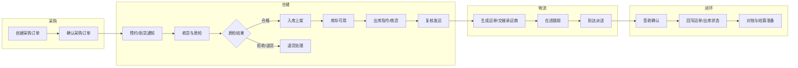

# 智链 SCM（供应链协同平台）

## 产品原型描述文档（PRD 级 · 供内部评审）

| 项目 | 说明 |
|------|------|
| **产品名称** | 智链 SCM（供应链协同平台） |
| **文档类型** | 原型说明 / PRD 节选（页面级） |
| **版本** | V0.1 草案 |
| **适用评审** | 产品 / 研发 / 测试 / 业务 |

---

## 一、产品概述与目标用户

**定位：** 面向企业内部供应链执行与协同，打通「采购—仓储—在途—签收」闭环，降低断货与积压风险，提升协同效率。

**目标用户与核心诉求：**

| 角色 | 典型场景 | 核心诉求 |
|------|----------|----------|
| **采购专员** | 下单、跟单、交期变更、对账前数据核对 | 订单状态清晰、异常可预警、与供应商协同顺畅 |
| **仓库管理员** | 收货、上架、拣货、盘点、库存查询 | 实物与账务一致、操作路径短、批次可追溯 |
| **物流调度员** | 分配承运、跟踪在途、处理异常签收 | 在途可视、节点可追踪、异常可干预 |

**非目标（本期原型边界）：** 完整财务结算、高级排产 APS、海关报关单证等可在后续版本单列。

---

## 二、核心页面原型说明

---

### 1. 采购工作台（优化版）

**页面目标：** 让采购专员在一个页面完成「今日待办处理、订单风险识别、异常闭环跟进」，将“找问题”和“处理问题”合并到同一操作路径中。

**核心问题（当前痛点）：**

- 待办分散在多个列表，优先级不清晰，导致高风险单据处理滞后。
- 订单状态可见但异常原因不聚合，采购需要多次跳转才能定位问题。
- KPI 与列表口径容易不一致，评审和复盘时难以对齐数据。

#### 1.1 页面布局示意图（字符画）

```
┌──────────────────────────────────────────────────────────────────────────┐
│ 顶栏：智链 SCM | 采购工作台（采购专员） [消息●] [当前用户▼] [帮助]            │
├───────────────┬──────────────────────────────────────────────────────────┤
│               │  快捷筛选：时间范围 | 供应商 | 订单状态 | 风险等级 | 关键词      │
│   左侧导航     │            [查询] [重置] [保存为我的视图]                      │
│   · 工作台●   ├──────────────────────────────────────────────────────────┤
│   · 订单中心   │  优先处理区（置顶）：超期未交 | 今日待确认 | 交期变更待审批      │
│   · 供应商     ├──────────────────────────────────────────────────────────┤
│   · 报表(灰)   │  KPI 条：待处理订单 | 今日待收货 | 高风险订单 | 异常关闭率       │
│               ├──────────────────────────────────────────────────────────┤
│               │  Tab：[待我处理] [全部订单] [异常预警] [已完成]                 │
│               ├──────────────────────────────────────────────────────────┤
│               │  列表区（支持排序/分页/批量操作）                               │
│               │  ┌────┬──────┬──────┬────┬──────┬────────┬──────────┐        │
│               │  │□ │单号  │供应商 │交期│风险等级│本单金额│操作      │        │
│               │  └────┴──────┴──────┴────┴──────┴────────┴──────────┘        │
│               │  底部：分页 / 每页 20 条 / 导出当前筛选                         │
└───────────────┴──────────────────────────────────────────────────────────┘
```

#### 1.2 主要字段与控件（优化后）

| 区域 | 字段 / 控件 | 说明 |
|------|-------------|------|
| **快捷筛选** | 时间范围、供应商、订单状态、风险等级、物料关键词 | 默认加载「近 30 天 + 待我处理」；支持保存个人常用视图 |
| **优先处理区** | 超期未交、今日待确认、交期变更待审批 | 以“需优先响应”的规则聚合，点击后直接定位到对应列表 |
| **KPI 条** | 待处理订单、今日待收货、高风险订单、异常关闭率 | 所有指标与当前筛选同源计算，避免口径不一致 |
| **订单列表** | 采购订单号、供应商、下单日、要求交期、状态、风险等级、本币金额 | 支持列固定、列宽拖拽、排序；风险等级采用颜色标签 |
| **操作列** | 查看、确认、变更交期、催交、关闭、导出 | 按状态与权限显示；支持勾选后批量催交/导出 |

#### 1.3 关键业务规则与交互

1. **默认优先级规则**：按“超期未交 > 今日待确认 > 普通待办”排序，确保高风险单据优先展示。
2. **风险等级判定**：基于交期偏差、历史延迟、质检异常次数综合打分；规则可配置，首期采用固定阈值。
3. **KPI 联动机制**：点击任一 KPI 自动注入筛选条件并切换至对应 Tab，支持“一键定位问题单”。
4. **确认订单流程**：二次确认弹窗 → 记录操作日志 → 状态改为「已确认」→ 可同步仓库预期到货通知。
5. **交期变更流程**：仅「已确认且未完结」可操作；必须填写变更原因，系统保留变更前后对比记录。
6. **异常闭环要求**：异常单必须包含“原因、处理动作、预计完成时间”；关闭异常时强制填写处理结论。

#### 1.4 可衡量目标（上线后 1-2 个迭代观测）

| 指标 | 目标值 | 口径说明 |
|------|--------|----------|
| 高风险订单 24 小时响应率 | ≥ 95% | 高风险订单在创建后 24 小时内首次处理 |
| 采购异常平均关闭时长 | 下降 20% | 异常创建到关闭的平均耗时 |
| 待确认订单积压量 | 下降 30% | 每日 18:00 的待确认订单存量 |
| 工作台首屏操作完成率 | ≥ 85% | 用户在工作台内完成处理，无需跳转详情页 |

---

### 2. 库存全景看板

**页面目标：** 为仓库管理员提供「库存结构 + 预警 + 快速下钻」的一屏总览。

#### 2.1 页面布局示意图（字符画）

```
┌──────────────────────────────────────────────────────────────────────────┐
│ 顶栏 …                                                                    │
├──────────────────────────────────────────────────────────────────────────┤
│  筛选：仓库（多选）| 物料分类 | ABC 标签 | 库存状态（可用/冻结/待检）[查询]   │
├───────────────────────────────┬──────────────────────────────────────────┤
│  左：仓库结构树 / 库区列表      │  右：主内容区                              │
│  · 华东中心仓                 │  ┌ 指标卡：总 SKU 数 | 库存金额 | 周转天数   │
│    └ 常温区                   │  ├ 图表区：库存金额分布（条形/饼图占位）      │
│    └ 冷藏区                   │  │         近 7 日出入库趋势（折线占位）       │
│  · 华南前置仓                 │  ├ 表格：物料库存明细                        │
│                               │  │  物料编码|名称|批次|可用|冻结|库位|安全库存 │
│                               │  └ 分页                                      │
└───────────────────────────────┴──────────────────────────────────────────┘
```

#### 2.2 主要字段与控件

| 区域 | 字段 / 控件 | 说明 |
|------|-------------|------|
| **筛选** | 仓库、物料分类、ABC、库存状态 | 仓库支持多选；状态区分可用/冻结/待检 |
| **指标卡** | SKU 数、库存总金额（按成本口径）、整体周转天数（可按仓库） | 口径在指标旁 `ⓘ` 悬浮说明 |
| **图表** | 分类金额占比、近 7 日入/出库笔数或数量趋势 | 点击图例可联动表格筛选 |
| **明细表** | 物料编码、名称、规格、批次、可用量、冻结量、库位、安全库存、低于安全库存标记 | 支持导出当前筛选结果 |

#### 2.3 关键交互逻辑

1. **切换仓库树节点**：右侧指标、图表、表格同步刷新，面包屑显示「仓库 > 库区」。
2. **低于安全库存**：行高亮或图标提示；点击「补货建议」跳转采购草稿（预留，本期可仅提示）。
3. **批次追溯入口**：点击批次号 → 弹出链路：采购单行 / 入库单 / 出库单（只读，依赖数据贯通）。
4. **冻结库存**：悬停说明冻结原因（质检、盘点锁定等）；有权限用户可跳转解冻流程（流程另页）。
5. **刷新策略**：指标卡与表格支持手动刷新；大屏模式可自动轮询（可选开关）。

---

### 3. 在途物流地图视图（简化版）

**页面目标：** 让物流调度员快速看到「哪些货在路上、大致在哪、是否异常」，以列表为主、地图为辅。

#### 3.1 页面布局示意图（字符画）

```
┌──────────────────────────────────────────────────────────────────────────┐
│  筛选：承运商 | 线路/区域 | 运单状态 | 是否异常 [查询]                       │
├───────────────────────────────┬──────────────────────────────────────────┤
│  地图区（简化）                │  运单列表（主操作区）                        │
│  · 全国底图                    │  Tab：[在途] [今日到达] [异常]               │
│  · 车辆/运单聚合点（数字气泡）  │  表格：运单号|线路|承运商|计划到达|状态|异常  │
│  · 点击气泡 → 列表过滤         │  点击行 → 下方「节点时间轴」展开              │
│  （无精确轨迹则仅显示起止城市） │  ────────────────────────────────────────  │
│                               │  节点时间轴：已揽收 → 在途 → 派送中 → 签收    │
└───────────────────────────────┴──────────────────────────────────────────┘
```

#### 3.2 主要字段与控件

| 区域 | 字段 / 控件 | 说明 |
|------|-------------|------|
| **筛选** | 承运商、区域、运单状态、异常标记 | 状态：已揽收/运输中/派送中/已签收/异常 |
| **地图** | 聚合点、城市级标注 | 简化版：不强制车辆 GPS，可用「起运城市—目的城市」连线或目的地点位 |
| **列表** | 运单号、关联出库单/订单摘要、承运商、计划到达时间、当前节点、异常原因 | 支持导出 |
| **时间轴** | 节点名称、时间、地点、操作人/系统来源 | 节点数据来自承运商回传或手工补录 |

#### 3.3 关键交互逻辑

1. **列表与地图联动**：选中列表行 → 地图定位到该运单目的城市或聚合点；点击地图气泡 → 列表筛选该区域内运单。
2. **异常处理**：异常行标红；点击「处理」记录处理意见与预计解决时间，写入日志。
3. **无 GPS 场景**：地图仅作「分布感」展示，以列表与时间轴为准，避免误导（界面需提示「示意位置」）。
4. **签收回写**：时间轴显示签收后，关联出库单状态变为「已签收」，并触发库存扣减一致性校验（与仓储规则对齐）。

---

### 4. 供应商主数据管理

**页面目标：** 维护供应商档案、准入状态与关键联系信息，为采购与对账提供唯一主数据入口。

#### 4.1 页面布局示意图（字符画）

```
┌──────────────────────────────────────────────────────────────────────────┐
│  [新建供应商]   筛选：供应商类型 | 合作状态 | 地区 | 关键词 [查询][重置]    │
├──────────────────────────────────────────────────────────────────────────┤
│  表格：供应商编码 | 名称 | 类型 | 合作状态 | 主联系人 | 更新日期 | 操作      │
├──────────────────────────────────────────────────────────────────────────┤
│  （点击「查看/编辑」→ 抽屉或详情页）                                        │
│  ┌─ 基本信息 ─────────────────────────────────────────────────────────┐  │
│  │  统一社会信用代码 | 注册地址 | 付款条款 | 结算币种 | 开票信息摘要      │  │
│  ├─ 联系与账号 ───────────────────────────────────────────────────────┤  │
│  │  主联系人、电话、邮箱 | 对账联系人 | 银行账号（脱敏显示）              │  │
│  ├─ 合作信息 ─────────────────────────────────────────────────────────┤  │
│  │  准入日期、合作状态、质量评级、备注 | 附件：资质文件列表                 │  │
│  └────────────────────────────────────────────────────────────────────┘  │
└──────────────────────────────────────────────────────────────────────────┘
```

#### 4.2 主要字段与控件

| 分组 | 字段 / 控件 | 说明 |
|------|-------------|------|
| **列表** | 供应商编码、名称、类型（生产/贸易/服务商）、合作状态、主联系人、最近更新人/时间 | 支持排序、批量导出 |
| **基本信息** | 统一社会信用代码、注册地址、付款条款、结算币种、税号/开票抬头摘要 | 税号等敏感字段权限控制 |
| **联系与账号** | 主联系人、电话、邮箱；对账联系人；银行账号 | 账号默认脱敏，完整查看需二次权限 |
| **合作信息** | 准入日期、状态（候选/试用/正式/冻结）、质量评级、备注 | 状态变更需原因 |
| **附件** | 营业执照、资质证书等 | 上传、预览、版本号（可选） |

#### 4.3 关键交互逻辑

1. **新建供应商**：向导式分步或单页表单 → 提交后状态默认「候选」或「试用」（可配置）→ 生成唯一供应商编码。
2. **编辑与审批**：关键字段（如付款条款、账号）变更可走审批流（本期可记为「需审批」占位）；记录变更历史。
3. **冻结/解冻**：冻结后禁止新采购订单选用该供应商；已有执行中单据按规则处理（提示用户）。
4. **删除**：仅「无关联业务单据」可物理删除；否则停用/归档，避免破坏历史数据。
5. **重复校验**：按信用代码或名称相似度提示可能重复，避免主数据分裂。

---

## 三、数据流转图（采购订单 → 入库 → 出库 → 物流 → 签收）



**文字版数据流（便于口头对齐）：**

| 序号 | 环节 | 主要单据/数据 | 说明 |
|------|------|----------------|------|
| 1 | 采购订单创建 | 采购订单头/行、供应商、交期、价格 | 可多次变更交期，留痕 |
| 2 | 确认 | 订单状态、可推送预期到货 | 与供应商协同可选对接 |
| 3 | 入库 | 收货单、质检结果、批次、库位 | 不合格走退货分支 |
| 4 | 库存 | 可用/冻结数量 | 支撑看板与可用 ATP |
| 5 | 出库 | 出库单、拣货复核 | 与订单/调拨类型关联 |
| 6 | 物流 | 运单、节点事件 | 地图为展示层，以事件为准 |
| 7 | 签收 | 签收时间、签收人/凭证 | 回写关闭在途，触发后续对账准备 |

---

## 四、评审建议关注点（供会议记录用）

| 序号 | 议题 | 说明 |
|------|------|------|
| 1 | 订单与入库的粒度 | 按订单行 vs 按批次收货是否满足业务 |
| 2 | 地图数据源 | 是否具备承运商接口；无则接受「城市级示意」 |
| 3 | 权限模型 | 采购/仓/物流的数据隔离与跨部门只读范围 |
| 4 | 与财务边界 | 本期是否仅到「结算准备」，不实现发票核销 |
